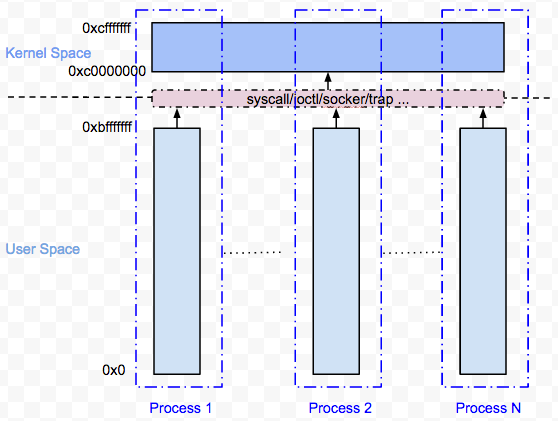
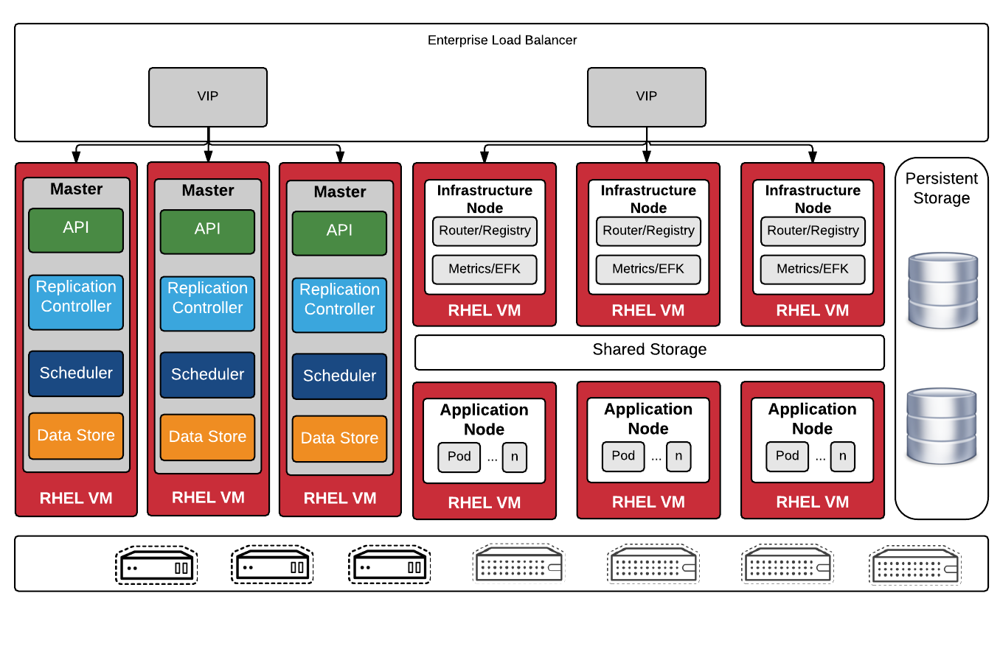
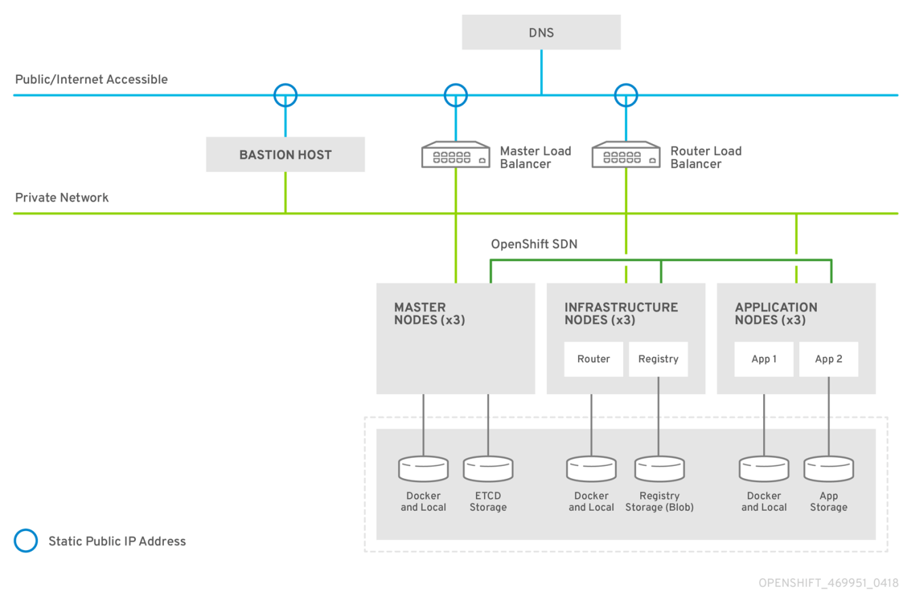
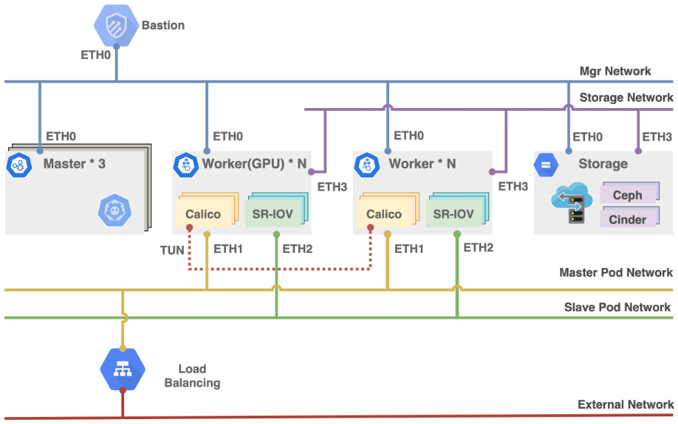

# Kubernetes-Administration

## 1. Prefix

- 授课时长：
    - 上午：9:30 至 12:00
    - 下午：13:30 至 16:00
- Prerequisite
    - vim 基础操作 -- 编辑、修改、保存文件
    - 网络基础知识 -- 网段 cidr、vlan、vxlan、配置 linux 网卡等等
    - 基础的 linux 知识 -- 权限、文件系统、服务
    - systemd 的基础操作 -- 重启、关闭、启动、重载、查看 systemd 的服务

## 2. Catalog

| Date | Time | Title | Content |
| ---- | ---- | ----- | ------- |
| 第 1 天 | 上午 | [1. Linux 容器和 Docker](#lesson-01lxc--docker) | [1.1 什么是 Linux 容器？](#11-什么是-linux-容器) |
| | | | [1.2 容器和虚拟机有何区别？](#12-容器和虚拟机有何区别) |
| | | | [1.3 Docker 和容器技术有什么关系？](#13-docker-和容器技术有什么关系) |
| | | | [1.4 Docker 的架构和概念空间是怎样的？](#14-docker-的架构和概念空间是怎样的) |
| | | | [1.5 什么是所谓的安全容器技术？](#15-什么是所谓的安全容器技术) |
| | | | [1.6 实验：Docker Quick Start](#16-实验docker-quick-start) |
| | 下午 | | [1.7 Docker 的网络模型](#17-docker-的网络模型) |
| | | | [1.8 Docker 的存储模型](#18-docker-的存储模型) |
| | | [2. Kubernetes 的快速入门](#lesson-02kubernetes-concepts) | [2.1 什么是 K8S？](#21-什么是-k8s) |
| | | | [2.2 K8S 是为了解决什么问题？]() |
| | | | [2.3 K8S 不解决什么问题？]() |
| | | | [2.4 K8S 的模块架构是怎样的？]() |
| | | | [2.5 K8S 有哪些竞争产品？]() |
| | | | [2.6 怎么部署出一个 K8S 群集？]() |
| | | | [2.7 实验：K8S 的部署]() |
| | | | [2.8 什么是 Pod？]() |
| | | | [2.9 实验：启动一个 pod ]() |
| 第 2 天 | 上午 | [3. K8S 的概念空间](#lesson-03k8s-concepts) | [3.1 什么是 YAML？]() |
| | | | [3.2 什么是 Namespace & Quota？]() |
| | | | [3.3 什么是 Deployment & ReplicaSet？]() |
| | | | [3.4 什么是 Services？]() |
| | | | [3.5 实验：K8S Dashboard]() |
| | | | [3.6 实验：K8S 怎么发布服务和扩缩容？]() |
| | | | [3.7 DeamonSet & SetfulSet]() |
| | 下午 | | [3.8 实验：ETCD 操作]() |
| | | | [3.9 什么是静态 Pod？]() |
| | | [4. K8S 的认证和安全](#lesson-04k8s-auth--security) | [4.1 什么是 K8S 的 3A？]() |
| | | | [4.2 怎么配置 kubectl？]() |
| | | | [4.3 K8S 怎么保证网络安全？]() |
| | | | [4.4 什么是用户和角色？]() |
| | | | [4.5 实验：添加用户 & 绑定角色]() |
| 第 3 天 | 上午 | [5. K8S 的调度](#lesson-05-k8s-schedule) | [5.1 怎么部署一个 HA 的 K8S 群集？]() |
| | | | [5.2 怎么把应用部署到指定的 Node？]() |
| | | | [5.3 什么是 Taints & Toleration？]() |
| | | | [5.4 什么是 Node Affinity？]() |
| | | | [5.5 什么是 Pod Affinity？]() |
| | | | [5.6 实验：Pod 调度]() |
| | 下午 | [6. K8S 的数据持久化](#lesson-06-k8s-storage) | [6.1 什么是 ConfigMap & Secret ？]() |
| | | | [6.2 什么是 PV / PVC？]() |
| | | | [6.3 什么是 Storage Class？]() |
| | | | [6.4 实验：ConfigMap / Secret / PV & PVC / StorageClass]() |
| | | [7. 服务发布](#lesson-07-service) | [7.1 Service 在底层是怎么实现的？]() |
| | | | [7.2 实验：发布服务]() |
| | | | [7.3 什么是 Ingress？]() |
| | | | [7.4 实验：对集群外发布服务]() |
| | | [8. 其它](#lesson-08advance) | [8.1 监控、日志、排错]() |
| | | | [8.2 什么是 HPA / CA / VA？]() |
| | | | [8.3 什么是 Federation？]() |
| | | | [8.4 K8S 怎么处理有状态服务？]() |
| 第 4 天 | 上午 | [9. CKA 考试讲解](#lesson-09cka) | [9.1 考试注意事项](#) |
| | | | [9.2 模拟题讲解](#) |
| | 下午 | | [9.3 实验：做模拟题](#) |

## Lesson 01：LXC & Docker

### 1.1 什么是 Linux 容器？

- 虚拟化技术的演进

    

- 虚拟化是为了解决什么问题？资源隔离 & 资源限制
- 什么是 Linux 容器？namespace & cgroup
- 什么是 lxc namespace？

    

- 什么是 CGroup？
- Mac 和 Win 上 有容器技术么？

### 1.2 容器和虚拟机有何区别？

- 原理
- 应用场景

### 1.3 Docker 和容器技术有什么关系？

- 什么是 [Docker](https://docs.docker.com/engine/docker-overview/#namespaces)（ [QuickStart](https://docs.docker.com/get-started/) ）？

    

- Docker 和容器有什么关系（ why Linus don't care docker ）？
- Docker 有哪些竞争产品？[CRI-O ？](https://zhuanlan.zhihu.com/p/30667806)

### 1.4 Docker 的架构和概念空间是怎样的？

- 概念空间

    

- 模块架构

### 1.5 什么是所谓的安全容器技术？

- 容器的天然不安全与天然安全
- [Kata Container](https://katacontainers.io/learn/)，[PDF](https://katacontainers.io/collateral/kata-containers-1pager.pdf)

    

- 竞争者：gVisor / firecracker / rustVM

### 1.6 实验：Docker Quick Start

- 在 Ubuntu 18.04 上配置 Docker

    ```bash
    # 更新依赖仓库
    apt-get update -y

    # 安装 Docker
    apt-get install docker.io -y
    systemctl enable docker
    systemctl start docker
    ```

- [如何创建一个镜像？如何启动和调试容器？](https://github.com/99cloud/lab-openstack/tree/master/src/docker-quickstart)

    ```console
    $ python app.py
     * Running on http://0.0.0.0:80/ (Press CTRL+C to quit)

    $ docker run -p 4000:80 maodouzi/get-started:part2
     * Running on http://0.0.0.0:80/ (Press CTRL+C to quit)

    # 进入容器调试
    $ docker exec -it 4224b69e7ee3 /bin/bash
    root@4224b69e7ee3:/app# env
    HOSTNAME=4224b69e7ee3
    PWD=/app
    HOME=/root
    NAME=World
    ...

    # 查看容器日志
    $ docker logs -f 4224b69e7ee3

    # 结束容器
    $ docker stop 4224b69e7ee3

    # 删除容器
    $ docker rm 4224b69e7ee3

    #  删除镜像
    $ docker rmi maodouzi/get-started:part2
    ```

- [Docker 官方入门参考资料](https://docs.docker.com/get-started/)

### 1.7 Docker 的网络模型

- Bridge 模式
- Host 模式
- CNM

### 1.8 Docker 的存储模型

- Mount 模式
- Volumn 模式

## Lesson 02：Kubernetes Concepts

### 2.1 什么是 K8S？

- 什么是 Kubernetes？容器编排工具。为什么叫 K8S？
- K8S 和 Docker 有什么关系？参考：[Container runtimes](https://kubernetes.io/docs/setup/production-environment/container-runtimes/)
    - Orchestration API -> Container API (cri-runtime) -> Kernel API(oci-runtime)
    - OCI：runC / Kata（ 及其前身 runV 和 Clear Containers ），gVisor，Rust railcar
        - 容器镜像的制作标准，即 ImageSpec。大致规定：容器镜像这个压缩了的文件夹里以 xxx 结构放 xxx 文件
        - 容器要需要能接收哪些指令，以及这些指令的行为，即 RuntimeSpec。这里面的大致内容就是“容器”要能够执行 “create”，“start”，“stop”，“delete” 这些命令，并且行为要规范。
        - Docker 则把 libcontainer 封装了一下，变成 runC 捐献出来作为 OCI 的参考实现。
    - CRI：Docker（ 借助 dockershim ），containerd（ 借助 CRI-containerd ），CRI-O，Frakti。是一组 gRPC 接口，[cri-api/pkg/apis/services.go](https://github.com/kubernetes/cri-api/blob/master/pkg/apis/services.go)：
        - 一套针对容器操作的接口，包括创建，启停容器等等
        - 一套针对镜像操作的接口，包括拉取镜像删除镜像等
        - 一套针对 PodSandbox（容器沙箱环境）的操作接口
    - 正常的 K8S 调用 Docker 流程

        

    - containerd-1.0，对 CRI 的适配通过一个单独的进程 CRI-containerd 来完成

        

    - containerd-1.1，把适配逻辑作为插件放进了 containerd 主进程中

        

    - CRI-O，更为专注的 cri-runtime，非常纯粹，兼容 CRI 和 OCI，做一个 Kubernetes 专用的运行时

        

- [CRI-O](https://cri-o.io/) 的架构：

    

    

- K8S 和 Borg 有何关系？Start from Borg, however completely different!

    

### 2.2 K8S 是为了解决什么问题？

- K8S 有什么优势？适用于哪些场景？自动化编排：自愈，快速缩放，一键部署和升降级，备份恢复
- 如何查文档？[K8S](https://kubernetes.io/)，[OpenShift Origin](https://www.okd.io/)
- 其它资料：slack、cncf、quay.io

### 2.3 K8S 不解决什么问题？

- 用户管理
- 限流熔断：istio
- 监控审计：prometheus / grafana / alertmanager / elasticsearch / fluent / kibana
- 用户界面
- 中间件
- 底层云平台支持

### 2.4 K8S 的模块架构是怎样的？

- [K8S 有哪些组件](https://kubernetes.io/zh/docs/concepts/architecture/#)？api-server、kube-scheduler、kube-controller、etcd、coredns、kubelete、kubeproxy

- 整体结构图

    

### 2.5 K8S 有哪些竞争产品？

- [OpenShift](https://www.openshift.com/learn/what-is-openshift-x)
    - 和 K8S 相比，OpenShift（ 红帽最有价值的产品 ）有哪些优势？

        

- VMware
- KubeSphere
- Ranchel

### 2.6 怎么部署出一个 K8S 群集？

- kubeadm
- Ansible

### 2.7 实验：K8S 的部署

1. [安装 kubeadm](https://kubernetes.io/docs/setup/production-environment/tools/kubeadm/install-kubeadm/)

    ```bash
    # iptables 看到 bridged 流量
    cat <<EOF | sudo tee /etc/sysctl.d/k8s.conf
    net.bridge.bridge-nf-call-ip6tables = 1
    net.bridge.bridge-nf-call-iptables = 1
    EOF
    sudo sysctl --system

    # Install kubeadm
    sudo apt-get update && sudo apt-get install -y apt-transport-https curl
    curl -s https://packages.cloud.google.com/apt/doc/apt-key.gpg | sudo apt-key add -
    cat <<EOF | sudo tee /etc/apt/sources.list.d/kubernetes.list
    deb https://apt.kubernetes.io/ kubernetes-xenial main
    EOF
    apt-get install -y kubelet kubeadm kubectl

    # 重启 kubelet
    systemctl daemon-reload
    systemctl restart kubelet
    ```
1. [用 kubeadm 创建一个 k8s 群集](https://kubernetes.io/zh/docs/setup/independent/create-cluster-kubeadm/)

    ```bash
    # 拉起 k8s 群集
    kubeadm init --pod-network-cidr 192.168.1.90/16

    # 配置 kubectl 客户端
    mkdir -p $HOME/.kube
    sudo cp -i /etc/kubernetes/admin.conf $HOME/.kube/config
    sudo chown $(id -u):$(id -g) $HOME/.kube/config
    ```

1. 此时可以观察到 node 并未 ready，导致 coredns 无法调度。接下来需要：[安装网络插件](https://kubernetes.io/zh/docs/setup/independent/create-cluster-kubeadm/#Pod-network)，[插件列表](https://kubernetes.io/docs/concepts/cluster-administration/addons/)，我们选择：[Flannel](https://github.com/coreos/flannel/blob/master/Documentation/kube-flannel.yml)

    ```bash
    # 添加网络插件
    kubectl apply -f https://raw.githubusercontent.com/coreos/flannel/master/Documentation/kube-flannel.yml

    # 查看 pods 和 nodes 状态
    kubectl get pods --all-namespaces
    kubectl get nodes
    ```

### 2.8 什么是 Pod？

- Pod 和容器的关系是什么？
- 为什么调度的基本单位是 pod 不是容器？

### 2.9 启动一个 pod

- [Pod YAML](https://kubernetes.io/docs/concepts/scheduling-eviction/assign-pod-node/)

    ```yaml
    apiVersion: v1
    kind: Pod
    metadata:
      name: nginx
      labels:
        env: test
    spec:
      containers:
      - name: nginx
        image: nginx
    ```

- 启动一个 Pod

    ```
     起 nginx pod
    kubectl apply -f nginx.yaml

    # 可以看到 pod 无法被调度，进行诊断
    kubectl describe pod nginx

    # 去污点、允许调度到 master
    kubectl taint nodes cka003 node-role.kubernetes.io/master:NoSchedule-

    # 查看 pods
    kubectl get pods

    # 查看容器
    docker ps | grep nginx
    ```

## Lesson 03：K8S concepts

### 3.1 什么是 YAML？

- 怎么理解 YAML？列表 / 字典 / 数字 / 字符串 / Bool

### 3.2 什么是 Namespace & Quota？

- Namespace & 租户隔离
- [实验：namespace & quota](https://kubernetes.io/docs/tasks/administer-cluster/manage-resources/quota-memory-cpu-namespace/)

    ```bash
    # 创建一个 namespace
    kubectl create namespace quota-mem-cpu-example

    # 为这个 namespace 限定配额
    kubectl apply -f https://k8s.io/examples/admin/resource/quota-mem-cpu.yaml --namespace=quota-mem-cpu-example

    # 查看配额的详细信息
    kubectl get resourcequota mem-cpu-demo --namespace=quota-mem-cpu-example --output=yaml

    # 创建一个 pod，并限制它的资源使用
    kubectl apply -f https://k8s.io/examples/admin/resource/quota-mem-cpu-pod.yaml --namespace=quota-mem-cpu-example

    # 确认 pod 已经启动
    kubectl get pod quota-mem-cpu-demo --namespace=quota-mem-cpu-example

    # 再次查看配额信息，检查已用部分
    kubectl get resourcequota mem-cpu-demo --namespace=quota-mem-cpu-example --output=yaml

    # 尝试启动第二个 pod，因为配额原因，失败
    kubectl apply -f https://k8s.io/examples/admin/resource/quota-mem-cpu-pod-2.yaml --namespace=quota-mem-cpu-example

    # Error from server (Forbidden): error when creating "examples/admin/resource/quota-mem-cpu-pod-2.yaml":pods "quota-mem-cpu-demo-2" is forbidden: exceeded quota: mem-cpu-demo, requested: requests.memory=700Mi,used: requests.memory=600Mi, limited: requests.memory=1Gi

    # 删除命名空间
    kubectl delete namespace quota-mem-cpu-example
    ```

### 3.3 什么是 Deployment & ReplicaSet？

- 实验：Pod Label 和 Replica Controller
- [实验：Deployment 相关](https://kubernetes.io/docs/concepts/workloads/controllers/deployment/)

### 3.4 什么是 Services？

- 基本概念：Service
- 实验：Service

### 3.5 实验：K8S Dashboard

### 3.6 实验：K8S 怎么发布服务和扩缩容？

### 3.7 DeamonSet & SetfulSet

### 3.8 实验：ETCD 操作

### 3.9 什么是静态 Pod？

## Lesson 04：K8S Auth & Security

### 4.1 什么是 K8S 的 3A？

- Authentication / Authorization / Admission
- K8S 的认证过程？Authentication、Authorization（ RBRA / ABAC / WebHook ）、Admission Controller

### 4.2 怎么配置 kubectl？

###	4.3 K8S 怎么保证网络安全？

- Kubernetes 的网络选型？flannel、calico、ovs、ovn

### 4.4 什么是用户和角色？

### 4.5 实验：添加用户 & 绑定角色

- 实验：创建 Normal 用户使用 kubectl 工具
- 实验：创建 Normal 用户并给予超级管理员组
- 实验：创建 Service Account 并绑定角色

## Lesson 05: K8S Schedule

### 5.1 怎么部署一个 HA 的 K8S 群集？

- [怎么部署一个 Multi-Node 的 K8S 环境？](https://github.com/99cloud/training-kubernetes/blob/master/doc/deploy-k8s-manual.md)

- [基于 AWS 部署高可用 Kubernetes 集群](https://github.com/99cloud/training-kubernetes/blob/master/doc/deploy-aws-ha-k8s-cluster.md)

- [penshift-container-platform-reference-architecture-implementation-guides](https://blog.openshift.com/openshift-container-platform-reference-architecture-implementation-guides/)

    

    

- 网络多平面

    

### 5.2 怎么把应用部署到指定的 Node？

- 实验：Node Label 和 Node Selector

### 5.3 什么是 Taints & Toleration？

- 实验：Taints 污染标签 & Toleration 容忍标签

### 5.4 什么是 Node Affinity？

- 实验：Node Affinity 节点亲和

### 5.5 什么是 Pod Affinity？

- 实验：Inter-Pod Affinity / Anti，Pod 的亲和与反亲和

### 5.6 实验：Pod 调度

## Lesson 06: K8S Storage

### 6.1 什么是 ConfigMap & Secret ？

- 实验：Config Map
- 实验：Secret

### 6.2 什么是 PV / PVC？

- 基本概念：PV / PVC

### 6.3 什么是 Storage Class？

- 基本概念：Storage Class
- 实验：Storage Class

### 6.4 实验：ConfigMap / Secret / PV & PVC / StorageClass

## Lesson 07: Service

### 7.1 Service 在底层是怎么实现的？

- [A Guide to the Kubernetes Networking Model](https://sookocheff.com/post/kubernetes/understanding-kubernetes-networking-model/)

### 7.2 实验：发布服务

- Cluster IP
- Service FQDN
- Nodeport
- LB Type Service

### 7.3 什么是 Ingress？

- 实验：Ingress / Route

### 7.4 实验：对集群外发布服务

- Lab: Ingress Controller

## Lesson 08：Advance

### Monitor / Log / Debug

- 监控：Grafana / Prometheus / AlertManager
- 日志：ElasticSearch / Fluent ( Logstash ) / Kibana
- 排错：怎么对 pod 的网口抓包？

    ```bash
    # 查看指定 pod 运行在那个 node 上
    kubectl describe pod <pod> -n <namespace>

    # 获得容器的 pid
    docker inspect -f {{.State.Pid}} <container>

    # 进入该容器的 network namespace
    nsenter --target <PID> -n

    # 使用 tcpdump 抓包，指定 eth0 网卡
    tcpdump -i eth0 tcp and port 80 -vvv

    # 或者抓包并导出到文件
    tcpdump -i eth0 -w ./out.cap
    ```

### 8.2 什么是 HPA / CA / VA？

- 怎么理解 HPA / CA / VPA？

### 8.3 什么是 Federation？

- Kubenetes Federation vs ManageIQ

### 8.4 K8S 怎么处理有状态服务？

- StatefulSet
- CRD & Operator

### Reference

- [K8S 测试](https://jimmysong.io/kubernetes-handbook/develop/testing.html)

##	Lesson 09：CKA

### 9.1 考试注意事项

### 9.2 模拟题讲解

### 9.3 实验：做模拟题
