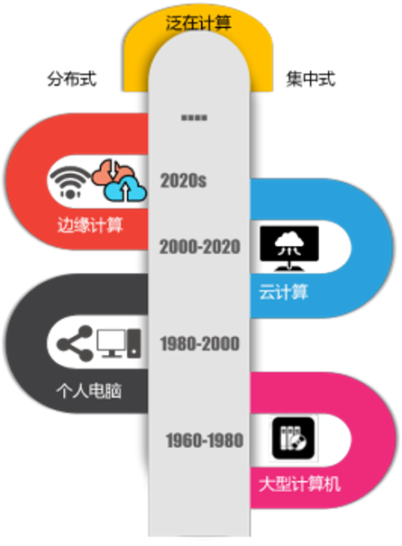
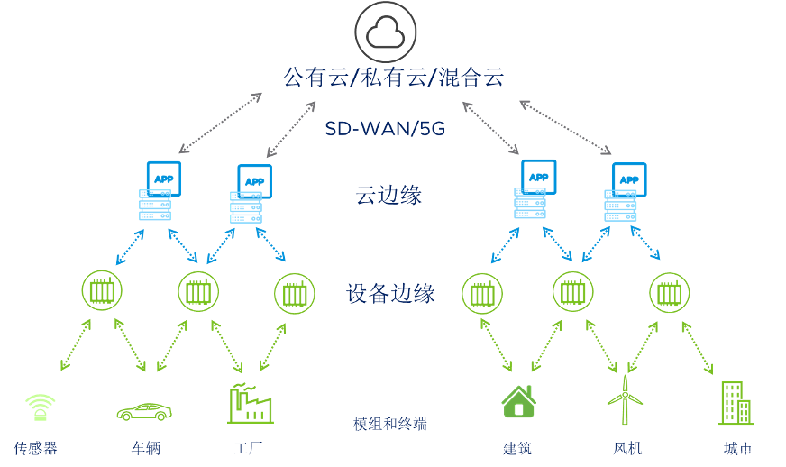
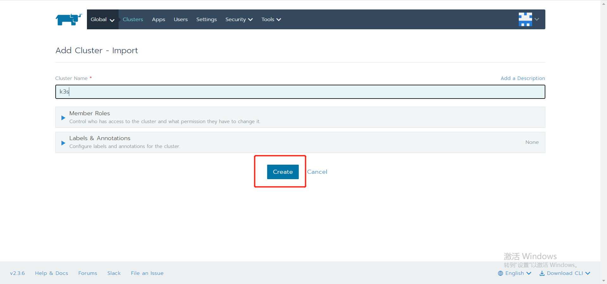
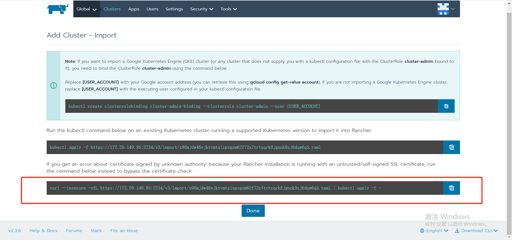

# 边缘容器云解决方案

## 1. 边缘计算与 K8S

### 1.1 边缘计算行业分析

#### 1.1.1 60 年来的算力架构演进



- 1960-1980：由封闭网络和巨型应用主导的单体计算架构。
- 1980-2000：由开放网络和小型客户端应用主导的分散式计算架构，进入 PC 互联网时代。
- 2000-2020：以云计算为中心，PC、Android、iOS 为客户端的集约式计算架构，进入移动互联网时代。
- 2020->？：未来将形成一个集中式和分散式统一协同的泛在式计算架构，进入产业互联网时代。

云计算和边缘计算并不是非此即彼的关系，集中式云数据中心将继续存在，且整体容量仍可能继续扩大，但新的需求（如：物联网、工业互联网、车联网）以及 5G 超低时延业务的需求将同步促进边缘计算的发展。随着计算密度越来越高，分布越来越广泛，集中与分散式的界限将变得更模糊。

#### 1.1.2 5G 与边缘计算互相成就

边缘计算的爆发一方面是基于 SDN/SD-WAN 的 IT 网络技术逐渐成熟，更重要的另一方面就是 5G 时代的到来落实了边缘计算的价值诉求。边缘计算弥补了云计算无法为 5G 网络提供支撑的：

- **增强移动带宽（eMBB）**：边缘计算可以节省 35% 的回传带宽，减轻承载网、核心网的数据传输压力。
- **低时延高可靠（uRLLC）**：边缘计算可以缩短 50% 的回传物理时延，满足时延敏感的用户场景。
- **海量终端接入（mMTC）**：2025 年，全球将有约 90 亿移动连接，以及 250 亿 IoT 连接。所产生的大量业务无关数据，可以在边缘进行过滤，不需要传输到中央处理。此外，还可以通过将终端算力上移到边缘，设备只需要具备流化显示能力，从而降低终端设备成本。


#### 1.1.3 5G + 边缘计算促进产业互联网升级

知名边缘计算研究机构 State of the Edge 发布了最新的边缘计算研究报告《State of the Edge 2020》。报告中对边缘计算市场做了预测。

未来 10 年，全球边缘计算 CAPEX 支出，年复合增长率将达到 35%。
2020-2028 年，全球边缘计算 CAPEX 支出累计将达到 7000 亿美元。

到 2028 年，边缘市场将由消费者应用程序主导，随着边缘以平台为中心的产品的成熟，边缘使用场景的种类和范围预计将大大增加。11 个产业占据 80-85% 的边缘市场：

- 电信运营商
- 企业 IT
- 制造业
- 智能电网
- 智慧城市
- 零售业
- 医疗保健
- 交通行业
- 移动消费者服务
- 居民消费者服务
- 商用无人机

### 1.2 边缘计算的架构形态


#### 1.2.1 MEC-边缘云


- 集群形态：存在多个边缘云集群，各集群自包含
- 边缘应用实例化入口：MEAO，Multi-Cluster 编排
- 需求侧重：面向 5G 需求
- 成本：高
- 数据安全：重视隐私安全

#### 1.2.2 云边缘



- 集群形态：只存在一个集群，云端运行一个中心的 Master，边端运行多个 Edge Node 接入到同一个 Master
- 边缘应用实例化入口：中心 Master，Multi-Node 编排
- 需求侧重：面向 CDN、IoT 等互联网需求
- 成本：低
- 数据安全：数据不安全

云边缘是中心云服务在边缘侧的延伸，逻辑上仍是中心云服务的一部分，边缘侧需要与中心云服务紧密协同。如：

- 华为云 KubeEdge
- 阿里云 OpenYurt
- 腾讯云 SuperEdge

核心述求：

- 将边缘计算视为云计算的延伸
- 聚焦于混合云场景，通过云上的软件堆栈吞噬边缘市场。

技术体系：

- 云边缘、云边协同架构
- 将计算节点下沉到边缘

### 1.3 边缘解决方案遇到的问题

#### 1.3.1 缺少现象级边缘应用

本质上是：5G 基础硬件技术领先与应用技术落后之间的矛盾

- 适配高速移动工业物联网的应用技术栈尚未成型
- 5G 微秒延迟与下沉 UPF 毫秒延迟
- 边缘云游戏只有在大屏渲染时才有优势，商业模式尚待验证
- AI 应用还局限于模式识别一隅，且模型优化是艺术不是工程
- AR / VR 待突破物理硬件设备的局限性
- 物联网智慧场馆限于 to B，技术栈复用曲线陡峭
- 数字人 / 元宇宙还是概念股

#### 1.3.2 边缘云需要支持异构硬件

- VM vs Pod
- CPU：ARM / X86 / RISC-V / Loogson ...
- OS：CentOS / OpenEula / 麒麟
- GPU
- SRIOV / DPDK
- RT Kernel
- 存储
- 统一管理 vs Offline 可用

#### 1.3.3 K8S 用于边缘

[K8S 架构](https://kubernetes.io/docs/concepts/overview/what-is-kubernetes/)


- [Demo: 十分钟部署 K8S](class-01-Kubernetes-Administration.md#27-实验k8s-的部署)
- [K8S 解决什么问题？](class-01-Kubernetes-Administration.md#22-k8s-是为了解决什么问题)
- [K8S 不解决什么问题？](class-01-Kubernetes-Administration.md#23-k8s-不解决什么问题)

[Kata 解决方案](https://katacontainers.io/)


[KubeVirt](https://kubevirt.io/)


## 2. K3S 解决方案

### 2.1 K3S 基本概念

#### 2.1.1 什么 K3S

K3S 参考文档

- [Kubernetes 官网](https://kubernetes.io/zh)
- [Kubernetes 官方文档](https://kubernetes.io/zh/docs/home)

Kubernetes 集群在管理大规模服务上有极佳的运维自动化优势（自愈 / 扩缩容 / 负载均衡 / 服务注册和服务发现 / 部署），但也需要耗费相对较多的资源，许多功能对特定对特定场景来说是冗余的，K3S 作为一个轻量级的 Kubernetes 发行版应运而生，它针对边缘计算、物联网等场景进行了高度优化。

K3s 有以下增强功能：

- 打包为单个二进制文件。
- 使用基于 sqlite3 的轻量级存储后端作为默认存储机制。同时支持使用 etcd3、MySQL 和 PostgreSQL 作为存储机制。
- 封装在简单的启动程序中，通过该启动程序处理很多复杂的 TLS 和选项。
- 默认情况下是安全的，对轻量级环境有合理的默认值。
- 添加了简单但功能强大的 batteries-included 功能，例如：本地存储提供程序，服务负载均衡器，Helm controller 和 Traefik Ingress controller。
- 所有 Kubernetes control-plane 组件的操作都封装在单个二进制文件和进程中，使 K3s 具有自动化和管理包括证书分发在内的复杂集群操作的能力。
- 最大程度减轻了外部依赖性，K3s 仅需要 kernel 和 cgroup 挂载。 K3s 软件包需要的依赖项包括：
  - containerd
  - Flannel
  - CoreDNS
  - CNI
  - 主机实用程序（iptables、socat 等）
  - Ingress controller（Traefik）
  - 嵌入式服务负载均衡器（service load balancer）
  - 嵌入式网络策略控制器（network policy controller）


K3S 适用于：

- 边缘计算-Edge / 物联网-IoT / 嵌入式 K8S
- CI / DevOps

### 2.2 K3S 的部署

#### 2.2.1 单节点架构


K3s 单节点集群的架构如下图所示，该集群有一个**内嵌 SQLite** 数据库的单节点 **K3s server**。

在这种配置中，每个 **agent** 节点都注册到**同一个** server 节点。K3s 用户可以通过调用 server 节点上的 K3s API 来操作 Kubernetes 资源。外部流量则通过 Traeffic 导入，且经过 loadBalance 进行负载均衡。

#### 2.2.2 部署准备

参阅 [K3S 官网配置改动](https://docs.rancher.cn/docs/k3s/installation/installation-requirements/_index)

#### 2.2.3 单节点部署

| 节点           | CPU    | 内存  | 磁盘   | 数量 | os        |
| ------------ | ------ | --- | ---- | -- | --------- |
| server/agent | >2Core | >1G | >10G | 1  | centos7.x |

k3s 默认使用 containerd 作为 cri，我们这里使用更为熟悉的 docker 作为集群 cri，我们先安装 docker

```bash
yum install -y yum-utils
yum-config-manager --add-repo http://mirrors.aliyun.com/docker-ce/linux/centos/docker-ce.repo
yum makecache fast
yum install docker-ce-19.03.9 -y
mkdir -p /etc/docker
echo '{"registry-mirrors": ["http://hub-mirror.c.163.com"]}'>/etc/docker/daemon.json
systemctl enable --now docker
```

部署脚本安装

``` bash
# curl -sfL https://get.k3s.io | INSTALL_K3S_EXEC="--docker" sh -
# 受限国内网络，大多数时候上述脚本无法安装，建议采用下述国内加速安装脚本
curl -sfL http://rancher-mirror.cnrancher.com/k3s/k3s-install.sh | INSTALL_K3S_MIRROR=cn INSTALL_K3S_EXEC="--docker" sh -
```

输出下述日志，即部署完成

```log
...
[INFO]  Creating /usr/local/bin/kubectl symlink to k3s
[INFO]  Creating /usr/local/bin/crictl symlink to k3s
[INFO]  Skipping /usr/local/bin/ctr symlink to k3s, command exists in PATH at /usr/bin/ctr
[INFO]  Creating killall script /usr/local/bin/k3s-killall.sh
[INFO]  Creating uninstall script /usr/local/bin/k3s-uninstall.sh
[INFO]  env: Creating environment file /etc/systemd/system/k3s.service.env
[INFO]  systemd: Creating service file /etc/systemd/system/k3s.service
[INFO]  systemd: Enabling k3s unit
[INFO]  systemd: Starting k3s
```

查看 pod 是否正常即可

```console
$ kubectl get po -A
NAMESPACE     NAME                                      READY   STATUS      RESTARTS   AGE
kube-system   helm-install-traefik-crd-j4bwn            0/1     Completed   0          2m10s
kube-system   helm-install-traefik-sxnmw                0/1     Completed   0          2m10s
kube-system   metrics-server-86cbb8457f-47kzz           1/1     Running     0          2m10s
kube-system   local-path-provisioner-5ff76fc89d-7bzjd   1/1     Running     0          2m10s
kube-system   coredns-7448499f4d-cjph9                  1/1     Running     0          2m10s
kube-system   svclb-traefik-8q77r                       2/2     Running     0          83s
kube-system   traefik-97b44b794-gb72h                   1/1     Running     0          83s

# 集群基础使用
# 我们来创建一个 deployment 的 pod
$ kubectl create deployment nginx --image=nginx
$ kubectl get po
NAME                     READY   STATUS    RESTARTS   AGE
nginx-6799fc88d8-pc4wz   1/1     Running   0          101s
```

网络选项

```console
# 修改 CNI 网络模式
# 默认情况下，K3s 将以 flannel 作为 CNI 运行，使用 VXLAN 作为默认后端。如需修改 CNI 的模式，可以参考下述命令安装
# --flannel-backend=vxlan   (默认) 使用 VXLAN 后端。
# --flannel-backend=ipsec	使用 IPSEC 后端，对网络流量进行加密。
# --flannel-backend=host-gw	使用 host-gw 后端。
# --flannel-backend=wireguard	使用 WireGuard 后端，对网络流量进行加密。可能需要额外的内核模块和配置。
$ curl -sfL http://rancher-mirror.cnrancher.com/k3s/k3s-install.sh | INSTALL_K3S_MIRROR=cn INSTALL_K3S_EXEC="--docker --flannel-backend=vxlan" sh -

# 查看对应的 linux 网络设备是否生成
$ ip a | grep flannel

31: flannel.1: <BROADCAST,MULTICAST,UP,LOWER_UP> mtu 1450 qdisc noqueue state UNKNOWN group default 
    inet 10.42.0.0/32 scope global flannel.1

# 替换 CNI
# K3S 除了支持 flannel，还支持 calico\canel 等 CNI 组件
# 我们使用 calico 作为网络组件

# 注：下述 10.96.0.0/16 不能跟实际网络冲突
curl -sfL http://rancher-mirror.cnrancher.com/k3s/k3s-install.sh | INSTALL_K3S_MIRROR=cn K3S_KUBECONFIG_MODE="644" INSTALL_K3S_EXEC="--flannel-backend=none --cluster-cidr=10.96.0.0/16 --disable-network-policy --disable=traefik" sh -

# 下载 calico.yaml
$ wget https://docs.projectcalico.org/manifests/calico.yaml
# 修改 calico.yaml 中被注释掉的参数 CALICO_IPV4POOL_CIDR
- name: CALICO_IPV4POOL_CIDR
  value: "10.96.0.0/16"

# apply calico
kubectl apply -f calico.yaml

# 查看集群 pod
$ kubectl get po -A
NAMESPACE     NAME                                       READY   STATUS    RESTARTS   AGE
kube-system   calico-node-6cv7v                          1/1     Running   0          3m30s
kube-system   local-path-provisioner-5ff76fc89d-sqdts    1/1     Running   0          33m
kube-system   calico-kube-controllers-74b8fbdb46-mdwjm   1/1     Running   0          3m30s
kube-system   metrics-server-86cbb8457f-5xgrs            1/1     Running   0          33m
kube-system   coredns-7448499f4d-mwtmw                   1/1     Running   0          33m
```

K3S 卸载

```console
# 要从 server 节点卸载 K3s
$ /usr/local/bin/k3s-uninstall.sh

# 要从 agent 节点卸载 K3s
$ /usr/local/bin/k3s-agent-uninstall.sh
```

### 2.3 从中心到边缘的纳管

#### 2.3.1 rancher 管理边缘整体架构

在实际边缘生成应用中，我们边缘环境可能分布着多个 k3s 集群，当集群数量过多时，后续的运维管理会变得非常的不方便。为了解决这样的问题，下面我们通过云端中心的 rancher 去纳管边缘的多个 k3s


#### 2.3.2 节点环境

| 节点角色    | CPU    | 内存  | 磁盘   | 数量 | os        |
| ------- | ------ | --- | ---- | -- | --------- |
| rancher | >2Core | >4G | >10G | 1  | centos7.x |
| k3s     | >2Core | >2G | >10G | n  | centos7.x |

### 2.3.3 部署 K3S 和 rancher

[部署 K3S](#223-单节点部署)

部署 rancher 服务

```console
$ docker run -d --restart=unless-stopped -p 1234:80 -p 2234:443 rancher/rancher:v2.3.6
```

### 2.3.4 纳管 k3s

通过浏览器访问 https://{rancher_ip}:2234/






复制上图中的命令，到 k3s 端运行

```bash
sudo docker run -d --privileged --restart=unless-stopped --net=host -v /etc/kubernetes:/etc/kubernetes -v /var/run:/var/run rancher/rancher-agent:v2.3.6 --server https://172.20.149.95:2234 --token ndhsgr9msksr4s6g6xqq6dl8cns42txlkxt96tsdwcl56hds568nbb --ca-checksum 5b778f411871d7caca521a0cf25cd40d8a7e28aeb1def47af829e22092c114cd --etcd --controlplane --worker
```

最后通过界面我们能看到 rancher 完成了对 k3s 集群的纳管


同样，后续的其余 k3s 也是用这个方式去纳管，就完成中心端对边缘端集群的管理。

### 2.4 K3S 用于 CI/CD

K3S 相对 K8S 具备轻量，消耗资源少等特点，我们根据这一特性，解析一个 cicd 的案例

#### 2.4.1 部署

[部署 K3S](#223-单节点部署)

```bash
curl -sfL http://rancher-mirror.cnrancher.com/k3s/k3s-install.sh | INSTALL_K3S_EXEC="--docker --no-deploy=traefik --kube-apiserver-arg=feature-gates=RemoveSelfLink=false"  INSTALL_K3S_MIRROR=cn sh -
# --no-deploy=traefik 默认自带了 traefik，不部署 traefik
# --kube-apiserver-arg=feature-gates=RemoveSelfLink=false 开启 nfs 存储，k8s 1.20 后如果要使用 nfs 需要开启
```

部署 nfs

```bash
$ yum install nfs-utils -y
$ mkdir -p /nfs/data
$ chmod -R 777 /nfs/data

# 若挂载磁盘的话执行:
# mkfs.xfs /dev/sdb
# mount /dev/sdb /nfs/data
# echo "/dev/sdb /nfs/data xfs defaults 0 0" >> /etc/fstab

echo "/nfs/data *(rw,no_root_squash,sync)" > /etc/exports
exportfs -r
systemctl enable nfs --now

kubectl apply -f nfs.yaml

# nfs yaml 见附录 'nfs.yaml'
```

#### 2.4.2 registry

```bash
# docker 方式启动
docker run -d -v /opt/registry:/var/lib/registry -p 32500:5000 --restart=always --name registry registry:2

# 或者如果想部署到 k3s 集群中，可以通过 yaml 部署，yaml 见附录 'registry.yaml'
kubectl apply -f registry.yaml
```

#### 2.4.3 部署 gogs

```bash
# 类似 gitlab 的代码仓库服务，略
```

#### 2.4.4 部署 drone

```bash
docker run --volume=/var/lib/drone:/data  --env=DRONE_GITLAB_SERVER=http://172.20.150.68:7080 --env=DRONE_LOGS_DEBUG=true --env=DRONE_GITLAB_CLIENT_ID=20f917a5c2395b40dabedd15b6acce3873770147c5fab4f4f7e188ec82cc3deb --env=DRONE_GITLAB_CLIENT_SECRET=da058f3d20ee00ab1bb14855c23610b98c682371dc215035fc35e1ace49c43d3 --env=DRONE_RPC_SECRET=4eb19c760068ea230837e2acfb98bf47 --env=DRONE_SERVER_HOST=172.20.150.68 --env=DRONE_SERVER_PROTO=http --publish=9999:80 --publish=3333:443 --restart=always --detach=true --name=drone drone/drone:2

# 部署 drone runner
docker run -d -v /var/run/docker.sock:/var/run/docker.sock -e DRONE_RPC_PROTO=http -e DRONE_RPC_HOST=172.20.150.68:9999 -e DRONE_RPC_SECRET=4eb19c760068ea230837e2acfb98bf47 -e DRONE_RUNNER_CAPACITY=2 -e DRONE_RUNNER_NAME=172.20.150.103 -p 3000:3000 --restart always --name runner drone/drone-runner-docker:1
```

#### 2.4.5 编写自动化 .drone.yml

```console
# 类似 jenkins pipline 脚本，略
```

#### 2.4.6 附录 YAML

nfs.yaml

```yaml
# 修改 yaml 中 ${NODE_IP} 为实际环境的 ip
---
apiVersion: v1
kind: ServiceAccount
metadata:
  name: nfs-client-provisioner
  # replace with namespace where provisioner is deployed
  namespace: default
---
kind: ClusterRole
apiVersion: rbac.authorization.k8s.io/v1
metadata:
  name: nfs-client-provisioner-runner
rules:
  - apiGroups: [""]
    resources: ["persistentvolumes"]
    verbs: ["get", "list", "watch", "create", "delete"]
  - apiGroups: [""]
    resources: ["persistentvolumeclaims"]
    verbs: ["get", "list", "watch", "update"]
  - apiGroups: ["storage.k8s.io"]
    resources: ["storageclasses"]
    verbs: ["get", "list", "watch"]
  - apiGroups: [""]
    resources: ["events"]
    verbs: ["create", "update", "patch"]
---
kind: ClusterRoleBinding
apiVersion: rbac.authorization.k8s.io/v1
metadata:
  name: run-nfs-client-provisioner
subjects:
  - kind: ServiceAccount
    name: nfs-client-provisioner
    # replace with namespace where provisioner is deployed
    namespace: default
roleRef:
  kind: ClusterRole
  name: nfs-client-provisioner-runner
  apiGroup: rbac.authorization.k8s.io
---
kind: Role
apiVersion: rbac.authorization.k8s.io/v1
metadata:
  name: leader-locking-nfs-client-provisioner
  # replace with namespace where provisioner is deployed
  namespace: default
rules:
  - apiGroups: [""]
    resources: ["endpoints"]
    verbs: ["get", "list", "watch", "create", "update", "patch"]
---
kind: RoleBinding
apiVersion: rbac.authorization.k8s.io/v1
metadata:
  name: leader-locking-nfs-client-provisioner
  # replace with namespace where provisioner is deployed
  namespace: default
subjects:
  - kind: ServiceAccount
    name: nfs-client-provisioner
    # replace with namespace where provisioner is deployed
    namespace: default
roleRef:
  kind: Role
  name: leader-locking-nfs-client-provisioner
  apiGroup: rbac.authorization.k8s.io
---
apiVersion: apps/v1
kind: Deployment
metadata:
  name: nfs-client-provisioner
  labels:
    app: nfs-client-provisioner
  namespace: default
spec:
  replicas: 1
  selector:
    matchLabels:
      app: nfs-client-provisioner
  strategy:
    type: Recreate
  selector:
    matchLabels:
      app: nfs-client-provisioner
  template:
    metadata:
      labels:
        app: nfs-client-provisioner
    spec:
      serviceAccountName: nfs-client-provisioner
      containers:
        - name: nfs-client-provisioner
          image: quay.io/external_storage/nfs-client-provisioner:latest
          volumeMounts:
            - name: nfs-client-root
              mountPath: /persistentvolumes
          env:
            - name: PROVISIONER_NAME
              value: fuseim.pri/ifs
            - name: NFS_SERVER
              value: ${NODE_IP}
            - name: NFS_PATH
              value: /nfs/data
      volumes:
        - name: nfs-client-root
          nfs:
            server: ${NODE_IP}
            path: /nfs/data
---
apiVersion: storage.k8s.io/v1
kind: StorageClass
metadata:
  name: nfs
provisioner: fuseim.pri/ifs
parameters:
  archiveOnDelete: "false"
reclaimPolicy: Delete
```

registry.yaml

```yaml
apiVersion: apps/v1
kind: Deployment
metadata:
  name: registry
spec:
  replicas: 1
  selector:
    matchLabels:
      app: registry
  template:
    metadata:
      labels:
        app: registry
    spec:
      containers:
      - name: registry
        image: registry:2
        ports:
        - containerPort: 80
        volumeMounts:
        - name: registry-pvc
          mountPath: "/var/lib/registry"
      volumes:
        - name: registry-pvc
          persistentVolumeClaim:
            claimName: registry-pvc
---
apiVersion: v1
kind: Service
metadata:
  name: registry
  labels:
    app: registry
spec:
  type: NodePort
  ports:
    - name: http
      port: 5000
      targetPort: 5000
      protocol: TCP
      nodePort: 32500
  selector:
    app: registry
---
apiVersion: v1
kind: PersistentVolumeClaim
metadata:
  name: registry-pvc
spec:
  storageClassName: "nfs"
  accessModes:
    - ReadWriteMany
  resources:
    requests:
      storage: 10Gi
```

### 2.5 K3S 高可用方案

#### 2.5.1 高可用架构


一个高可用 K3s 集群由以下几个部分组成：

- **K3s Server 节点**：两个或更多的 server 节点将为 Kubernetes API 提供服务并运行其他 control-plane 服务
- **外部数据库**：与单节点 k3s 设置中使用的嵌入式
SQLite 数据存储相反，高可用 K3s 需要**挂载一个external database 外部数据库**作为数据存储的媒介。

**固定 agent 节点的注册地址**

在高可用 K3s server 配置中，每个节点还必须使用固定的注册地址向 **Kubernetes API** 注册，注册后，agent 节点直接与其中一个 server 节点建立连接，如下图所示：


#### 2.5.2 高可用部署配置

先决条件：节点不能有相同的主机名

| 节点角色   | CPU    | 内存  | 磁盘   | 数量 | os        |
| ------ | ------ | --- | ---- | -- | --------- |
| server | >2Core | >4G | >10G | >3 | centos7.x |
| agent  | >2Core | >2G | >10G | >3 | centos7.x |

#### 2.5.3 外部数据库 etcd 部署

部署外部数据库 etcd。K3S 支持多种外部数据库，这里我们选用 etcd 数据库，为方便搭建，我们这里搭建的 etcd 集群为非 TLS 访问方式
更多详情内容参阅 [K3S 外部数据库配置](https://docs.rancher.cn/docs/k3s/installation/ha/_index) 和 [etcd 官方文档](https://etcd.io)

```bash
# 所有节点均部署 docker，与上述单节点部署过程一样，不再赘述
# etcd 高可用部署
# 三台 master 节点上均执行下述的 etcd 操作流程

wget https://github.com/etcd-io/etcd/releases/download/v3.3.15/etcd-v3.3.15-linux-amd64.tar.gz $
tar -vxf etcd-v3.3.15-linux-amd64.tar.gz $ cp etcd-v3.3.15-linux-amd64/etcd /usr/bin/ $ cp
etcd-v3.3.15-linux-amd64/etcdctl /usr/bin/

# etcd 采用 systemd 托管服务

vi /etc/systemd/system/etcd.service

# 填入 etcd 配置，保存退出。（etcd.service 配置见附录）
```

```console
$ systemct start etcd $ systemct status etcd ● etcd.service - etcd Loaded: loaded
(/etc/systemd/system/etcd.service; disabled; vendor preset: disabled) Active: active (running) since
Sun 2021-10-03 18:19:52 CST; 10s ago Docs: https://github.com/etcd-io/etcd

$ etcdctl member list member 763586516b512018 is healthy: got healthy result from
http://{etcd1-ip}:2379 member 78bb25a565876d17 is healthy: got healthy result from
http://{etcd2-ip}:2379 member da51b2723088b522 is healthy: got healthy result from
http://{etcd3-ip}:2379
```

注：后续如果重装 k3s 集群，请先停止所有 etcd 服务，并清理所有 etcd 节点的数据，最后重启 etcd 即可

```bash
systemctl stop etcd
rm -rf /var/lib/etcd
systemctl restart etcd
```

#### 2.5.4 server HA

下述命令中的 INSTALL_K3S_MIRROR,K3S_DATASTORE_ENDPOINT, K3S_TOKEN... 等可以作为环境变量，如 export K3S_TOKEN="k3s_token"

```console
$ curl -sfL http://rancher-mirror.cnrancher.com/k3s/k3s-install.sh | INSTALL_K3S_MIRROR=cn K3S_DATASTORE_ENDPOINT='http://{etcd1-ip}:2379,http://{etcd2-ip}:2379,http://{etcd3-ip}:2379' K3S_TOKEN="k3s_token" INSTALL_K3S_VERSION=v1.18.6+k3s1 INSTALL_K3S_EXEC="--docker" sh -s - server
[INFO]  Creating /usr/local/bin/kubectl symlink to k3s
[INFO]  Creating /usr/local/bin/crictl symlink to k3s
[INFO]  Creating /usr/local/bin/ctr symlink to k3s
[INFO]  Creating killall script /usr/local/bin/k3s-killall.sh
[INFO]  Creating uninstall script /usr/local/bin/k3s-uninstall.sh
[INFO]  env: Creating environment file /etc/systemd/system/k3s.service.env
[INFO]  systemd: Creating service file /etc/systemd/system/k3s.service
[INFO]  systemd: Enabling k3s unit
[INFO]  systemd: Starting k3s

$ kubectl get no
NAME         STATUS   ROLES                  AGE     VERSION
caasnode-1   Ready    control-plane,master   2m58s   v1.21.4+k3s1
caasnode-2   Ready    control-plane,master   78s     v1.21.4+k3s1
caasnode-3   Ready    control-plane,master   82s     v1.21.4+k3s1
````

#### 2.5.5 加入 agent

在所有 agent 节点中执行 master-ip 可以是多个 master 间共用的 vip 或者第一个 master 的 ip。

下述命令中的 INSTALL_K3S_MIRROR,K3S_DATASTORE_ENDPOINT, K3S_TOKEN... 等可以作为环境变量，如 export K3S_TOKEN="k3s_token"

```console
$ curl -sfL http://rancher-mirror.cnrancher.com/k3s/k3s-install.sh | INSTALL_K3S_MIRROR=cn K3S_TOKEN="k3s_token" K3S_URL=https://{master-ip}:6443 INSTALL_K3S_VERSION=v1.18.6+k3s1 INSTALL_K3S_EXEC="--docker" sh -
[INFO]  Creating /usr/local/bin/kubectl symlink to k3s
[INFO]  Creating /usr/local/bin/crictl symlink to k3s
[INFO]  Skipping /usr/local/bin/ctr symlink to k3s, command exists in PATH at /usr/bin/ctr
[INFO]  Creating killall script /usr/local/bin/k3s-killall.sh
[INFO]  Creating uninstall script /usr/local/bin/k3s-agent-uninstall.sh
[INFO]  env: Creating environment file /etc/systemd/system/k3s-agent.service.env
[INFO]  systemd: Creating service file /etc/systemd/system/k3s-agent.service
[INFO]  systemd: Enabling k3s-agent unit
[INFO]  systemd: Starting k3s-agent

$ kubectl get no
caasbastion-3   Ready    <none>                 3m20s   v1.21.4+k3s1
caasbastion-2   Ready    <none>                 2m49s   v1.21.4+k3s1
caasbastion-1   Ready    <none>                 2m27s   v1.21.4+k3s1
caasnode-1      Ready    control-plane,master   21m     v1.21.4+k3s1
caasnode-2      Ready    control-plane,master   19m     v1.21.4+k3s1
caasnode-3      Ready    control-plane,master   19m     v1.21.4+k3s1
```

#### 2.5.6 K3S 卸载

```console
# 要从 server 节点卸载 K3s
$ /usr/local/bin/k3s-uninstall.sh

# 要从 agent 节点卸载 K3s
$ /usr/local/bin/k3s-agent-uninstall.sh

# 如需重新部署，需要清理 etcd 的 data 目录，文档默认为 '/var/lib/etcd'
```

#### 2.5.7 附录

etcd.service

```console
# /etc/systemd/system/etcd.service
# etcd-ip: 本机 ip
# etcd1-ip: 本机 ip
# etcd2-ip: 第二台节点 ip
# etcd3-ip: 第三台节点 ip
[Unit]
Description=etcd
Documentation=https://github.com/etcd-io/etcd
After=network-online.target

[Service]
Type=notify
Restart=on-failure
RestartSec=5s
TimeoutStartSec=0
ExecStart=/usr/bin/etcd --name etcd1 \
--heartbeat-interval 300 \
--election-timeout 1500 \
--initial-advertise-peer-urls http://{etcd-ip}:2380 \
--listen-peer-urls http://{etcd-ip}:2380 \
--listen-client-urls http://{etcd-ip}:2379,http://127.0.0.1:2379 \
--advertise-client-urls http://{etcd-ip}:2379 \
--data-dir /var/lib/etcd \
--initial-cluster etcd1=http://{etcd1-ip}:2380,etcd2=http://{etcd2-ip}:2380,etcd3=http://{etcd3-ip}:2380 \
--initial-cluster-token etcd-cluster \
--initial-cluster-state new \
--auto-compaction-retention=1 \
--snapshot-count=5000  \
--quota-backend-bytes=171798691840 \
--heartbeat-interval=100 \
--election-timeout=500
ExecReload=/bin/kill -HUP
KillMode=process

[Install]
WantedBy=multi-user.target
```

## 3. KubeEdge 解决方案

### 3.1 KubeEdge 基本概念

### 3.2 KubeEdge 的部署

### 3.3 KubeEdge 边缘计算案例剖析

### 3.4 CloudCore 原理和应用

### 3.5 EdgeCore 原理和应用

## 4. EdgeX Fundary 解决方案

### 4.1 EdgeX Foundry 介绍

### 4.2 EdgeX Foundry 部署

### 4.3 EdgeX Foundry 案例

## 5. 企业实践

### 5.1 容器镜像服务高可用解决方案

### 5.2 中心云-边缘云统一管理方案

#### 5.2.1 K8S / K3S 生命周期管理方案

#### 5.2.2 节点自注册方案

#### 5.2.3 跨区域多集群统一纳管的方案

### 5.3 PaaS 平台方案：KubeSphere

### 5.4 AI 云平台解决方案

### 5.5 物联网云平台解决方案
