# 边缘容器云解决方案

## 1. 边缘计算与 K8S

### 1.1 边缘计算行业分析

#### 1.1.1 60 年来的算力架构演进


- 1960-1980：由封闭网络和巨型应用主导的单体计算架构。
- 1980-2000：由开放网络和小型客户端应用主导的分散式计算架构，进入 PC 互联网时代。
- 2000-2020：以云计算为中心，PC、Android、iOS 为客户端的集约式计算架构，进入移动互联网时代。
- 2020->？：未来将形成一个集中式和分散式统一协同的泛在式计算架构，进入产业互联网时代。

云计算和边缘计算并不是非此即彼的关系，集中式云数据中心将继续存在，且整体容量仍可能继续扩大，但新的需求（如：物联网、工业互联网、车联网）以及 5G 超低时延业务的需求将同步促进边缘计算的发展。随着计算密度越来越高，分布越来越广泛，集中与分散式的界限将变得更模糊。

#### 1.1.2 5G 与边缘计算互相成就

边缘计算的爆发一方面是基于 SDN/SD-WAN 的 IT 网络技术逐渐成熟，更重要的另一方面就是 5G 时代的到来落实了边缘计算的价值诉求。边缘计算弥补了云计算无法为 5G 网络提供支撑的：

- **增强移动带宽（eMBB）**：边缘计算可以节省 35% 的回传带宽，减轻承载网、核心网的数据传输压力。
- **低时延高可靠（uRLLC）**：边缘计算可以缩短 50% 的回传物理时延，满足时延敏感的用户场景。
- **海量终端接入（mMTC）**：2025 年，全球将有约 90 亿移动连接，以及 250 亿 IoT 连接。所产生的大量业务无关数据，可以在边缘进行过滤，不需要传输到中央处理。此外，还可以通过将终端算力上移到边缘，设备只需要具备流化显示能力，从而降低终端设备成本。


#### 1.1.3 5G + 边缘计算促进产业互联网升级

知名边缘计算研究机构 State of the Edge 发布了最新的边缘计算研究报告《State of the Edge 2020》。报告中对边缘计算市场做了预测。

未来 10 年，全球边缘计算 CAPEX 支出，年复合增长率将达到 35%。
2020-2028 年，全球边缘计算 CAPEX 支出累计将达到 7000 亿美元。

到 2028 年，边缘市场将由消费者应用程序主导，随着边缘以平台为中心的产品的成熟，边缘使用场景的种类和范围预计将大大增加。11 个产业占据 80-85% 的边缘市场：

- 电信运营商
- 企业 IT
- 制造业
- 智能电网
- 智慧城市
- 零售业
- 医疗保健
- 交通行业
- 移动消费者服务
- 居民消费者服务
- 商用无人机

### 1.2 边缘计算的架构形态

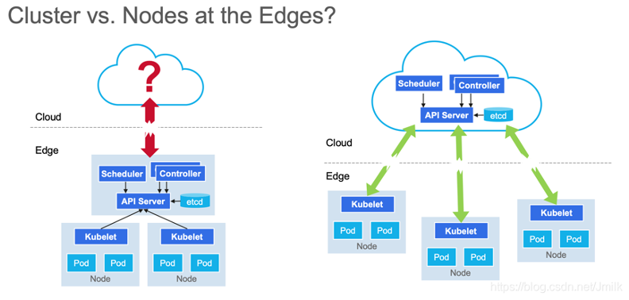

#### 1.2.1 MEC-边缘云


- 集群形态：存在多个边缘云集群，各集群自包含
- 边缘应用实例化入口：MEAO，Multi-Cluster 编排
- 需求侧重：面向 5G 需求
- 成本：高
- 数据安全：重视隐私安全

#### 1.2.2 云边缘


- 集群形态：只存在一个集群，云端运行一个中心的 Master，边端运行多个 Edge Node 接入到同一个 Master
- 边缘应用实例化入口：中心 Master，Multi-Node 编排
- 需求侧重：面向 CDN、IoT 等互联网需求
- 成本：低
- 数据安全：数据不安全

云边缘是中心云服务在边缘侧的延伸，逻辑上仍是中心云服务的一部分，边缘侧需要与中心云服务紧密协同。如：

- 华为云 KubeEdge
- 阿里云 OpenYurt
- 腾讯云 SuperEdge

核心述求：

- 将边缘计算视为云计算的延伸
- 聚焦于混合云场景，通过云上的软件堆栈吞噬边缘市场。

技术体系：

- 云边缘、云边协同架构
- 将计算节点下沉到边缘

### 1.3 边缘解决方案遇到的问题

#### 1.3.1 缺少现象级边缘应用

本质上是：5G 基础硬件技术领先与应用技术落后之间的矛盾

- 适配高速移动工业物联网的应用技术栈尚未成型
- 5G 微秒延迟与下沉 UPF 毫秒延迟
- 边缘云游戏只有在大屏渲染时才有优势，商业模式尚待验证
- AI 应用还局限于模式识别一隅，且模型优化是艺术不是工程
- AR / VR 待突破物理硬件设备的局限性
- 物联网智慧场馆限于 to B，技术栈复用曲线陡峭
- 数字人 / 元宇宙还是概念股

#### 1.3.2 边缘云需要支持异构硬件

- VM vs Pod
- CPU：ARM / X86 / RISC-V / Loogson ...
- OS：CentOS / OpenEula / 麒麟
- GPU
- SRIOV / DPDK
- RT Kernel
- 存储
- 统一管理 vs Offline 可用

#### 1.3.3 K8S 用于边缘

[K8S 架构](https://kubernetes.io/docs/concepts/overview/what-is-kubernetes/)

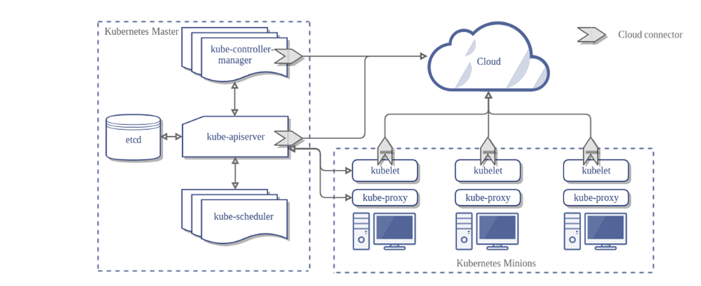

- [Demo: 十分钟部署 K8S](class-01-Kubernetes-Administration.md#27-实验k8s-的部署)
- [K8S 解决什么问题？](class-01-Kubernetes-Administration.md#22-k8s-是为了解决什么问题)
- [K8S 不解决什么问题？](class-01-Kubernetes-Administration.md#23-k8s-不解决什么问题)

[Kata 解决方案](https://katacontainers.io/)


[KubeVirt](https://kubevirt.io/)

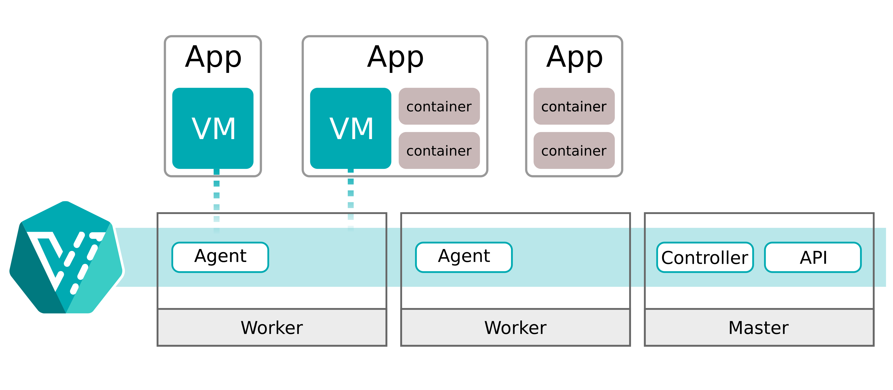


## 2. K3S 解决方案

### 2.1 K3S 基本概念

#### 2.1.1 什么 K3S

K3S 参考文档

- [Kubernetes 官网](https://kubernetes.io/zh)
- [Kubernetes 官方文档](https://kubernetes.io/zh/docs/home)

Kubernetes 集群在管理大规模服务上有极佳的运维自动化优势（自愈 / 扩缩容 / 负载均衡 / 服务注册和服务发现 / 部署），但也需要耗费相对较多的资源，许多功能对特定对特定场景来说是冗余的，K3S 作为一个轻量级的 Kubernetes 发行版应运而生，它针对边缘计算、物联网等场景进行了高度优化。

K3s 有以下增强功能：

- 打包为单个二进制文件。
- 使用基于 sqlite3 的轻量级存储后端作为默认存储机制。同时支持使用 etcd3、MySQL 和 PostgreSQL 作为存储机制。
- 封装在简单的启动程序中，通过该启动程序处理很多复杂的 TLS 和选项。
- 默认情况下是安全的，对轻量级环境有合理的默认值。
- 添加了简单但功能强大的 batteries-included 功能，例如：本地存储提供程序，服务负载均衡器，Helm controller 和 Traefik Ingress controller。
- 所有 Kubernetes control-plane 组件的操作都封装在单个二进制文件和进程中，使 K3s 具有自动化和管理包括证书分发在内的复杂集群操作的能力。
- 最大程度减轻了外部依赖性，K3s 仅需要 kernel 和 cgroup 挂载。 K3s 软件包需要的依赖项包括：
  - containerd
  - Flannel
  - CoreDNS
  - CNI
  - 主机实用程序（iptables、socat 等）
  - Ingress controller（Traefik）
  - 嵌入式服务负载均衡器（service load balancer）
  - 嵌入式网络策略控制器（network policy controller）

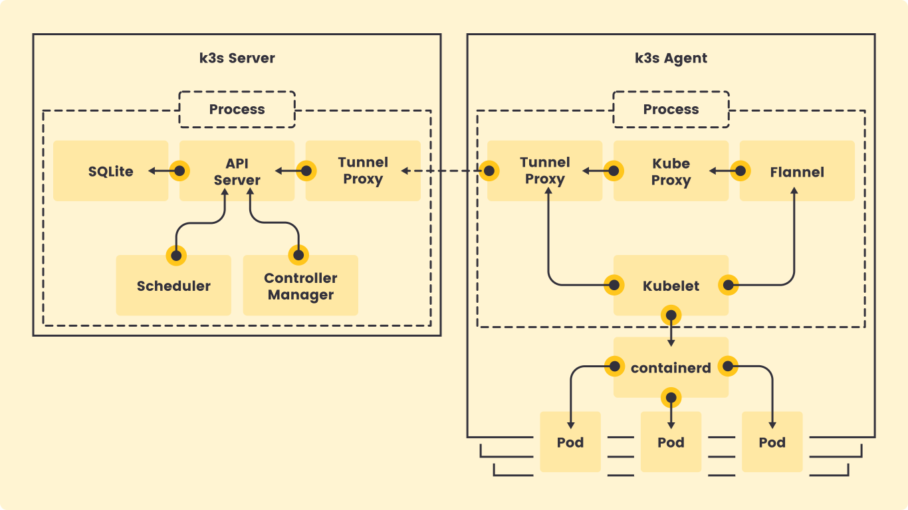

K3S 适用于：

- 边缘计算-Edge / 物联网-IoT / 嵌入式 K8S
- CI / DevOps

### 2.2 K3S 的部署

#### 2.2.1 单节点架构


K3s 单节点集群的架构如下图所示，该集群有一个**内嵌 SQLite** 数据库的单节点 **K3s server**。

在这种配置中，每个 **agent** 节点都注册到**同一个** server 节点。K3s 用户可以通过调用 server 节点上的 K3s API 来操作 Kubernetes 资源。外部流量则通过 Traeffic 导入，且经过 loadBalance 进行负载均衡。

#### 2.2.2 部署准备

参阅 [K3S 官网配置改动](https://docs.rancher.cn/docs/k3s/installation/installation-requirements/_index)

#### 2.2.3 单节点部署

| 节点           | CPU    | 内存  | 磁盘   | 数量 | os        |
| ------------ | ------ | --- | ---- | -- | --------- |
| server/agent | >2Core | >1G | >10G | 1  | centos7.x |

k3s 默认使用 containerd 作为 cri，我们这里使用更为熟悉的 docker 作为集群 cri，我们先安装 docker

```bash
yum install -y yum-utils
yum-config-manager --add-repo http://mirrors.aliyun.com/docker-ce/linux/centos/docker-ce.repo
yum makecache fast
yum install docker-ce-19.03.9 -y
mkdir -p /etc/docker
echo '{"registry-mirrors": ["http://hub-mirror.c.163.com"]}'>/etc/docker/daemon.json
systemctl enable --now docker
```

部署脚本安装

``` bash
# curl -sfL https://get.k3s.io | INSTALL_K3S_EXEC="--docker" sh -
# 受限国内网络，大多数时候上述脚本无法安装，建议采用下述国内加速安装脚本
curl -sfL http://rancher-mirror.cnrancher.com/k3s/k3s-install.sh | INSTALL_K3S_MIRROR=cn INSTALL_K3S_EXEC="--docker" sh -
```

输出下述日志，即部署完成

```log
...
[INFO]  Creating /usr/local/bin/kubectl symlink to k3s
[INFO]  Creating /usr/local/bin/crictl symlink to k3s
[INFO]  Skipping /usr/local/bin/ctr symlink to k3s, command exists in PATH at /usr/bin/ctr
[INFO]  Creating killall script /usr/local/bin/k3s-killall.sh
[INFO]  Creating uninstall script /usr/local/bin/k3s-uninstall.sh
[INFO]  env: Creating environment file /etc/systemd/system/k3s.service.env
[INFO]  systemd: Creating service file /etc/systemd/system/k3s.service
[INFO]  systemd: Enabling k3s unit
[INFO]  systemd: Starting k3s
```

查看 pod 是否正常即可

```console
$ kubectl get po -A
NAMESPACE     NAME                                      READY   STATUS      RESTARTS   AGE
kube-system   helm-install-traefik-crd-j4bwn            0/1     Completed   0          2m10s
kube-system   helm-install-traefik-sxnmw                0/1     Completed   0          2m10s
kube-system   metrics-server-86cbb8457f-47kzz           1/1     Running     0          2m10s
kube-system   local-path-provisioner-5ff76fc89d-7bzjd   1/1     Running     0          2m10s
kube-system   coredns-7448499f4d-cjph9                  1/1     Running     0          2m10s
kube-system   svclb-traefik-8q77r                       2/2     Running     0          83s
kube-system   traefik-97b44b794-gb72h                   1/1     Running     0          83s

# 集群基础使用
# 我们来创建一个 deployment 的 pod
$ kubectl create deployment nginx --image=nginx
$ kubectl get po
NAME                     READY   STATUS    RESTARTS   AGE
nginx-6799fc88d8-pc4wz   1/1     Running   0          101s
```

网络选项

```console
# 修改 CNI 网络模式
# 默认情况下，K3s 将以 flannel 作为 CNI 运行，使用 VXLAN 作为默认后端。如需修改 CNI 的模式，可以参考下述命令安装
# --flannel-backend=vxlan   (默认) 使用 VXLAN 后端。
# --flannel-backend=ipsec	使用 IPSEC 后端，对网络流量进行加密。
# --flannel-backend=host-gw	使用 host-gw 后端。
# --flannel-backend=wireguard	使用 WireGuard 后端，对网络流量进行加密。可能需要额外的内核模块和配置。
$ curl -sfL http://rancher-mirror.cnrancher.com/k3s/k3s-install.sh | INSTALL_K3S_MIRROR=cn INSTALL_K3S_EXEC="--docker --flannel-backend=vxlan" sh -

# 查看对应的 linux 网络设备是否生成
$ ip a | grep flannel

31: flannel.1: <BROADCAST,MULTICAST,UP,LOWER_UP> mtu 1450 qdisc noqueue state UNKNOWN group default 
    inet 10.42.0.0/32 scope global flannel.1

# 替换 CNI
# K3S 除了支持 flannel，还支持 calico\canel 等 CNI 组件
# 我们使用 calico 作为网络组件

# 注：下述 10.96.0.0/16 不能跟实际网络冲突
curl -sfL http://rancher-mirror.cnrancher.com/k3s/k3s-install.sh | INSTALL_K3S_MIRROR=cn K3S_KUBECONFIG_MODE="644" INSTALL_K3S_EXEC="--flannel-backend=none --cluster-cidr=10.96.0.0/16 --disable-network-policy --disable=traefik" sh -

# 下载 calico.yaml
$ wget https://docs.projectcalico.org/manifests/calico.yaml
# 修改 calico.yaml 中被注释掉的参数 CALICO_IPV4POOL_CIDR
- name: CALICO_IPV4POOL_CIDR
  value: "10.96.0.0/16"

# apply calico
kubectl apply -f calico.yaml

# 查看集群 pod
$ kubectl get po -A
NAMESPACE     NAME                                       READY   STATUS    RESTARTS   AGE
kube-system   calico-node-6cv7v                          1/1     Running   0          3m30s
kube-system   local-path-provisioner-5ff76fc89d-sqdts    1/1     Running   0          33m
kube-system   calico-kube-controllers-74b8fbdb46-mdwjm   1/1     Running   0          3m30s
kube-system   metrics-server-86cbb8457f-5xgrs            1/1     Running   0          33m
kube-system   coredns-7448499f4d-mwtmw                   1/1     Running   0          33m
```

K3S 卸载

```console
# 要从 server 节点卸载 K3s
$ /usr/local/bin/k3s-uninstall.sh

# 要从 agent 节点卸载 K3s
$ /usr/local/bin/k3s-agent-uninstall.sh
```

### 2.3 从中心到边缘的纳管

#### 2.3.1 rancher 管理边缘整体架构

在实际边缘生成应用中，我们边缘环境可能分布着多个 k3s 集群，当集群数量过多时，后续的运维管理会变得非常的不方便。为了解决这样的问题，下面我们通过云端中心的 rancher 去纳管边缘的多个 k3s

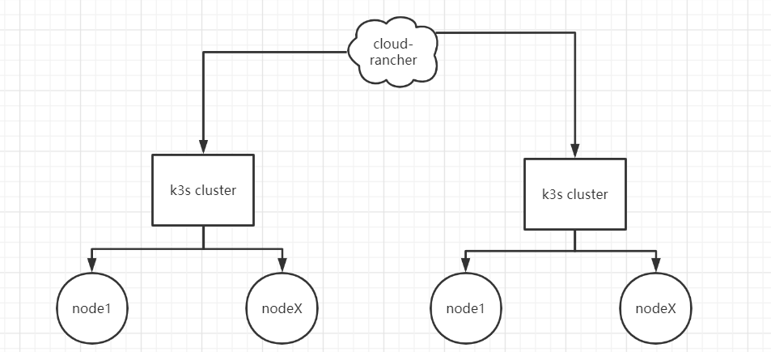

#### 2.3.2 节点环境

| 节点角色    | CPU    | 内存  | 磁盘   | 数量 | os        |
| ------- | ------ | --- | ---- | -- | --------- |
| rancher | >2Core | >4G | >10G | 1  | centos7.x |
| k3s     | >2Core | >2G | >10G | n  | centos7.x |

### 2.3.3 部署 K3S 和 rancher

[部署 K3S](#223-单节点部署)

部署 rancher 服务

```console
$ docker run -d --restart=unless-stopped -p 1234:80 -p 2234:443 rancher/rancher:v2.3.6
```

### 2.3.4 纳管 k3s

通过浏览器访问 https://{rancher_ip}:2234/


复制上图中的命令，到 k3s 端运行

```bash
sudo docker run -d --privileged --restart=unless-stopped --net=host -v /etc/kubernetes:/etc/kubernetes -v /var/run:/var/run rancher/rancher-agent:v2.3.6 --server https://172.20.149.95:2234 --token ndhsgr9msksr4s6g6xqq6dl8cns42txlkxt96tsdwcl56hds568nbb --ca-checksum 5b778f411871d7caca521a0cf25cd40d8a7e28aeb1def47af829e22092c114cd --etcd --controlplane --worker
```

最后通过界面我们能看到 rancher 完成了对 k3s 集群的纳管

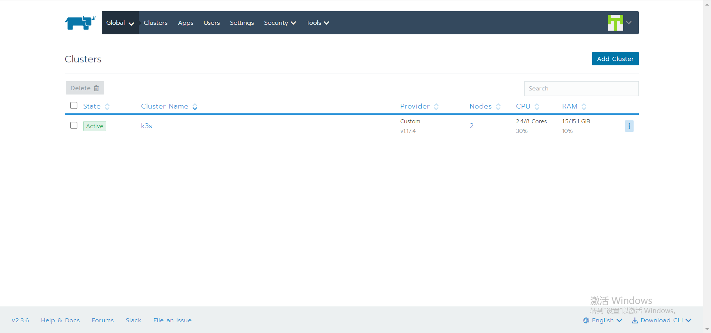

同样，后续的其余 k3s 也是用这个方式去纳管，就完成中心端对边缘端集群的管理。

### 2.4 K3S 用于 CI/CD

K3S 相对 K8S 具备轻量，消耗资源少等特点，我们根据这一特性，解析一个 cicd 的案例

#### 2.4.1 部署

[部署 K3S](#223-单节点部署)

```bash
curl -sfL http://rancher-mirror.cnrancher.com/k3s/k3s-install.sh | INSTALL_K3S_EXEC="--docker --no-deploy=traefik --kube-apiserver-arg=feature-gates=RemoveSelfLink=false"  INSTALL_K3S_MIRROR=cn sh -
# --no-deploy=traefik 默认自带了 traefik，不部署 traefik
# --kube-apiserver-arg=feature-gates=RemoveSelfLink=false 开启 nfs 存储，k8s 1.20 后如果要使用 nfs 需要开启
```

部署 nfs

```bash
$ yum install nfs-utils -y
$ mkdir -p /nfs/data
$ chmod -R 777 /nfs/data

# 若挂载磁盘的话执行:
# mkfs.xfs /dev/sdb
# mount /dev/sdb /nfs/data
# echo "/dev/sdb /nfs/data xfs defaults 0 0" >> /etc/fstab

echo "/nfs/data *(rw,no_root_squash,sync)" > /etc/exports
exportfs -r
systemctl enable nfs --now

kubectl apply -f nfs.yaml

# nfs yaml 见附录 'nfs.yaml'
```

#### 2.4.2 registry

```bash
# docker 方式启动
docker run -d -v /opt/registry:/var/lib/registry -p 32500:5000 --restart=always --name registry registry:2

# 或者如果想部署到 k3s 集群中，可以通过 yaml 部署，yaml 见附录 'registry.yaml'
kubectl apply -f registry.yaml
```

#### 2.4.3 部署 gogs

```bash
# 类似 gitlab 的代码仓库服务，略
```

#### 2.4.4 部署 drone

```bash
docker run --volume=/var/lib/drone:/data  --env=DRONE_GITLAB_SERVER=http://172.20.150.68:7080 --env=DRONE_LOGS_DEBUG=true --env=DRONE_GITLAB_CLIENT_ID=20f917a5c2395b40dabedd15b6acce3873770147c5fab4f4f7e188ec82cc3deb --env=DRONE_GITLAB_CLIENT_SECRET=da058f3d20ee00ab1bb14855c23610b98c682371dc215035fc35e1ace49c43d3 --env=DRONE_RPC_SECRET=4eb19c760068ea230837e2acfb98bf47 --env=DRONE_SERVER_HOST=172.20.150.68 --env=DRONE_SERVER_PROTO=http --publish=9999:80 --publish=3333:443 --restart=always --detach=true --name=drone drone/drone:2

# 部署 drone runner
docker run -d -v /var/run/docker.sock:/var/run/docker.sock -e DRONE_RPC_PROTO=http -e DRONE_RPC_HOST=172.20.150.68:9999 -e DRONE_RPC_SECRET=4eb19c760068ea230837e2acfb98bf47 -e DRONE_RUNNER_CAPACITY=2 -e DRONE_RUNNER_NAME=172.20.150.103 -p 3000:3000 --restart always --name runner drone/drone-runner-docker:1
```

#### 2.4.5 编写自动化 .drone.yml

```console
# 类似 jenkins pipline 脚本，略
```

#### 2.4.6 附录 YAML

nfs.yaml

```yaml
# 修改 yaml 中 ${NODE_IP} 为实际环境的 ip
---
apiVersion: v1
kind: ServiceAccount
metadata:
  name: nfs-client-provisioner
  # replace with namespace where provisioner is deployed
  namespace: default
---
kind: ClusterRole
apiVersion: rbac.authorization.k8s.io/v1
metadata:
  name: nfs-client-provisioner-runner
rules:
  - apiGroups: [""]
    resources: ["persistentvolumes"]
    verbs: ["get", "list", "watch", "create", "delete"]
  - apiGroups: [""]
    resources: ["persistentvolumeclaims"]
    verbs: ["get", "list", "watch", "update"]
  - apiGroups: ["storage.k8s.io"]
    resources: ["storageclasses"]
    verbs: ["get", "list", "watch"]
  - apiGroups: [""]
    resources: ["events"]
    verbs: ["create", "update", "patch"]
---
kind: ClusterRoleBinding
apiVersion: rbac.authorization.k8s.io/v1
metadata:
  name: run-nfs-client-provisioner
subjects:
  - kind: ServiceAccount
    name: nfs-client-provisioner
    # replace with namespace where provisioner is deployed
    namespace: default
roleRef:
  kind: ClusterRole
  name: nfs-client-provisioner-runner
  apiGroup: rbac.authorization.k8s.io
---
kind: Role
apiVersion: rbac.authorization.k8s.io/v1
metadata:
  name: leader-locking-nfs-client-provisioner
  # replace with namespace where provisioner is deployed
  namespace: default
rules:
  - apiGroups: [""]
    resources: ["endpoints"]
    verbs: ["get", "list", "watch", "create", "update", "patch"]
---
kind: RoleBinding
apiVersion: rbac.authorization.k8s.io/v1
metadata:
  name: leader-locking-nfs-client-provisioner
  # replace with namespace where provisioner is deployed
  namespace: default
subjects:
  - kind: ServiceAccount
    name: nfs-client-provisioner
    # replace with namespace where provisioner is deployed
    namespace: default
roleRef:
  kind: Role
  name: leader-locking-nfs-client-provisioner
  apiGroup: rbac.authorization.k8s.io
---
apiVersion: apps/v1
kind: Deployment
metadata:
  name: nfs-client-provisioner
  labels:
    app: nfs-client-provisioner
  namespace: default
spec:
  replicas: 1
  selector:
    matchLabels:
      app: nfs-client-provisioner
  strategy:
    type: Recreate
  selector:
    matchLabels:
      app: nfs-client-provisioner
  template:
    metadata:
      labels:
        app: nfs-client-provisioner
    spec:
      serviceAccountName: nfs-client-provisioner
      containers:
        - name: nfs-client-provisioner
          image: quay.io/external_storage/nfs-client-provisioner:latest
          volumeMounts:
            - name: nfs-client-root
              mountPath: /persistentvolumes
          env:
            - name: PROVISIONER_NAME
              value: fuseim.pri/ifs
            - name: NFS_SERVER
              value: ${NODE_IP}
            - name: NFS_PATH
              value: /nfs/data
      volumes:
        - name: nfs-client-root
          nfs:
            server: ${NODE_IP}
            path: /nfs/data
---
apiVersion: storage.k8s.io/v1
kind: StorageClass
metadata:
  name: nfs
provisioner: fuseim.pri/ifs
parameters:
  archiveOnDelete: "false"
reclaimPolicy: Delete
```

registry.yaml

```yaml
apiVersion: apps/v1
kind: Deployment
metadata:
  name: registry
spec:
  replicas: 1
  selector:
    matchLabels:
      app: registry
  template:
    metadata:
      labels:
        app: registry
    spec:
      containers:
      - name: registry
        image: registry:2
        ports:
        - containerPort: 80
        volumeMounts:
        - name: registry-pvc
          mountPath: "/var/lib/registry"
      volumes:
        - name: registry-pvc
          persistentVolumeClaim:
            claimName: registry-pvc
---
apiVersion: v1
kind: Service
metadata:
  name: registry
  labels:
    app: registry
spec:
  type: NodePort
  ports:
    - name: http
      port: 5000
      targetPort: 5000
      protocol: TCP
      nodePort: 32500
  selector:
    app: registry
---
apiVersion: v1
kind: PersistentVolumeClaim
metadata:
  name: registry-pvc
spec:
  storageClassName: "nfs"
  accessModes:
    - ReadWriteMany
  resources:
    requests:
      storage: 10Gi
```

### 2.5 K3S 高可用方案

#### 2.5.1 高可用架构


一个高可用 K3s 集群由以下几个部分组成：

- **K3s Server 节点**：两个或更多的 server 节点将为 Kubernetes API 提供服务并运行其他 control-plane 服务
- **外部数据库**：与单节点 k3s 设置中使用的嵌入式
SQLite 数据存储相反，高可用 K3s 需要**挂载一个external database 外部数据库**作为数据存储的媒介。

**固定 agent 节点的注册地址**

在高可用 K3s server 配置中，每个节点还必须使用固定的注册地址向 **Kubernetes API** 注册，注册后，agent 节点直接与其中一个 server 节点建立连接，如下图所示：


#### 2.5.2 高可用部署配置

先决条件：节点不能有相同的主机名

| 节点角色   | CPU    | 内存  | 磁盘   | 数量 | os        |
| ------ | ------ | --- | ---- | -- | --------- |
| server | >2Core | >4G | >10G | >3 | centos7.x |
| agent  | >2Core | >2G | >10G | >3 | centos7.x |

#### 2.5.3 外部数据库 etcd 部署

部署外部数据库 etcd。K3S 支持多种外部数据库，这里我们选用 etcd 数据库，为方便搭建，我们这里搭建的 etcd 集群为非 TLS 访问方式
更多详情内容参阅 [K3S 外部数据库配置](https://docs.rancher.cn/docs/k3s/installation/ha/_index) 和 [etcd 官方文档](https://etcd.io)

```bash
# 所有节点均部署 docker，与上述单节点部署过程一样，不再赘述
# etcd 高可用部署
# 三台 master 节点上均执行下述的 etcd 操作流程

wget https://github.com/etcd-io/etcd/releases/download/v3.3.15/etcd-v3.3.15-linux-amd64.tar.gz $
tar -vxf etcd-v3.3.15-linux-amd64.tar.gz $ cp etcd-v3.3.15-linux-amd64/etcd /usr/bin/ $ cp
etcd-v3.3.15-linux-amd64/etcdctl /usr/bin/

# etcd 采用 systemd 托管服务

vi /etc/systemd/system/etcd.service

# 填入 etcd 配置，保存退出。（etcd.service 配置见附录）
```

```console
$ systemct start etcd $ systemct status etcd ● etcd.service - etcd Loaded: loaded
(/etc/systemd/system/etcd.service; disabled; vendor preset: disabled) Active: active (running) since
Sun 2021-10-03 18:19:52 CST; 10s ago Docs: https://github.com/etcd-io/etcd

$ etcdctl member list member 763586516b512018 is healthy: got healthy result from
http://{etcd1-ip}:2379 member 78bb25a565876d17 is healthy: got healthy result from
http://{etcd2-ip}:2379 member da51b2723088b522 is healthy: got healthy result from
http://{etcd3-ip}:2379
```

注：后续如果重装 k3s 集群，请先停止所有 etcd 服务，并清理所有 etcd 节点的数据，最后重启 etcd 即可

```bash
systemctl stop etcd
rm -rf /var/lib/etcd
systemctl restart etcd
```

#### 2.5.4 server HA

下述命令中的 INSTALL_K3S_MIRROR,K3S_DATASTORE_ENDPOINT, K3S_TOKEN... 等可以作为环境变量，如 export K3S_TOKEN="k3s_token"

```console
$ curl -sfL http://rancher-mirror.cnrancher.com/k3s/k3s-install.sh | INSTALL_K3S_MIRROR=cn K3S_DATASTORE_ENDPOINT='http://{etcd1-ip}:2379,http://{etcd2-ip}:2379,http://{etcd3-ip}:2379' K3S_TOKEN="k3s_token" INSTALL_K3S_VERSION=v1.18.6+k3s1 INSTALL_K3S_EXEC="--docker" sh -s - server
[INFO]  Creating /usr/local/bin/kubectl symlink to k3s
[INFO]  Creating /usr/local/bin/crictl symlink to k3s
[INFO]  Creating /usr/local/bin/ctr symlink to k3s
[INFO]  Creating killall script /usr/local/bin/k3s-killall.sh
[INFO]  Creating uninstall script /usr/local/bin/k3s-uninstall.sh
[INFO]  env: Creating environment file /etc/systemd/system/k3s.service.env
[INFO]  systemd: Creating service file /etc/systemd/system/k3s.service
[INFO]  systemd: Enabling k3s unit
[INFO]  systemd: Starting k3s

$ kubectl get no
NAME         STATUS   ROLES                  AGE     VERSION
caasnode-1   Ready    control-plane,master   2m58s   v1.21.4+k3s1
caasnode-2   Ready    control-plane,master   78s     v1.21.4+k3s1
caasnode-3   Ready    control-plane,master   82s     v1.21.4+k3s1
````

#### 2.5.5 加入 agent

在所有 agent 节点中执行 master-ip 可以是多个 master 间共用的 vip 或者第一个 master 的 ip。

下述命令中的 INSTALL_K3S_MIRROR,K3S_DATASTORE_ENDPOINT, K3S_TOKEN... 等可以作为环境变量，如 export K3S_TOKEN="k3s_token"

```console
$ curl -sfL http://rancher-mirror.cnrancher.com/k3s/k3s-install.sh | INSTALL_K3S_MIRROR=cn K3S_TOKEN="k3s_token" K3S_URL=https://{master-ip}:6443 INSTALL_K3S_VERSION=v1.18.6+k3s1 INSTALL_K3S_EXEC="--docker" sh -
[INFO]  Creating /usr/local/bin/kubectl symlink to k3s
[INFO]  Creating /usr/local/bin/crictl symlink to k3s
[INFO]  Skipping /usr/local/bin/ctr symlink to k3s, command exists in PATH at /usr/bin/ctr
[INFO]  Creating killall script /usr/local/bin/k3s-killall.sh
[INFO]  Creating uninstall script /usr/local/bin/k3s-agent-uninstall.sh
[INFO]  env: Creating environment file /etc/systemd/system/k3s-agent.service.env
[INFO]  systemd: Creating service file /etc/systemd/system/k3s-agent.service
[INFO]  systemd: Enabling k3s-agent unit
[INFO]  systemd: Starting k3s-agent

$ kubectl get no
caasbastion-3   Ready    <none>                 3m20s   v1.21.4+k3s1
caasbastion-2   Ready    <none>                 2m49s   v1.21.4+k3s1
caasbastion-1   Ready    <none>                 2m27s   v1.21.4+k3s1
caasnode-1      Ready    control-plane,master   21m     v1.21.4+k3s1
caasnode-2      Ready    control-plane,master   19m     v1.21.4+k3s1
caasnode-3      Ready    control-plane,master   19m     v1.21.4+k3s1
```

#### 2.5.6 K3S 卸载

```console
# 要从 server 节点卸载 K3s
$ /usr/local/bin/k3s-uninstall.sh

# 要从 agent 节点卸载 K3s
$ /usr/local/bin/k3s-agent-uninstall.sh

# 如需重新部署，需要清理 etcd 的 data 目录，文档默认为 '/var/lib/etcd'
```

#### 2.5.7 附录

etcd.service

```console
# /etc/systemd/system/etcd.service
# etcd-ip: 本机 ip
# etcd1-ip: 本机 ip
# etcd2-ip: 第二台节点 ip
# etcd3-ip: 第三台节点 ip
[Unit]
Description=etcd
Documentation=https://github.com/etcd-io/etcd
After=network-online.target

[Service]
Type=notify
Restart=on-failure
RestartSec=5s
TimeoutStartSec=0
ExecStart=/usr/bin/etcd --name etcd1 \
--heartbeat-interval 300 \
--election-timeout 1500 \
--initial-advertise-peer-urls http://{etcd-ip}:2380 \
--listen-peer-urls http://{etcd-ip}:2380 \
--listen-client-urls http://{etcd-ip}:2379,http://127.0.0.1:2379 \
--advertise-client-urls http://{etcd-ip}:2379 \
--data-dir /var/lib/etcd \
--initial-cluster etcd1=http://{etcd1-ip}:2380,etcd2=http://{etcd2-ip}:2380,etcd3=http://{etcd3-ip}:2380 \
--initial-cluster-token etcd-cluster \
--initial-cluster-state new \
--auto-compaction-retention=1 \
--snapshot-count=5000  \
--quota-backend-bytes=171798691840 \
--heartbeat-interval=100 \
--election-timeout=500
ExecReload=/bin/kill -HUP
KillMode=process

[Install]
WantedBy=multi-user.target
```

## 3. KubeEdge 解决方案

### 3.1 KubeEdge 基本概念

文档部分内容节选自 [KubeEdge 官网](https://kubeedge.io/zh/docs)，更多详细内容可参阅
[KubeEdge 官方文档](https://kubeedge.io/zh/docs/_index_zh/)

#### 3.1.1 什么是 KubeEdge

KubeEdge 是一个开源系统，将原生的容器化应用程序编排功能扩展到边缘节点。可将本机容器化应用编排和管理扩展到边缘端设备。

它基于 Kubernetes 构建，为网络和应用程序提供核心基础架构支持，并在云端和边缘端部署应用，同步元数据。KubeEdge 还支持 MQTT 协议，允许开发人员编写客户逻辑，并在边缘端启用设备通信的资源约束。KubeEdge 包含云端和边缘端两部分。

#### 3.1.2 KubeEdge 的优势

1. **边缘计算**

    通过在边缘端运行业务逻辑，可以在本地保护和处理大量数据。KubeEdge 减少了边和云之间的带宽请求，加快响应速度，并保护客户数据隐私。

2. **简化开发**

    开发人员可以编写常规的基于 http 或 mqtt 的应用程序，容器化并在边缘或云端任何地方运行。

3. **Kubernetes 原生支持**

    使用 KubeEdge 用户可以在边缘节点上编排应用、管理设备并监控应用程序/设备状态，就如同在云端操作 Kubernetes 集群一样。

4. **丰富的应用程序**

    用户可以轻松地将复杂的机器学习、图像识别、事件处理等高层应用程序部署到边缘端。

#### 3.1.3 依赖

在云端方面，我们需要：

- Kubernetes 集群

在边缘，我们需要：

- 容器运行时，现在我们支持：
  - Docker
  - Containerd
  - Cri-o
  - Virtlet
- MQTT服务器（可选）

### 3.2 KubeEdge 的架构

#### 3.2.1 KubeEdge 模块组成

KubeEdge 由以下组件构成:

**云上部分**

- **CloudHub**: CloudHub 是一个 Web Socket 服务端，负责监听云端的变化, 缓存并发送消息到 EdgeHub。
- **EdgeController**: EdgeController 是一个扩展的 Kubernetes 控制器，管理边缘节点和 Pods 的元数据确保数据能够传递到指定的边缘节点。
- **DeviceController**: DeviceController 是一个扩展的 Kubernetes 控制器，管理边缘设备，确保设备信息、设备状态的云边同步。

**边缘部分**

- **EdgeHub**: EdgeHub 是一个 Web Socket 客户端，负责与边缘计算的云服务（例如 KubeEdge 架构图中的 Edge
  Controller）交互，包括同步云端资源更新、报告边缘主机和设备状态变化到云端等功能。
- **Edged**: Edged 是运行在边缘节点的代理，用于管理容器化的应用程序。
- **EventBus**: EventBus 是一个与 MQTT 服务器（mosquitto）交互的 MQTT 客户端，为其他组件提供订阅和发布功能。
- **ServiceBus**:
  ServiceBus是一个运行在边缘的HTTP客户端，接受来自云上服务的请求，与运行在边缘端的HTTP服务器交互，提供了云上服务通过HTTP协议访问边缘端HTTP服务器的能力。
- **DeviceTwin**: DeviceTwin 负责存储设备状态并将设备状态同步到云，它还为应用程序提供查询接口。
- **MetaManager**: MetaManager 是消息处理器，位于 Edged 和 Edgehub 之间，它负责向轻量级数据库（SQLite）存储/检索元数据。

#### 3.2.2 KubeEdge 架构


### 3.3 KubeEdge 部署

**使用限制**

- keadm 目前支持 Ubuntu 和 CentOS OS。RaspberryPi 的支持正在进行中。
- 需要超级用户权限（或 root 权限）才能运行。

| 角色    | 环境                | CPU    | 内存  | 磁盘   | 数量 | os        |
| ----- | ----------------- | ------ | --- | ---- | -- | --------- |
| cloud | K8S(AIO/HA)1.18.6 | >4Core | >4G | >50G | 1  | centos7.x |
| edge  | dokcer19.03.9     | >1Core | >1G | >10G | n  | centos7.x |

#### 3.3.1 使用 Keadm 进行部署

Keadm 用于安装 KubeEdge 的云端和边缘端组件。**它不负责 K8s 的安装和运行**。所以在部署 KubeEdge Cloud 部分前需要预先搭建好一个 K8s 集群环境。[K8s 部署过程](class-01-Kubernetes-Administration.md#27-实验k8s-的部署)

下面介绍 Keadm 部署 KubeEdge。为方便说明，我们将 **cloud 端的 K8S 集群称为 cloud 端**，**边缘节点称为 edge 端**。且 cloud 端的所有操作在 K8S 集群的 **master** 节点上进行（该节点需具备 kubectl 和 kubeconfig）

使用 Keadm 部署 cloud 端

```bash
# 在 cloud 端下载 keadm
yum update -y
yum install wget -y
wget https://github.com/kubeedge/kubeedge/releases/download/v1.8.0/keadm-v1.8.0-linux-amd64.tar.gz 
tar -vxf keadm-v1.8.0-linux-amd64.tar.gz
cp keadm-v1.8.1-linux-amd64/keadm/keadm /usr/bin/

# 部署 cloud 端
# 部署过程比较简单，但是受限国内网络环境，大多数情况下仅靠该命令无法成功部署出来，我们需要额外做一些辅助线部署工作

mkdir -pv /etc/kubeedge
mkdir -pv /etc/kubeedge/crds
mkdir -pv /etc/kubeedge/crds/devices && /etc/kubeedge/crds/reliablesyncs && /etc/kubeedge/crds/router

wget -k --no-check-certificate https://github.com/kubeedge/kubeedge/releases/download/v1.8.0/kubeedge-v1.8.0-linux-amd64.tar.gz -O /etc/kubeedge/kubeedge-v1.8.0-linux-amd64.tar.gz
wget -k --no-check-certificate https://raw.githubusercontent.com/kubeedge/kubeedge/release-1.8/build/tools/cloudcore.service -O  /etc/kubeedge/cloudcore.service
wget -k --no-check-certificate https://raw.githubusercontent.com/kubeedge/kubeedge/release-1.8/build/crds/devices/devices_v1alpha2_device.yaml -O /etc/kubeedge/crds/devices/devices_v1alpha2_device.yaml
wget -k --no-check-certificate https://raw.githubusercontent.com/kubeedge/kubeedge/release-1.8/build/crds/reliablesyncs/devices_v1alpha2_devicemodel.yaml -O /etc/kubeedge/crds/devices/devices_v1alpha2_devicemodel.yaml
wget -k --no-check-certificate https://raw.githubusercontent.com/kubeedge/kubeedge/masrelease-1.8ter/build/crds/reliablesyncs/cluster_objectsync_v1alpha1.yaml -O /etc/kubeedge/crds/reliablesyncs/cluster_objectsync_v1alpha1.yaml
wget -k --no-check-certificate https://raw.githubusercontent.com/kubeedge/kubeedge/release-1.8/build/crds/reliablesyncs/objectsync_v1alpha1.yaml -O /etc/kubeedge/crds/reliablesyncs/objectsync_v1alpha1.yaml
wget -k --no-check-certificate https://raw.githubusercontent.com/kubeedge/kubeedge/release-1.8/build/crds/router/router_v1_ruleEndpoint.yaml -O /etc/kubeedge/crds/router/router_v1_ruleEndpoint.yaml
wget -k --no-check-certificate https://raw.githubusercontent.com/kubeedge/kubeedge/release-1.8/build/crds/router/router_v1_rule.yaml -O /etc/kubeedge/crds/router/router_v1_ruleEndpoint.yaml
```

```bash
# 部署 cloud 端
# THE-EXPOSED-IP 通常为 k8s master ip/vip
# 特别注意：部署过程中出现 'kubeedge-v1.8.0-linux-amd64.tar.gz in your path checksum failed and do you want to delete this file and try to download again? [y/N]:',输入 n 即可
```

```console
$ keadm init --advertise-address="THE-EXPOSED-IP"

Kubernetes version verification passed, KubeEdge installation will start...
Expected or Default KubeEdge version 1.8.0 is already downloaded and will checksum for it. 
kubeedge-v1.8.0-linux-amd64.tar.gz checksum: 
checksum_kubeedge-v1.8.0-linux-amd64.tar.gz.txt content: 
kubeedge-v1.8.0-linux-amd64.tar.gz in your path checksum failed and do you want to delete this file and try to download again? 
[y/N]: 
n
W1002 10:30:19.561552   65565 common.go:279] failed to checksum and will continue to install.
[Run as service] service file already exisits in /etc/kubeedge//cloudcore.service, skip download
kubeedge-v1.8.0-linux-amd64/
kubeedge-v1.8.0-linux-amd64/edge/
kubeedge-v1.8.0-linux-amd64/edge/edgecore
kubeedge-v1.8.0-linux-amd64/cloud/
kubeedge-v1.8.0-linux-amd64/cloud/csidriver/
kubeedge-v1.8.0-linux-amd64/cloud/csidriver/csidriver
kubeedge-v1.8.0-linux-amd64/cloud/admission/
kubeedge-v1.8.0-linux-amd64/cloud/admission/admission
kubeedge-v1.8.0-linux-amd64/cloud/cloudcore/
kubeedge-v1.8.0-linux-amd64/cloud/cloudcore/cloudcore
kubeedge-v1.8.0-linux-amd64/version

KubeEdge cloudcore is running, For logs visit:  /var/log/kubeedge/cloudcore.log
CloudCore started

# 查看 cloudcore 服务
$ ps aux | grep cloudcore
root      65819  0.6  1.3 900580 25600 pts/0    Sl   10:30   0:00 /usr/local/bin/cloudcore
root      65914  0.0  0.0 112812   972 pts/0    S+   10:30   0:00 grep --color=auto cloudcore
```

使用 Keadm 部署 edge 端

```bash
# 所有 edge 节点均执行下述操作

# 安装 dokcer
yum update -y
yum install -y yum-utils
yum-config-manager --add-repo http://mirrors.aliyun.com/docker-ce/linux/centos/docker-ce.repo
yum makecache fast
yum install docker-ce-19.03.9 -y
mkdir -p /etc/docker
echo '{"registry-mirrors": ["http://hub-mirror.c.163.com"]}'>/etc/docker/daemon.json
systemctl enable --now docker

# 在 edge 端下载 keadm
yum install wget -y
wget https://github.com/kubeedge/kubeedge/releases/download/v1.8.0/keadm-v1.8.0-linux-amd64.tar.gz 
tar -vxf keadm-v1.8.0-linux-amd64.tar.gz
cp keadm-v1.8.1-linux-amd64/keadm/keadm /usr/bin/

# 部署 edge 端
# THE-EXPOSED-IP 通常为 cloud 端 k8s master ip/vip
# TOKEN 通常在 cloud 端获取：keadm gettoken
# edge 端加入 cloud 端比较简单，同样受限国内网络环境，我们需要做一下辅助性工作

scp -r root@{THE-EXPOSED-IP}:/etc/kubeedge /etc/

keadm join --cloudcore-ipport={THE-EXPOSED-IP}:10000 --kubeedge-version=1.8.0 --token={TOKEN}

# 特别注意：部署过程中出现 'kubeedge-v1.8.0-linux-amd64.tar.gz in your path checksum failed and do you want to delete this file and try to download again? [y/N]:',输入 n 即可
```

```console
Host has mosquit+ already installed and running. Hence skipping the installation steps !!!
Expected or Default KubeEdge version 1.8.0 is already downloaded and will checksum for it. 
kubeedge-v1.8.0-linux-amd64.tar.gz checksum: 
checksum_kubeedge-v1.8.0-linux-amd64.tar.gz.txt content: 
kubeedge-v1.8.0-linux-amd64.tar.gz in your path checksum failed and do you want to delete this file and try to download again? 
[y/N]: 
n
W1002 10:56:18.457155   74140 common.go:279] failed to checksum and will continue to install.
[Run as service] service file already exisits in /etc/kubeedge//edgecore.service, skip download
kubeedge-v1.8.0-linux-amd64/
kubeedge-v1.8.0-linux-amd64/edge/
kubeedge-v1.8.0-linux-amd64/edge/edgecore
kubeedge-v1.8.0-linux-amd64/cloud/
kubeedge-v1.8.0-linux-amd64/cloud/csidriver/
kubeedge-v1.8.0-linux-amd64/cloud/csidriver/csidriver
kubeedge-v1.8.0-linux-amd64/cloud/admission/
kubeedge-v1.8.0-linux-amd64/cloud/admission/admission
kubeedge-v1.8.0-linux-amd64/cloud/cloudcore/
kubeedge-v1.8.0-linux-amd64/cloud/cloudcore/cloudcore
kubeedge-v1.8.0-linux-amd64/version

KubeEdge edgecore is running, For logs visit: journalctl -u edgecore.service -b

# 略微等待1分钟，我们回到 cloud 端进行查看 edge 是否成功加入
$ kubectl get no

NAME                    STATUS   ROLES        AGE   VERSION
localhost.localdomain   Ready    agent,edge   11h   v1.19.3-kubeedge-v1.8.0
master                  Ready    master       12h   v1.18.6
```

### 3.4 KubeEdge 边缘计算案例剖析

#### 3.4.1 用 Apache Beam 进行数据分析

Apache Beam是一个开源的、统一的模型，用于定义批处理和流数据并行处理管道。使用其中一个开源的 Beam SDK，我们可以建立一个定义管道的程序。


分析引擎的主要目的是以流的形式从 mqtt 代理处获得数据，并对传入的数据实时应用规则，在 mqtt 代理处产生警报/行动。通过管道获取数据和应用分析功能是通过使用 Apache Beam 完成的。

#### 3.4.2 为什么使用 Apache Beam 进行分析

有许多框架，如 Hadoop、Spark、Flink、Google Cloud
Dataflow 等用于流处理。但没有统一的 API 来绑定所有这些框架和数据源。我们需要从这些大数据框架中抽象出应用逻辑。Apache Beam 框架在您的应用逻辑和大数据生态系统之间提供了这种抽象。

- 基于数据流的通用模型用于构建抽象管道，可以在任何运行时（如 Flink/Samza 等）上运行。
- 同样的管道代码可以在云上执行（例如，基于 Apache Flink 的华为云流），也可以在边缘使用自定义的后端，可以在边缘集群中有效地安排工作负载并执行分布式分析。
- Apache Beam 与用于机器学习的 TensorFlow 整合得很好，这是边缘的一个关键用例。
- Beam 支持流处理和分析所需的大多数功能。

#### 3.4.3 Demo 实时警报：从 MQTT 读取批量数据，过滤并生成警报

- Apache Beam 中对批处理数据的基本 mqtt 读/写支持
- 从一个 MQTT 中读取数据
- 创建读取数据的 PC 集合，并将其作为管道的初始数据
- 对数据进行过滤
- 如果读数超过数值，在主题上发布一个警报


#### 3.4.4 Demo 过滤流数据。从 MQTT 读取流数据，定期过滤

- 使用 MQTT 读取流数据
- 在固定的时间间隔内对数据进行过滤


#### 3.4.5 部署流水线应用程序

先决条件

- Golang(版本: 1.14+)
- KubeEdge(版本: v1.5+)
- Docker(版本: 18.09-ce+)

```console
$ git clone https://github.com/kubeedge/examples && cd examples

# 拉取镜像
$ docker pull containerise/ke_apache_beam:ke_apache_analysis_v1.1
$ docker pull containerise/ke_apache_beam:ke_apache_analysis_v1.2

# 运行 deployment
$ kubectl apply -f examples/apache-beam-analysis/deployment.yaml

# 然后你可以使用下面的命令来检查应用程序是否正常运行。
$ kubectl get pods
```

#### 3.4.6 数据检验

```console
# 通过使用[testmachine](publisher/testmachine.go)发布假数据。添加以下供应商软件包。

$ go get -u github.com/yosssi/gmq/mqtt
$ go get -u github.com/yosssi/gmq/mqtt/client

$ go build testmachine.go
$ ./testmachine
```

### 3.5 CloudCore 原理和应用

我们通过前面的了解可以知道，KubeEdge Cloud Core 主要有三大模块组成：CloudHub、EdgeController 和 DeviceController，下面我们来分别介绍三个模块


#### 3.5.1 CloudHub

CloudHub 是 cloudcore 的一个模块，是 Controller 和 Edge 端之间的中转。它同时支持基于 websocket 的连接以及 QUIC 协议访问。Edgehub 可以选择一种协议来访问 cloudhub。CloudHub 的功能是启用边端与控制器之间的通信。

到边端的连接（通过 EdgeHub 模块）是通过 websocket 连接上的 HTTP 完成的。对于内部通讯，它直接与控制器通讯。发送到 CloudHub 的所有请求都是上下文对象，它们与标记为它的 nodeID 的事件对象的映射通道一起存储在 channelQ 中。

CloudHub 执行的主要功能是：

1. **获取消息上下文并为事件创建ChannelQ**

    上下文对象存储在 channelQ 中。对于所有 nodeID，将创建通道并将消息转换为事件对象，然后将事件对象通过通道传递。

2. **通过websocket创建http连接：**

    TLS 证书通过上下文对象中提供的路径加载, HTTP 服务器以 TLS 配置启动,然后将 HTTP 连接升级为接收 conn 对象的 websocket 连接。ServeConn 函数可服务所有传入连接

3. **从边端读取消息：**

    首先，为保持活动间隔设置最后期限, 然后读取来自连接的 JSON 消息, 设置完消息路由器详细信息之后, 然后将消息转换为事件对象以进行云内部通信, 最后，事件被发布给控制器

4. ** 将消息写到Edge：**

    首先，为给定的 nodeID 接收所有事件对象, 检查相同请求的存在和节点的活动性,事件对象转换为消息结构,设置写截止时间。然后消息传递到 websocket 连接

5. **向控制器发布消息：**

    每次向 Websocket 连接发出请求时，带有时间戳，clientID 和事件类型的默认消息都会发送到控制器, 如果节点断开连接，则会引发错误，并将描述节点故障的事件发布到控制器。

CloudHub 消息可靠性

- CloudHub 作为 Controller 和 Edge端之间的中介。它负责下行分发消息(其内封装了 k8s 资源事件，如 pod update 等)，也负责接收并发送边缘节点上行消息至 controllers。其中下行的消息在应用层增强了传输的可靠性，以应对云边的弱网络环境。
- 到边缘的连接（通过 EdgeHub 模块）是通过可选的 websocket/quic 连接完成的。对于 Cloudcore 内部通信，Cloudhub 直接与 Controller 通讯。Controller 发送到 CloudHub 的所有请求，与用于存储这个边缘节点的事件对象的通道一起存储在 channelq 中。
- 如果是 message 类型，则表示 EdgeController 和 devicecontroller 需要同步到边端的消息。这时需要 Cloudhub 和Edgehub作消息通信。但考虑到云与边缘之间的不稳定网络会导致边缘节点频繁断开连接。如果 cloudcore 或 edgecore 重启或离线一段时间，可能会导致发送到边缘节点的消息丢失，而这些消息在没有消息可靠性前是无法到达的。如果没有将新事件成功发送到边缘，这将导致云和边缘之间的不一致。所以云边通信需要一个可靠的消息传输机制。它需要覆盖以下几种情况：
    1. 如果 cloudcore 重新启动或离线一段时间，则每当 cloudcore 重新上线时，将最新事件发送到边缘节点（如果有任何更新要发送）。
    2. 如果edgenode重新启动或离线一段时间，无论何时该节点上线时，cloudcore 都会发送最新事件以使其保持最新状态。

CloudHub 消息可靠机制：有三种类型的消息传递机制

1. 最多一次 At-Most-Once
2. 恰好一次 Exactly-Once
3. 至少一次 At-Least-Once

第一种方法“At-Most-Once”是不可靠的，第二种方法“Exactly-Once”代价非常高，虽然它提供了可靠的消息传递，没有消息丢失或重复的现象，但是性能比第三种差很多。

由于 KubeEdge 遵循 Kubernetes 最终的一致性设计原则，因此，只要消息是最新消息，边缘节点重复接收相同消息不是问题。因此，KubeEdge 采用 At-Least-Once 建议。

下面显示的是消息从云传递到边缘的具体流程。


1. KubeEdge 使用 K8s CRD 存储已成功发送到 Edge 的资源的最新 resourceVersion。当 cloudcore 重新启动或正常启动时，它将检查 resourceVersion 以避免发送旧消息。
2. EdgeController 和 devicecontroller 将消息发送到 Cloudhub，MessageDispatcher 将根据消息中的节点名称将消息发送到相应的 NodeMessageQueue。
3. CloudHub 将顺序地将数据从 NodeMessageQueue 发送到相应的边缘节点 [5]，并将消息 ID 存储在 ACK 通道中 [4]。当收到来自边缘节点的 ACK 消息时，ACK 通道将触发以将消息 resourceVersion 作为 CRD 保存到 K8s[11]，并发送下一条消息。
4. 当 Edgecore 收到消息时，它将首先将消息保存到本地数据存储中，然后将ACK消息返回到云中。如果 cloudhub 在此间隔内未收到  ACK消息，它将继续重新发送该消息 5 次。如果所有 5 次重试均失败，cloudhub 将丢弃该事件。
5. SyncController 将处理这些失败的事件。即使边缘节点接收到该消息，返回的ACK消息也可能在传输过程中丢失。在这种情况下，cloudhub 将再次发送消息，并且边缘可以处理重复的消息。

#### 3.5.2 EdgeController

我们知道 EdgeController 是一个扩展的 Kubernetes 控制器，管理边缘节点和 Pods 的元数据确保数据能够传递到指定的边缘节点。

EdgeController 结构图


upstream 处理上行数据（与原生 k8s 中 kubelet 上报自身信息一致，这里主要上报边缘节点 node 状态和 pod 状态）；downstream 处理下行数据。云边协同采用的是在 websocket 之上封装了一层消息，而且不会全量的同步数据，只会同步和本节点最相关最需要的数据，边缘节点故障重启后也不会 re-list，因为边缘采用了持久化存储，直接从本地恢复。本地数据怎么实时保持最新？就是通过 downstream 不断从云上发生变更的相关数据往边缘去同步。


系统起来的时候，CloudCore 里面的 EdgeController 会 watch 很多资源，对于 pod 来说，它会 watch 所有 pod，但它里面会有一个过滤，但是过滤不会反映在 list-watch 上，只在内部做下发的时候处理。

1. CloudCore 收到 pod 变更通知后，会在内部循环中做条件的判断，看pod 中的 nodeName 字段是不是在它所管理的边缘节点范围。如果是，它会做一个事件的封装发送到 CloudHub 中去
2. CloudHub 对事件做完消息的封装和编码后会通过 websocket通道发送到每个边缘的节点，边缘节点的 EdgeHub 收到消息后解开去查看 pod 的信息，然后发送到 MetaManager 组件
3. MetaManager 会把收到的 pod 进行本地持久化
4. MetaManager 在把 pod 信息发送到 Edged(轻量化的 kubelet)，去拉起应用

#### 3.5.3 DeviceController

DeviceController 属于 KubeEdge 的云端组件，负责设备管理。这个完全是一个 operator 的典型设计和实现，有一个自定义的 API 对象以及有一个相应的自定义 controller 去管理该对象的生命周期。

KubeEdge 利用 Kubernetes 提供的 CRD 机制，对真实的物理设备进行抽象，通过自定义一个名为 Device 的自定义资源（Custom
Resource）来描述设备的元数据以及状态。而 DeviceController，顾名思义，就是这一资源的的控制器，由它负责云边的设备信息同步。在具体的实现中，DeviceController 分为两个部分，会启动两个独立的goroutine，即 downstream 和 upstream，其中 downstream 通过监听 Kubernetes API Server 将设备的状态更新由云端同步至边缘端；而 upstream 则负责订阅来自边缘端的消息，并将其同步至 API Server中。

在 KubeEdge 中，DeviceController 通过下面这两个概念对设备进行抽象。

- DeviceModel：描述了设备的属性（properties），定义了访问这些属性的方式（property visitor）。我们可以将 DeviceModel 理解为一组设备的模板。DeviceModel 的具体设计详见[这里](https://github.com/kubeedge/kubeedge/blob/master/docs/proposals/device-crd.md#device-model-type-definition)。
- DeviceInstance：表示一个真实的设备实例。通过引用DeviceModel，创建一个设备实例。其中，Device Spec表示的设备的期望状态，而Device Status 则表示设备的真实状态。DeviceInstance 的具体设计详见[这里](https://github.com/kubeedge/kubeedge/blob/master/docs/proposals/device-crd.md#device-instance-type-definition)。


### 3.6 EdgeCore 原理和应用

我们通过前面的了解可以知道，KubeEdge Edge Core
主要下面几个模块组成：EdgeCore包括几个模块：Edged、EdgeHub、MetaManager、DeviceTwin、EventBus、ServiceBus 下面我们来分别介绍这些模块

#### 3.6.1 Edged

Edged是管理节点生命周期的边缘节点模块。它可以帮助用户在边缘节点上部署容器化的工作负载或应用程序。
这些工作负载可以执行任何操作，从简单的遥测数据操作到分析或ML推理等。使用kubectl云端的命令行界面，用户可以发出命令来启动工作负载。

当前容器和镜像管理支持Docker容器运行时。将来应添加其他运行时支持，例如containerd等。有许多模块协同工作以实现edged的功能。

- pod管理: 用于pod的添加删除修改,它还使用pod status manager和pleg跟踪pod的运行状况。其主要工作如下：
  - 从metamanager接收和处理pod添加/删除/修改消息。
  - 处理单独的工作队列以添加和删除容器。
  - 处理工作程序例程以检查工作程序队列以执行pod操作。
  - 分别为config map 和 secrets保留单独的的缓存。
  - 定期清理孤立的pod

- Pod生命周期事件生成器
- CRI边缘化
- secret管理
- Probe Management
- ConfigMap Management
- Container GC
- Image GC
- Status Manager
- 卷管理
- MetaClient

#### 3.6.2 EdgeHub

Edge Hub 负责与云中存在的 CloudHub 组件进行交互。它可以使用 WebSocket 连接或 QUIC 协议连接到 CloudHub。它支持同步云端资源更新，报告边缘端主机和设备状态更改等功能。它充当边缘与云之间的通信链接。它将从云接收的消息转发到边缘的相应模块，反之亦然。

edgehub 执行的主要功能是：

- Keep Alive
- Publish Client Info
- Route to Cloud
- Route to Edge


EdgeHub 中有两类 client，分别是 httpclient 以及 websocket/quic client，前者用于与 EdgeCore 与 CloudCore 通信所需证书的申请，后者负责与 CloudCore 的日常通信（资源下发、状态上传等）

当 EdgeHub 启动时，其先从 CloudCore 申请证书（若正确配置本地证书，则直接使用本地证书），初始化与 CloudCore 通信的 websocket/quic client，成功连接之后将成功连接的信息传给其他组件（MetaGroup、TwinGroup、BusGroup），分别启动三个 goroutine 不断的进行云到边以及边到云的消息分发(单纯分发，不做任何封装或改变)、健康状态上报。当云边传送消息过程中出现错误时，则边缘端重新 init 相应的websocket/quic client，与云端重新建立连接。

#### 3.6.3 MetaManager

MetaManager 是 edged 和 edgehub 之间的消息处理器。它还负责将元数据存储到轻量级数据库（SQLite）或从中检索元数据。

Metamanager 根据以下列出的操作接收不同类型的消息：

- Insert
- Update
- Delete
- Query
- Response
- NodeConnection
- MetaSync


#### 3.6.4 DeviceTwin

DeviceTwin 模块负责存储设备状态，处理设备属性，处理 DeviceTwin 操作，在边缘设备和边缘节点之间创建成员关系，将设备状态同步到云以及在边缘和云之间同步 DeviceTwin 信息。它还为应用程序提供查询接口。

DeviceTwin 由四个子模块组成，以执行 device twin 模块的职责。

- Membership Module
- Twin Module
- Communication Module
- Device Module

数据存储方面，将设备数据存储到本地存储 sqlLite，包括三张表：

- device
- deviceAttr
- deviceTwin

处理其他模块发送到 twin module 的消息，然后调用 dtc.distributeMsg 来处理消息。在消息处理逻辑里面，消息被分为了四个类别，并分别发送到这四个类别的action执行处理（每一个类别又包含多个 action）：

- membership
- device
- communication
- twin

#### 3.6.5 Eventbus

Eventbus 充当用于发送/接收有关 mqtt 主题的消息的接口, 它支持三种模式：

- internalMqttMode
- externalMqttMode
- bothMqttMode

#### 3.6.6 ServiceBus

ServiceBus 是一个运行在边缘的 HTTP 客户端，接受来自云上服务的请求，与运行在边缘端的HTTP服务器交互，提供了云上服务通过 HTTP 协议访问边缘端 HTTP 服务器的能力。

ServiceBus 通常启动一个 goroutine 来接受来自 beehive 的消息，然后基于消息中带的参数，通过调用 http client 将消息通过 REST-API 发送到本地 127.0.0.1 上的目标 APP。这相当于一个客户端，而 APP 是一个 http Rest-API server，所有的操作和设备状态都需要客户端调用接口来下发和获取。

## 4. EdgeX Fundary 解决方案

### 4.1 EdgeX Foundry 介绍

文档部分内容节选自 [EdgeX Foundry 官网](https://cn.edgexfoundry.org/)，更多详细内容可参阅
[EdgeX Foundry开源项目](https://github.com/edgexfoundry)

EdgeXFoundry 是 LF Edge 旗下的一款开源，不受供应商限制的边缘物联网中间件平台，是一款高度灵活且可扩展的开源软件框架，有助于促进物联网边缘设备与应用间的互操作性。由生态系统提供强力支持的首选边缘物联网即插即用型、开放式软件平台。

#### 4.1.1 EdgeX Foundry 特点

1. **EdgeX Foundry 必须与平台无关**
    - 硬件（x86，ARM）
    - 操作系统（Linux, Windows, MacOS, …）
    - 支持分布式（通过微服务架构设计支持在边缘节点，网关，雾节点、云平台等上部署）
    - 部署/编排(Docker, Snaps, K8s, roll-your-own…)
    - 协议(北侧协议或南侧协议)注：Edgex Foundry定义了南侧、北侧的概念，南侧是设备，即数据产生中心，而北侧是数据利用中心，收集来自南侧的数据，并对数据进行存储、聚合和分析。
2. **EdgeX Foundry 必须非常灵活**

    平台的任何一部分均可以被其他微服务或者软件组件更新、替代。 所有的服务都可以根据设备能力和应用场景进行缩放。

3. **EdgeX Foundry 应该提供“参考实现”服务，但鼓励最优解决方案**
4. **EdgeXFoundry 必须提供存储和转发能力**
    - 支持断开连接/远程边缘系统
    - 来处理断断续续的连接
5. **EdgeX Foundry 必须支持和促进“智能”向边缘移动，以便解决**
    - 驱动延迟问题
    - 带宽和存储问题
    - 远程操作问题
6. **EdgeXFoundry 必须支持棕色和绿色设备/传感器的现场部署**
7. **EdgeXFoundry 必须是安全的，易于管理的**

#### 4.1.2 架构介绍


EdgeXFoundry的架构如上图（当前版本 hanoi，和 fuji 版本已经有了变化），它主要有一系列的微服务构成。包含 4 个逻辑层和 2 个贯穿平台的服务：安全以及设备 & 系统管理。

- **设备服务层（Device services)**: 最底层的逻辑层，是物理设备直接通信的具体微服务的集合，每个设备微服务可以管理支持对应接口的多个物理设备
- **核心服务层（CoreServices）**：设备服务层之上是核心服务层，包括core-data（核心数据），core-command（核心命令），core-metadata（核心元数据），和registry&config（注册与配置），其中registry&config使用Google开源的golang版本的服务发现、配置管理中心服务consul，因此项目中没有关于registry&config微服务的源代码
- **支持服务层（Supporting Services）**：在核心服务层之上，提供规则引擎，调度，告警与通知，扩展服务等通用服务层
- **应用服务层（Application Services）**：包含对外部系统提供的SDK 接口，可配置的应用服务，可扩展的应用服务等

南边之下是众多的物理设备，具有相同接口的一个或多个设备由同一个device service 接入系统；北边之上是数据的最终归处，可以是远程的云端，也可以是本地的数据处理服务。

#### 4.1.3 核心服务层

核心服务为 EdgeX 的南北两侧提供中介。正如其名字，它们是 EdgeX 功能的“核心”。核心服务是EdgeX实例中所包含的关于连接什么“东西”、流过什么数据以及如何配置 EdgeX 的大多数固有知识的所在。

南边之下是众多的物理设备，具有相同接口的一个或多个设备由同一个 device service 接入系统；北边之上是数据的最终归处，可以是远程的云端，也可以是本地的数据处理服务。

#### 4.1.4 支持服务层

支持服务包括了一系列微服务，包括边缘分析(也称为本地分析)。支持服务层中微服务提供了，正常的软件应用程序职责，如日志记录、调度和数据清理(在 EdgeX 中也称为清理)。

支持服务通常需要一些核心服务才能发挥作用。在所有情况下，支持服务都可以被认为是可选的——也就是说，根据用例需求和系统资源，它们可以被排除在EdgeX部署之外。

支持服务包括：

- 规则引擎：参考边缘分析服务，它基于 EdgeX 实例收集的传感器数据在边缘执行 if-then 条件驱动。该服务可能会被特定于用例的分析功能所取代或增强。
- 调度：一个内部的 EdgeX “时钟”，可以在任何 EdgeX 服务中启动操作。在配置指定的时间中，服务可以通过 REST 调用任何 EdgeX 服务 API URL 来触发操作。例如，调度服务定期调用核心数据 api 来清理已成功从 EdgeX 导出的“旧事件”。
- 日志：为所有 EdgeX 服务提供中央日志记录工具。服务通过 REST API 将日志条目发送到日志记录工具中，在 REST API 中，日志内容可以持久化到数据库或日志文件中。注意:此服务已被弃用，并将在日内瓦版本发布后删除。服务仍然能够使用标准输出或记录到文件中。大多数操作系统和日志记录工具提供了比 EdgeX 通过日志记录服务提供的更好的日志聚合。
- 警报和通知：作为 EdgeX 服务的一个中央，以发送警报或通知。这些通知被发送到另一个系统或监视 EdgeX 实例的人员(内部服务通信通常更直接地处理)。

#### 4.1.5 应用服务层

应用服务是从 EdgeX 提取、处理/转换和将传感器数据发送到选择的端点或进程的方法。EdgeX 今天提供了应用服务示例，可以将数据发送到许多主要的云提供商(Amazon IoT Hub, Google IoT Core, Azure IoT Hub, IBM Watson IoT…)、MQTT(s) 协议和 HTTP(s) REST 终端。

应用程序服务基于“功能管道”的思想。功能管道是按指定顺序处理消息(在本例中为 EdgeX 事件消息)的功能集合。

管道中的第一个功能是触发器。触发器开始功能管道的执行。例如，触发器类似于消息队列中的消息。然后，每个子功能作用于消息。常用的功能包括过滤、转换(即转换为 XML 或 jSON )、压缩和加密函数。当消息经过所有功能组件并设置为接收器时，功能管道就结束了。将产生的消息放入要发送到 Azure 或 AWS 的 MQTT 协议是接收完成应用程序服务的一个示例。

#### 4.1.6 设备服务层

设备服务将“事物”即传感器和设备，连接到 EdgeX 中

设备服务是边缘测的连接器与“事物”交互,包括但不限于：报警系统、住宅和写字楼中的供暖和空调系统,所有行业中的灯光，机器、无人机，自动化交通等一些铁路系统；在未来，还可能包括无人驾驶汽车和卡车、交通信号、全自动快餐设施、全自动自助食品商店、从患者身上获取医疗读数的设备等。

设备服务可以同时服务一个或多个事物或设备(传感器、执行装置等)。设备服务管理的设备可以不是简单的、单一的物理设备。可以是另一个网关(以及该网关的所有设备)，一个设备管理器，一个设备聚合器，或设备集合。

设备服务通过每个设备对象的本地协议与设备、传感器、执行器和其他物联网对象通信。设备服务将物联网对象产生和通信的数据转换为通用的 EdgeX
Foundry 数据结构，并将转换后的数据发送到核心服务层，以及 EdgeX Foundry 其他层中的其他微服务。

EdgeX 附带了许多设备服务，这些服务涉及许多常见的物联网协议，如 Modbus、BACnet、BLE 等。

#### 4.1.7 系统服务层

安全基础服务

EdgeX Foundry 的安全组件可以保护 EdgeX Foundry 管理的设备、传感器和其他物联网对象。基于 EdgeX 是一个“中立的边缘网络开源软件平台供应商”这一事实，EdgeX 的安全特性也建立在开放接口和可插拔、可替换模块的基础上。

有两个主要的安全组件

1. 一个安全仓库，为 EdgeX 存放加密数据。EdgeX 加密数据的例子有：其他服务连接到云系统使用的数据库访问密码等。
2. 一个 API 网关，作为反向代理访问受限制的 EdgeX REST 资源，同时执行访问控制相关工作。 系统管理服务系统管理工具为外部管理系统提供中央访问控制点，以启动/停止/重启 EdgeX 服务，获取服务的状态/健康状况，或获取 EdgeX 服务的指标(如内存使用情况)，以便监视 EdgeX 服务。

软件开发包 (SDKs)

EdgeX 提供了两种类型的 sdk 来帮助创建“南北端”服务——特别是创建应用程序服务和设备服务。南北服务的 sdk 通过向开发人员提供负责服务基本操作的组件代码，使连接新“事物”或新的云/企业系统变得更容易。因此，开发人员可以专注于与南侧或北侧对象的连接细节，而不必担心微服务的所有原始通讯。

现在 EdgeX 提供以下开发语言 SDK:

- Golang 设备服务 SDK
- C 设备服务 SDK

### 4.2 EdgeX Foundry 部署

### 4.2.1 安装 docker

#### 4.2.2 部署 Docker

[安装 Docker](#223-单节点部署)

#### 4.2.3 python3

```bash
# 安装依赖
yum install -y openssl-devel openssl-static zlib-devel lzma tk-devel xz-devel bzip2-devel ncurses-devel gdbm-devel readline-devel sqlite-devel gcc libffi-devel python-devel

# 安装 python3
wget https://www.python.org/ftp/python/3.7.0/Python-3.7.0.tgz
tar -xvf Python-3.7.0.tgz
mv Python-3.7.0 /usr/local
cd /usr/local/Python-3.7.0/
./configure
make
make install
ln -s /usr/local/Python-3.7.0/python /usr/bin/python3

pip3 install --upgrade pip
```

#### 4.2.4 安装 EdgeX Foundry

```bash
# 安装 docker compose
pip3 install docker-compose

# 下载 EdgeX Foundry yaml
cd
git clone https://github.com/edgexfoundry/developer-scripts
cp developer-scripts/releases/hanoi/docker-compose-hanoi.yml ./docker-compose.yml
sed -i "s/127.0.0.1/0.0.0.0/g" ./docker-compose.yml

# 安装 EdgeX Foundry
docker-compose up -d
```

```console
# 查看容器
$ docker-compose ps

Name                              Command               State                                              Ports                                           
---------------------------------------------------------------------------------------------------------------------------------------------------------------------------
edgex-app-service-configurable-rules   /app-service-configurable  ...   Up       48095/tcp, 0.0.0.0:48100->48100/tcp                                                       
edgex-core-command                     /core-command -cp=consul.h ...   Up       0.0.0.0:48082->48082/tcp                                                                  
edgex-core-consul                      edgex-consul-entrypoint.sh ...   Up       8300/tcp, 8301/tcp, 8301/udp, 8302/tcp, 8302/udp, 8400/tcp, 0.0.0.0:8500->8500/tcp,       
                                                                                 8600/tcp, 8600/udp                                                                        
edgex-core-data                        /core-data -cp=consul.http ...   Up       0.0.0.0:48080->48080/tcp, 0.0.0.0:5563->5563/tcp                                          
edgex-core-metadata                    /core-metadata -cp=consul. ...   Up       0.0.0.0:48081->48081/tcp                                                                  
edgex-device-rest                      /device-rest-go --cp=consu ...   Up       0.0.0.0:49986->49986/tcp                                                                  
edgex-device-virtual                   /device-virtual --cp=consu ...   Up       0.0.0.0:49990->49990/tcp                                                                  
edgex-kuiper                           /usr/bin/docker-entrypoint ...   Up       0.0.0.0:20498->20498/tcp, 0.0.0.0:48075->48075/tcp, 9081/tcp                              
edgex-proxy                            /bin/sh -c until /consul/s ...   Exit 0                                                                                             
edgex-redis                            docker-entrypoint.sh redis ...   Up       0.0.0.0:6379->6379/tcp                                                                    
edgex-secrets-setup                    entrypoint.sh generate           Up                                                                                                 
edgex-security-bootstrap-database      /entrypoint.sh                   Up                                                                                                 
edgex-support-notifications            /support-notifications -cp ...   Up       0.0.0.0:48060->48060/tcp                                                                  
edgex-support-scheduler                /support-scheduler -cp=con ...   Up       0.0.0.0:48085->48085/tcp                                                                  
edgex-sys-mgmt-agent                   /sys-mgmt-agent -cp=consul ...   Up       0.0.0.0:48090->48090/tcp                                                                  
edgex-vault                            /vault/init/start_vault.sh       Up       0.0.0.0:8200->8200/tcp                                                                    
edgex-vault-worker                     entrypoint.sh                    Up                                                                                                 
kong                                   /docker-entrypoint.sh /bin ...   Up       0.0.0.0:8000->8000/tcp, 0.0.0.0:8001->8001/tcp, 0.0.0.0:8443->8443/tcp,                   
                                                                                 0.0.0.0:8444->8444/tcp                                                                    
kong-db                                docker-entrypoint.sh postgres    Up       0.0.0.0:5432->5432/tcp                                                                    
kong-migrations                        /docker-entrypoint.sh /bin ...   Exit 0
```

#### 4.2.5 运行检查与测试

```txt
# web 页面访问

http://{node ip}:48080/api/v1/ping
http://{node ip}:8500
```


#### 4.2.6 停止和卸载

```bash
# 在 docker-compose.yml 目录下

# 停止
docker-compose stop

# 删除
docker-compose down

# 查看日志
docker-compose logs -f [compose-contatainer-name]
```

### 4.3 EdgeX Foundry 案例

智慧场馆 / 开源物业系统

- 展现层：U3D/UE4/web/App
- 业务层：物业/办公
- 中台：IoT 中台（EdgeX）、用户、权限
- IoT 适配层
- IoT：三方 IoT 接口
- 网络层：BA/Bodbus/Zigbee/NBIoT/HTTP
- 感知层：设备（传感器）

## 5 MEC 边缘计算

### 5.1 MEC 技术体系

- ETSI MEC + 边缘云
- 电信级 PaaS
- 将 UPF 网络节点下沉到边缘

#### 5.1.1 MEC 的基本架构 - ETSI


边缘计算形态：MEC + 边缘云。

- 边缘云是在边缘侧构建中小规模云计算平台。
- 而 MEC 是一套面向电信运营商的应用编排系统，由 NFV 演变而来。

MEC 与边缘云不能一概而论，边缘云是一个小型云计算数据中心，MEC 则是一套上层的业务系统。边缘云即充当 MEC 系统的运行载体，又作为 MEC 系统中的 VIM 组件。所以运营商的边缘计算技术架构应该称作：“MEC + 边缘云”。

#### 5.1.2 MEC 的商业逻辑核心需求

1. 拒绝“哑管道”，构建 OT、IT、CT 融合的 MEC 平台。根据 Chetan Sharma 的预计 MEC 能在 2030 年在全球带来超过 4 万亿美元的收入增长，超过 75% 的收入都是来自应用的，而管道连接的收入增长则少得可怜。

    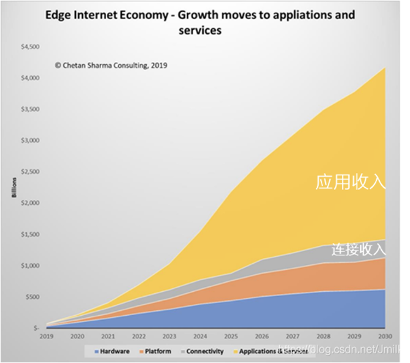

1. 云网融合、云边协同是电信运营商最大的优势，构建面向应用的电信级 PaaS 平台。Analysys Mason 针对全球运营商的一项调研显示：63% 的运营商希望直接进入 MEC 的应用服务这块巨大的蛋糕，70% 的运营商希望提供 PaaS。

    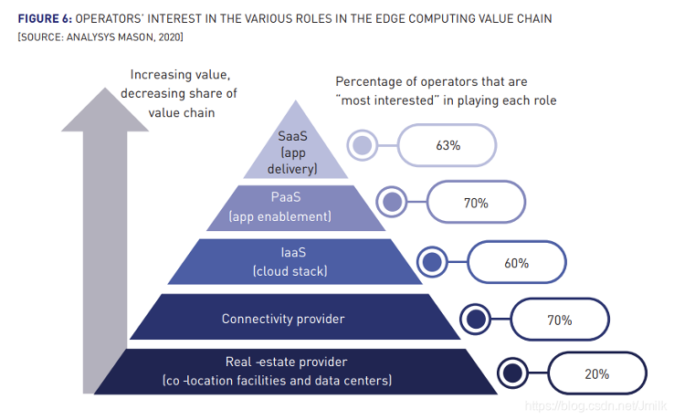

#### 5.1.3 满足 3GPP 标准演进的电信级 PaaS


1. SBA 架构的引入，将网元功能服务化，服务间轻量级交互协议的低耦合模式，使得5G 网络成为一个灵活的按需部署的网络。
2. eSBA 分布式框架将业务与框架解耦，将业务发现、注册、路由控制作为框架基本功能，通过框架代理为业务服务。
3. 5G 云原生提供电信基础设施，通过PaaS 平台可以快速开发、设计网络功能和服务，灵活部署网络。

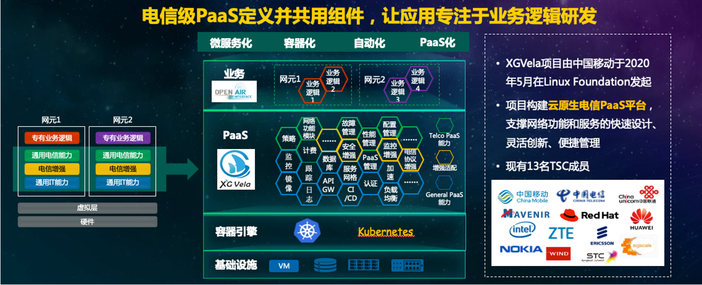

#### 5.1.4 PaaS 平台

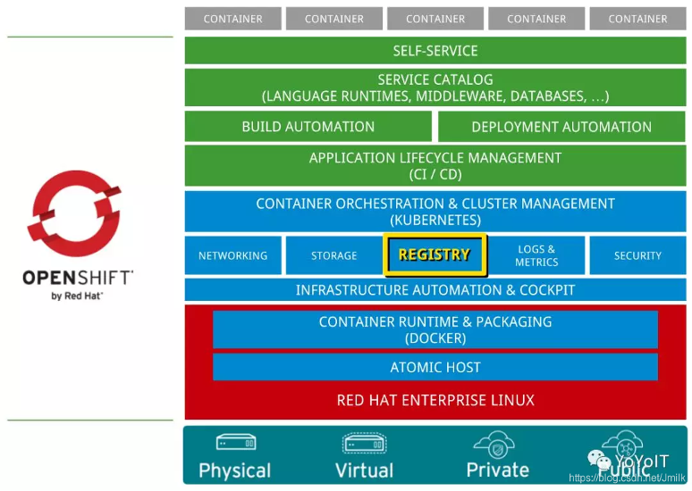

- 基础架构层：提供计算、网络、存储、安全等基础设施，支持在物理机、虚拟机、私有云和公有云等环境上部署 OpenShift。
- 容器引擎层：采用 Docker 容器引擎，在较新版本中，使用了 RedHat 提出的 CRI-O 容器运行时。
- 容器编排层：采用 Kubernetes 作为容器编排与管理引擎。
- PaaS 服务层： OpenShift 在 PaaS 服务层提供了丰富的开发语言、开发框架、数据库、中间件及应用支持，支持构建自动化、部署自动化、应用生命周期管理（CI/CD）、服务目录、内置的镜像仓库等。最终的目的是构建一个以应用为中心的 PaaS 平台，加速应用开发、部署和运维的速度和效率。而这些 服务是作为 CaaS 的 Kubernetes 所不具备的。
- 界面及工具层：云平台一个很重要的特点是强调用户的自助服务，从而降低运维成本，提高服务效率。OpenShift 提供了企业级的 Web UI 界面，以及运维工具集合。

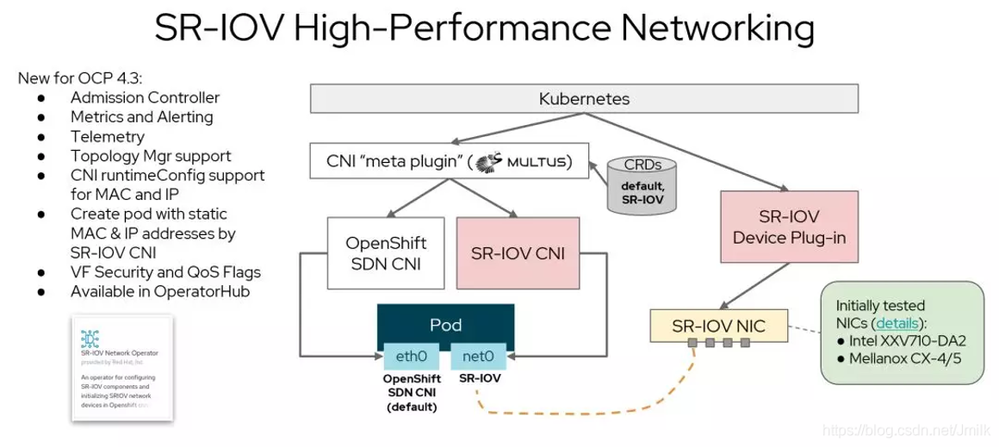


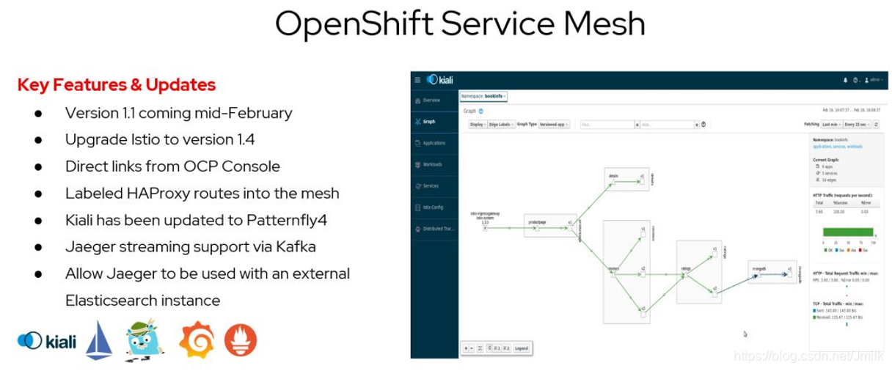

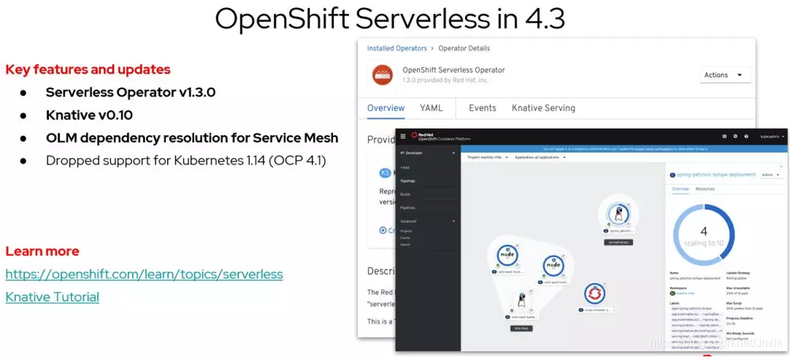

### 5.2 基于 MEC 构建面向泛在计算架构

#### 5.2.1 分布式云操作系统

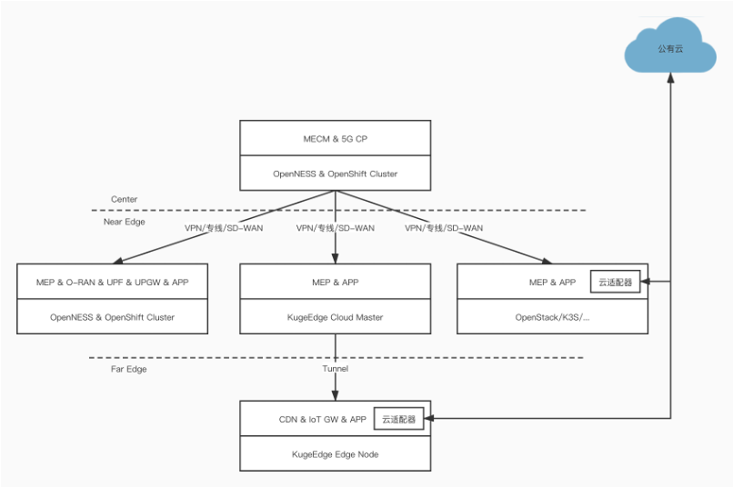

- **分场景提供轻量下沉，或拉远管理的边缘节点**：针对某些边缘资源节点非常的有限的场景，需要提供轻量化的资源配置，而且可以实现拉远管理。- **边缘应用以及服务的全生命周期管理**：边缘应用自动上/下线、用户面规则自动创建/更新、边缘服务注册中心管理。
- **云边协同**：基于 MEC 构建云操作系统所实现的云边协同。
- **以微服务为中心的架构，实现差异化编排**：打造多租户、多场景的、按需差异化编排能力。
- **多类型 VIM 支持，满足不同的资源池场景**：除了常规的 IaaS、CaaS、PaaS 平台，还支持 KubeEdge、K3S 等 VIM 类型的异构编排。

#### 5.2.2 直接以 KubeEdge 作为 MEC 底座的分布式云

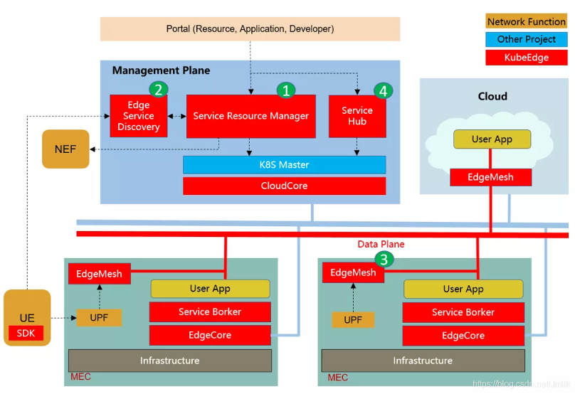

#### 5.2.3 基于 MEC 的云边协同

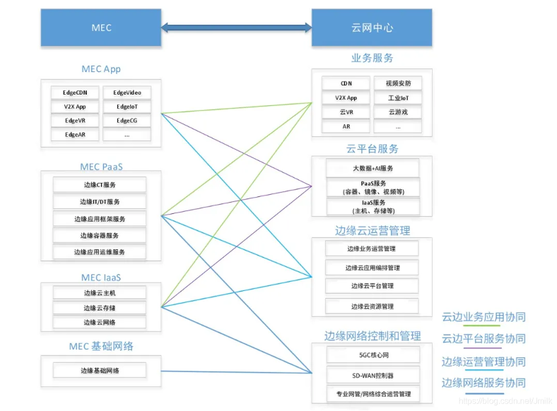

- **云边协同的本质是**：充分利用中心云和边缘云各自的优势，取得算力成本、网络成本以及业务收益之间的交叉峰值。
- 理想情况是，基于云网融合，使中心云、边缘云的计算和存储服务与形成云边一体，即：
  - 让计算和数据在云边自由流动
  - 云端租户计算实例可以调度迁移至边端
  - 基于业务需求、计算负载等实现云边算力的统一调度

#### 5.2.4 MEC 中的 UPGW


#### 5.2.5 MEC 中的云适配器


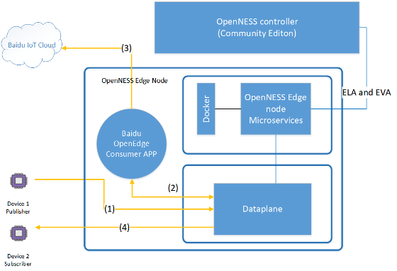

## 6. 企业实践

### 6.1 中心云-边缘云统一管理方案

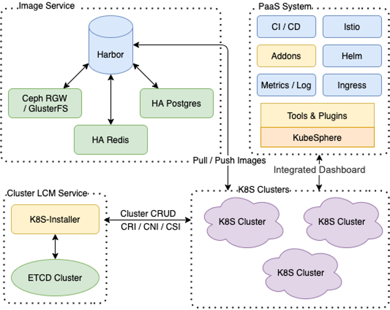

#### 6.1.1 容器镜像服务高可用解决方案

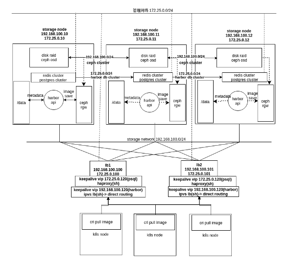

#### 6.1.2 跨区域多集群统一纳管的方案

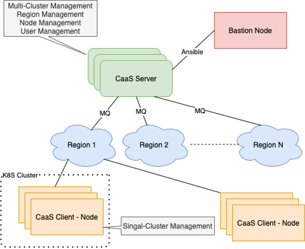

- K8S / K3S 生命周期管理方案
- 节点自注册方案

### 6.2 云边缘企业方案

#### 6.2.1 KubeEdge

云边可靠协同：

- 双向多路复用消息通道，支持边缘节点位于私有网络。
- WebSocket + 消息封装或 QUIC，大幅减少通信压力，高时延下仍可正常工作。
- 云边消息校验，网络不稳定时不丢数据。

边缘离线自治：

- 节点元数据持久化，实现节点级离线自治。
- 节点故障恢复无需 List-watch，降低网络压力，快速 Ready。

边缘极致轻量：

- 重组 Kubelet 功能模块，极致轻量化（~70mb 内存占用）。
- 支持 CRI 集成 Containerd、CRI-O，优化 Runtime 资源消耗。

边缘设备管理：

- 云端通过 Kubernetes API 管理边缘 Device

边缘 IoT 网关是以云计算技术重构了原来的嵌入式网关系统，在边缘侧提供协议/接口转换、边缘计算等能力，部署在云侧的控制器提供边缘节点的资源调度、应用管理与业务编排等能力。

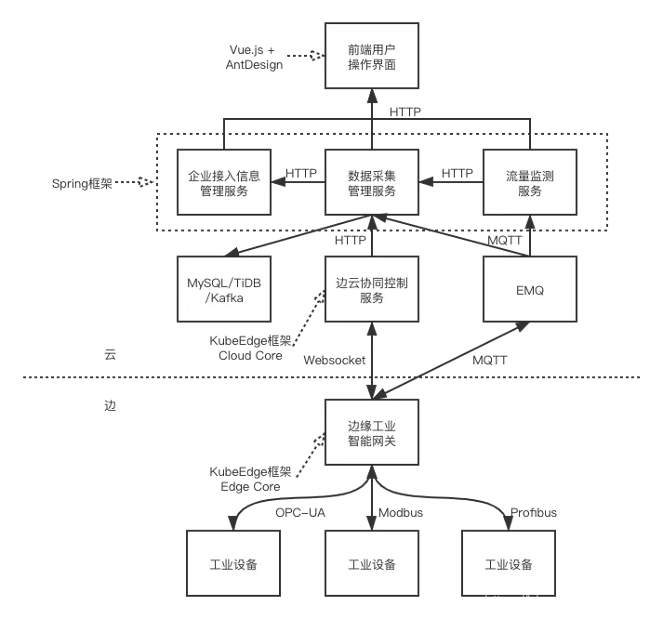

#### 6.2.2 OpenYurt


- Kubernetes 生态全兼容：对原生 Kubernetes “零”侵入，保证对原生 Kubernetes 完整生态的全部兼容，OpenYurt 集群可以紧跟 Kubernetes 社区版本升级节奏，云原生社区主流技术可以轻松落地 OpenYurt；
- 边缘异构资源支持：对不同边缘节点硬件架构（e.g. x86、ARM、RM64 等），硬件规格，通信协议提供一致体验；
- 高可靠/稳定性：基于边缘自治和边缘单元化能力，为多地域，大规模的边缘应用的持续稳定运行提供保障。支持各类开源 AI 系统（e.g. Tensorflow、Pytorch 等），为 AI 用户提供最佳体验；
- 云平台无关：OpenYurt 可以轻松部署在任何公共云的 Kubernetes 服务中。
- 一键转换：一条指令将 Kubernetes 转换为 OpenYurt 集群。

#### 6.2.3 SuperEdge

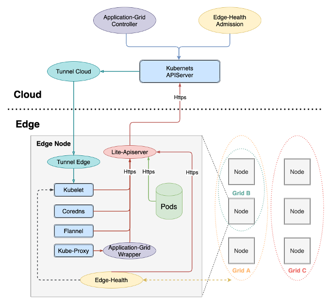

- Kubernetes 原生：SuperEdge 以无侵入的方式将 Kubernetes 强大的容器编排、调度能力拓展到边缘端，其原生支持 Kubernetes，完全兼容 Kubernetes 所有 API 及资源，无额外学习成本。
- 边缘自治：SuperEdge 提供 L3 级边缘自治能力，当边缘节点与云端网络连接不稳定或处于离线状态时，边缘节点可以自主工作，化解了网络不可靠所带来的不利影响。
- 分布式节点健康监测：SuperEdge 是业内首个提供边缘侧健康监测能力的开源容器管理系统。SuperEdge 能在边缘侧持续守护进程，并收集节点的故障信息，实现更加快速和精准的问题发现与报告。此外，其分布式的设计还可以实现多区域、多范围的监测和管理。
- 内置边缘编排能力：SuperEdge 能够自动部署多区域的微服务，方便管理运行于多个地区的微服务。同时，网格内闭环服务可以有效减少运行负载，提高系统的容错能力和可用性。
- 内网穿透：SuperEdge 能够保证 Kubernetes 节点在有无公共网络的情况下都可以连续运行和维护，并且同时支持传输控制协议（TCP）、超文本传输协议（HTTP）和超文本传输安全协议（HTTPS）。

### 6.3 PaaS 平台方案：KubeSphere

### 6.4 AI 云平台解决方案

沙箱设计

### 6.5 物联网云平台解决方案

## 7 FAQ

1. K3S 比 K8S，在文件大小、CPU/内存占用率、能耗方面，一般能提升多少？

   50%

2. 使用 KubeEdge 在边缘节点上编排应用，有什么独特的专有的优点？
   - 借助在 Edge 上运行的业务逻辑，可以让本地生成的数据，进行大量数据处理操作并对其进行保护。这样可以减少边缘和云之间的网络带宽需求和消耗，提高响应速度，降低成本并保护客户的数据隐私
   - 开发人员可以编写基于 HTTP 或 MQTT 的常规应用程序，对其进行容器化，然后在 Edge 或 Cloud 中的任何一个更合适的位置运行应用程序。
   - 借助 KubeEdge ，用户可以像在传统的 Kubernetes 集群一样，在 Edge 节点上编排应用程序，管理设备并监视应用程序和设备状态。
   - 可以轻松地将现有的复杂机器学习，图像识别，事件处理等其他高级应用程序部署到 Edge。
3. 如果边缘设备挂了，APP 如何会自动跳转到远端服务？
4. 实际应用中推荐使用边缘云还是云边缘？

   参考：http://blog.itpub.net/69912185/viewspace-2685097/

   边缘云：在边缘侧构建中小规模云服务能力，服务能力主要由边缘云提供，集中式数据中心侧主要提供边缘云的管理调度能力，如多接入边缘计算（MEC）、CDN 等属于此类。

   云边缘：是云服务在边缘侧的延伸，逻辑上仍是云服务，主要的能力提供依赖于云服务或需要与云服务紧密协同，如视频智能接入解决方案就属于此类。

   二者各有优势，应根据具体场景选择。
   
5. KubeEdge 节点和普通节点都在 kubectl get node 中获取到，这两者有什么区别？

   参考：https://my.oschina.net/u/4425967/blog/3149045

   没有本质区别，KubeEdge 的边缘组件会将 Node 通过云边协同通道注册到 K8s Master，唯一的不同是普通节点由 Kubelet 直接访问 Master 完成节点注册，KubeEdge 是通过云边协同通道注册，API 都是一致的。

6. KubeEdge 的安全层是怎么做的？

   KubeEdge 云边协同使用了安全的 WebSocket 通道。对于应用间的安全互访要依赖用户自己配置安全证书等。

   WebSocket：基于 TCP 的全双工通信协议

7. kubeEdge 的业务流和 serviceBus、edgeHub 有交互吗？

   serviceBus 接受来自云端的请求，调用相应的边缘端 http 接口，发送请求并接收回复后传给 edgeHub

8. k3s 把多个二进制打包成一个二进制，除了安装方便外，有别的好处吗？

   所有 Kubernetes control-plane 组件的操作都封装在单个二进制文件和进程中，使 K3s 具有自动化和管理包括证书分发在内的复杂集群操作的能力。

9.  K3S 的轻量化性能如何保证？

    删除不必要的组件、代码以及其它遗留程序来减少空间，同时支持用户按需选择加载项

10. 边缘计算与协同边缘计算有什么区别？

    边缘计算：分布式计算架构，将应用程序、数据资料与服务的计算，由网络中心节点，移往网络逻辑上的边缘节点来处理。

    云边协同：中心云与边缘云协同，中心云可以管理边缘云，并为边缘云提供充足的虚拟资源支持。

11. k0s 的主要思想是什么
    - 零摩擦：降低了安装和运行 k8s 的复杂性，可以在几分钟内创建一个新集群。开发人员之间的摩擦减少到0，允许任何在 k8s 没有特殊技能或专业知识的人轻松开始。
    - 零依赖：以一个二进制文件的形式分发，除了主机操作系统内核外没有主机操作系统依赖。可以与任何操作系统一起工作而无需额外的软件包或配置，任何安全漏洞或性能问题都可以在 k0s 发行版中修复。
    - 零成本：对个人或商业用途完全免费。
12. 边缘云和云边缘哪个方案在生产系统多一些
13. k3s 和 k8s 性能相比差距有多少
14. kata 解决方案有哪些优点

    参考：https://github.com/kata-containers/kata-containers/blob/main/docs/Limitations.md

    解决了传统容器共享内核的安全和隔离问题，让每个容器运行在一个轻量级的虚拟机中，使用单独的内核

15. K3S 在轻量化的情况下，如何确保安全性？
    
    参考：https://docs.rancher.cn/docs/k3s/security/hardening-guide/_index

    K3s 已经应用了一些安全缓解措施，并在默认情况下开启，无需修改即可通过 Kubernetes CIS 的一些控制。有一些明显的例外，如主机级别的修改，需要手动执行才能完全符合 CIS 基准。
    
16. K3S 边缘云是否可以通过 flannel 与 K8S 集群实现容器网络互通？
    
    可以

17. 边缘节点离线后，依赖数据多次变更，边缘应用和云端数据的最终一致是怎么保证的？

    KubeEdge 目前的应用管理等操作都需要通过 K8s master 进行，针对边缘节点离线场景主要提供自治的能力，既本地持久化的数据仅用于管理节点上的应用和设备，云边通信恢复时，节点将同步云依据来自 CloudCore 的最新消息更新本地元数据。这里稍有不同的是边缘设备管理，对设备期望状态的设置需要通过 Device CRD 中的 Desired State 来操作（从云到边），而设备实际状态的上报会体现在 Reported State 中（从边到云），两个方向的数据同步不会冲突。

18. 边缘节点的 Docker 容器镜像是从整个云-边 k8s 系统统一的镜像仓库拉取的吗？

    kubeedge 边缘节点可以从任意连接到的镜像仓库拉取镜像

19. k8s 集群生命周期管理是否适用于 k3s？
    
    适用
    
20. k3s 相比于 k8s 的轻量级体现在哪里，能将镜像更轻量化吗？
    - 使用 SQLite 数据库取代 etcd
    - 最大程度减轻了外部依赖性，k3s 仅需要 kernel 和 cgroup 挂载

    不能

21. k3s 能解决镜像在国外拉不到的问题吗

    不能，但可以改用国内镜像仓库

22. k3s 除了安全还有什么优势吗
    - 轻量级、适合部署在边缘
    - 用户操作简单
23. k3s 中 cloud core 可以对应什么规模的 edgecore

    | 部署规模  | 节点      |  VCPUS | 内存 |
    | ---------|----------|--------|-----|
    | Small    | up to 10 |   1    |2 GB |
    | Medium   | up to 100|   2    |8 GB |
    | Large    | up to 250|   4    |16 GB|
    | X-Large  | up to 500|   8    |32 GB|
    | XX-Large | 500+     |   16   |64 GB|

24. K3s 是如何保证数据安全的?与主控节点通信可以中断多长时间
25. 云边缘和边缘云两者从用户角度来讲，是否有差别，哪个用户感觉更好一点
26. 对于开源 license，比如 GPL、Apache 等是否有对国内限制的可能？如果有，目前国产捐献内容是否有不可用风险

    有，但可能性不高。

    国产捐献内容应当不存在不可用风险

27. StarlingX 目前是否还有应用场景

    参考：https://www.99cloud.net/11234.html%EF%BC%8F

    有。主要面向工业 IoT、电信、视频等对延迟要求较高的业务

28. kubeedge 离线自治大概能够保证多久离线时间业务是正常的
29. k3s 相比 k8s 主要在哪些组件有所精简？

    参考：https://github.com/k3s-io/k3s/blob/master/README.md

    整合：
      - Containerd & runc
      - Flannel for CNI
      - CoreDNS
      - Metrics Server
      - Traefik for ingress
      - Klipper-lb as an embedded service load balancer provider
      - Kube-router for network policy
      - Helm-controller to allow for CRD-driven deployment of helm manifests
      - Kine as a datastore shim that allows etcd to be replaced with other databases
      - Local-path-provisioner for provisioning volumes using local storage
      - Host utilities such as iptables/nftables, ebtables, ethtool, & socat

    移除：
      - In-tree storage drivers
      - In-tree cloud provider

30. k3s 与 kubeedge 应用前景怎么样？

    前景很好，很多的边缘设备都不足以部署 k8s，且相较于 k8s，它们的成本更低。

31. K3S 目前在国内边缘计算产业发展应用的成熟度如何？
    
    较为成熟，已经有了一定数目的落地案例

32. K3S 是如何保证高并发的？

    Deployment

33. k3s 落地案例有哪些

    工业物联网、国有银行

34. k3s 的性能如何，可以承载多大业务量
35. kubeedge 中 cloud core 可以对应多少个 edgecore

    n
    
36. kubeedge 中 edge core 可以对应多少个 edged

    1

37. 边缘计算的计算节点放在 5G 基站合适还是下沉 UPF 合适？

    放在下沉 UPF 之后。

38. 边缘计算落地典型案例有哪些？
    - KubeEdge: 使用 Apache Beam 进行数据分析
    - 农业现代化，如播种、监控作物长势
    - 城市监控系统
39. kubeEdge 的网络组件是否要与K8S保持一致？
40. kubevirt 是否完成模拟了网络环境？

    每个虚拟机实例对象都对应1个 pod ，该 pod 的网卡作为虚拟机的虚拟网卡所对应的物理网卡。
    
41. 国内MEC平台解决方案与 KubeEdge 有何区别？
42. KubeEdge 支持的设备接入规模是多大？
43. K3S的轻量级体现在哪里？
    - 磁盘要求更小
    - 内存要求低
    - 删除多余组件、程序、旧的代码
    - 使用 SQLite 替换 etcd
    - 没有操作系统依赖，只需要 kernel 和 cgroup 挂载
44. KubeEdge 和 K3S 哪个在边缘云场景使用的更多？
45. 中心云纳管边缘云和边缘云纳管中心云，这两者各有什么优劣点？
46. K3S 与 K8S 相比，具体轻量化了哪些组件和功能？

    参考：https://github.com/k3s-io/k3s/blob/master/README.md

    整合：
      - Containerd & runc
      - Flannel for CNI
      - CoreDNS
      - Metrics Server
      - Traefik for ingress
      - Klipper-lb as an embedded service load balancer provider
      - Kube-router for network policy
      - Helm-controller to allow for CRD-driven deployment of helm manifests
      - Kine as a datastore shim that allows etcd to be replaced with other databases
      - Local-path-provisioner for provisioning volumes using local storage
      - Host utilities such as iptables/nftables, ebtables, ethtool, & socat

    移除：
      - In-tree storage drivers
      - In-tree cloud provider

47. k3s 和 k8s 集群生命周期管理有什么推荐的方式？
48. KubeEdge 端容器和 K8S 端容器互通有哪些方案推荐
49. k8s crd operator 除 helm 外还有哪些替代产品？

    https://docs.k0sproject.io/v1.22.3+k0s.0/manifests/

    k0s：Manifest Deployer

50. 从 k3s 和 k8s 的资源环境需求来看，两者的差别不是很大，这种情况下，k3s 的差异性优势如何体现？
    - k3s 和 k8s 的资源环境需求还是比较大的，k3s 的资源占用更加小，更适合部署在资源不足的边缘环境；
    - 对于很多用户来说，k8s 的很多功能并不是必须的，在这种情况下，k3s 仅保留必要的组件、额外需求用户可以自行安装组件扩展，比 k8s 更有竞争力；
    - k3s 的操作更加简单，对用户更加友好。
51. k3s 对比 k8s 安全性能如何？
52. 国内 k3s 的应用案例有哪些？

    参考：https://www.bilibili.com/video/BV1g7411G7By?from=search&seid=18067894859541366568&spm_id_from=333.337.0.0

    工业物联网、国有银行

53. 虽然边缘计算毫秒级延迟，但边缘计算最吸引客户的是不是设备和数据的独享性和安全性，请问老师如何看待边缘计算的市场优势

    边缘计算最大的优势还是低时延；虽然在边缘设备上能够进行一定的数据处理，但最终仍要上传到服务器，期间可以对数据进行一定的处理保证安全性，独享性并不突出。

54. kubevirt 在哪种应用场景下性价比最高

    同时需要纳管虚拟机和 k8s 集群

55. K3S 常用端口有哪些？
    - 6443: agent 节点访问 server 节点
    - 8472: Flannel VXLAN 下节点互相访问
    - 10250: metrics server
    - 2379-2380: etcd
56. k3s 怎么避免 master 的单点故障

    高可用架构，增加冗余；节点故障难以避免

57. K3S 单节点架构如何保证高可靠？

    可靠性指在规定的条件下和规定的时间内，完成规定功能的能力。这与单节点架构无关。

    单节点架构无法保证高可用。

58. K3S 云到边的数据同步对网络有什么要求，是强一致性同步吗
59. MEC 中的云适配器，主流架构和软件是什么？
60. OpenYurt 除了零侵入外，还有没有其它优点？
    - 边缘异构资源支持：对于同边缘节点硬件架构（e.g. x86、ARM、RM64 等），硬件规格，通信协议提供一致体验；
    - 高可靠/稳定性：基于边缘自治和边缘单元化能力，为多地域，大规模的边缘应用的持续稳定运行提供保障。支持各类开源 AI 系统（e.g. Tensorflow、Pytorch 等），为 AI 用户提供最佳体验；
    - 云平台无关：OpenYurt 可以轻松部署在任何公共云的 Kubernetes 服务中；
    - 一键转换：一条指令将 Kubernetes 转换为 OpenYurt 集群。
61. dvr 为啥在生产中使用较少
62. kubevirt 在生产是否有大规模部署？
63. upgw 和运营商 upf 有什么区别
64. 云边缘的编排是不是都在云端

    不是。 KubeEdge 将原生的容器化应用程序编排功能扩展到了边缘节点。

65. 虚拟机的镜像是怎么做到增量同步的？

    增量镜像，将对虚拟机的改变都保存到增量镜像中，原始镜像保持不变。

66. etcd 本来就容易连接超时，如果考虑安全，用 https 会更慢，那怎么保证安全？
67. K3S 的具体适用场景有哪些？
    - 边缘计算
    - 物联网
    - CI
    - Deployment
    - ARM
    - 嵌入 k8s
68. OpenYurt 的适用场景有哪些？和 K8S,K3S 有什么不同点？

    参考：https://cloud.tencent.com/developer/article/1785922

    K8S 是为云数据中心设计，拥有完整的功能，但对资源的消耗更大；如果需要在边缘部署较为复杂的应用，可以选择 K8S

    K3S 是轻量化的 K8S，资源需求小，可以不需要中心云，独立部署于边缘节点，应用于需要完整集群（包含管理集群）的边缘节点

    OpenYurt 同样是基于 K8S 的边缘计算项目，相对于 K3S，它拥有云边协同，边缘自治等特性，维护成本更低，管理方式为云管边

69. k3s 有好多推荐的书吗
70. 云边缘的 pod 调度由边缘控制还是云中心控制

    由边缘控制，边缘网络状况往往不佳，由云中心控制存在不便。

71. 边缘云和中心云的主机硬件规格有什么不同
    
    中心云的硬件规格要求更高。

72. EdgeXFoundry 有哪些应用场景

    EdgeXFoundry 适用于需要接入大量的不同种类设备，且想要用统一架构进行操控的场合，如工业物联网、智慧场馆、开源物业系统。

73. EdgeX Foundry 如何应用在混合云及MEC场景中？
74. Kubeedge 与 k3s 各适用于那些 MEC 场景？
75. EdgeX Foundry 架构中 core data 和 meta data 都存储的什么数据？

    core data： 数据中转，南北侧通信借此转发

    meta data：设备和服务的信息

76. EdgeX Foundry 的安全层是怎么做的？
    - secret store：为 EdgeX 存放加密数据。EdgeX 加密数据的例子有：其他服务连接到云系统使用的数据库访问密码等。
    - API gateway：作为反向代理访问受限制的 EdgeX REST 资源，同时执行访问控制相关工作。 系统管理服务系统管理工具为外部管理系统提供中央访问控制点，以启动/停止/重启 EdgeX 服务，获取服务的状态/健康状况，或获取 EdgeX 服务的指标(如内存使用情况)，以便监视 EdgeX 服务。
77. 边缘计算有哪些解决方案已经使用。
    - EdgeX Foundry：智能零售、制造工厂表面质量检测、监控工业设备
    - k3s：工业物联网、某国有银行
    - KubeEdge：用 Apache Beam 进行数据分析
78. 如何实现 redis 的高可用

    redis sentinel

    - 主从复制
    - Redis 集群
79. 镜像同步到边缘设备是否会造成网络压力

    会

80. k3s 在国外有应用场景吗
81. EdgeX Foundry 架构中对承载网络的需求是什么?
82. EdgeX Foundry 中得数据安全是怎么做的？
    - secret store：存储其他服务和令牌用以连接到云端系统的数据库许可密码
    - API gateway：反向代理，限制对 EdgeX REST 资源的访问并进行访问控制
83. 三层的分布式云操作系统在实际项目部署中是否存在因为层级导致整体性能下降的情况？
84. openYurt 与 kubeadge 最关键的区别是什么？ 从架构图看不是很明显都是基于两个连接组件将K8s联系起来了
85. kubeedge 是否支持 arm 架构的低功耗产品

    支持
    
86. edgex foundry 架构是否支持低功耗产品
    
    支持

87. 运营商边缘环境与IT的边缘环境有什么区别，运营商架构有哪些可以借鉴优化？
88. 已经采用 horizon 作为界面的系统如何解决日志排查链比较长的问题？
89. 如何通过 Core Services Layers 和 Supporting Services Layers 进行安全的访问接入和控制？
90. IP摄像机等设备的视频流如何接入 EdgeX Foundry？
    
    参考：https://www.edgexfoundry.club/user/lulililu/article/5d8d93356598210001292c9b

    使用 edgex-device-rtsp

91. EdgeXFoundry 必须支持棕色和绿色设备/传感器的现场部署，棕色和绿色分别指什么设备？
    - 棕色：较旧的遗留设备，通常使用较旧的协议
    - 绿色：具有现代协议的新设备
92. 目前最有价值的边缘云落地场景有哪些？
    
    5G+MEC+边缘云

93. kubeedge 与 k3s 是否有融合使用方案
94. kubeedge 与物联网有没有成熟方案
    
    参考：https://bbs.huaweicloud.com/blogs/241370

    KubeEdge+K8S 管理高速公路边缘节点

95. 边缘计算的应用场景有哪些？
    
    物联网、工业互联网、车联网、5G 超低时延业务

96. 边缘计算目前做得好的公司有哪些？
    
    亚马逊、微软、谷歌、阿里云、华为云、中国移动等

97. Kubesphere 集群纳管的数量是否有限制？
98. Kubeedge 资源缺乏报错的解决方案是啥？
99.  技术迭代非常快，容器化技术后，是否有其他更新技术的雏形产生？

     新容器技术：podman

100. 目前边缘计算有什么应用场景

     物联网、工业互联网、车联网、5G超低时延业务

101. 怎么选择 redis 的 HA 实现方式？
102. 边缘设备自动发现有哪些技术？

     订阅

103. EdgeX Foundry 在哪些方面优化时延问题？
104. C 比 golang 性能好，原因是啥？

     C：程序员可以自己管理内存的分配和释放

     golang：使用 GC（垃圾收集器），编译器自己实现内存的分配和过期内存的回收

105. 通常而言，在一个边缘计算应用的场景中，都需要哪些参与方，各方的职责及提供的内容是什么？
106. 在工程实践中，边缘计算哪些方面标准化不足，最亟需标准化的是哪些方面？
107. EdgeXFoundry 与 kubeEdge 面向物联网需求场景有何差异性？
     
     EdgeXFoundry更适用于存在大量不同设备的场景，它可以兼容多种不同协议

108. 电信运营商边缘云发展有何建议？
     
     MEC+边缘云，构建面向应用的电信级 PaaS 平台

109. JWT 令牌的优势是什么？
     - 基于 json，方便解析
     - 可以自定义丰富的内容，易扩展
     - 通过非对称加密算法及数字签名技术，防篡改，安全性高
     - 资源服务可以不依赖认证服务即可完成授权
110. k3s/k8s 对 arm 的支持如何？
     
     均支持

111. EdgeXFoundry 如何保证安全性
112. 随着 AIOps 工具和流程的成熟，云计算行业对运维人员的需求点在哪里
     - 相关业务经验
     - 具有AI能力
113. k3s 有什么好用的工具书或者网站吗？
114. kubedge 在物联网方面的应用有什么？
     
     参考：https://bbs.huaweicloud.com/blogs/241370

     KubeEdge+K8S 管理高速公路边缘节点

115. 一般什么规模下需要考虑边缘计算
116. 边缘计算的架构是否还需要继续发展
117. 服务网格 Service Mesh 有哪几种实现方式？
     
     参考：https://www.nginx.com/blog/what-is-a-service-mesh/

     边车模式，设置一个代理服务接管服务的流量，通过代理之间的通信间接完成服务之间的通信请求。如：Linkerd、Envoy、Istio 等。

118. EdgeXFoundry 的四层架构和智慧场馆/开源物业系统案例中的几个层次是如何对应的
     - 应用服务层：
       - 展现层：U3D/UE4/web/App

     - 支持服务层：
       - 业务层：物业/办公

     - 核心服务层台：
       - IoT 中台（EdgeX）、用户、权限
       - IoT 适配层
       - IoT：三方 IoT 接口
       - 网络层：BA/Bodbus/Zigbee/NBIoT/HTTP

     - 设备服务层：
       - 感知层：设备（传感器）
