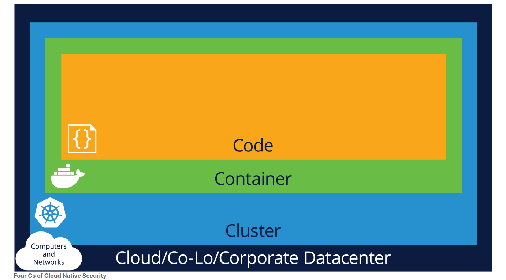
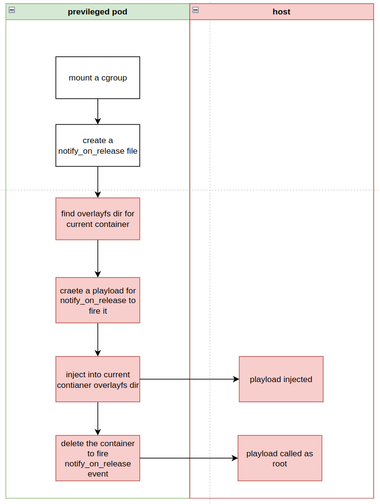
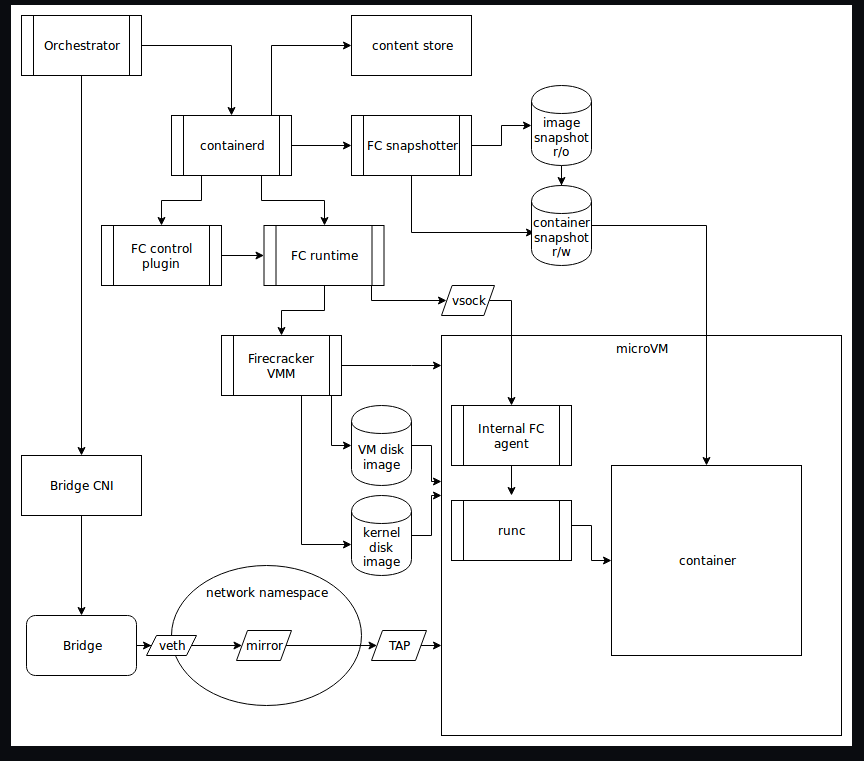
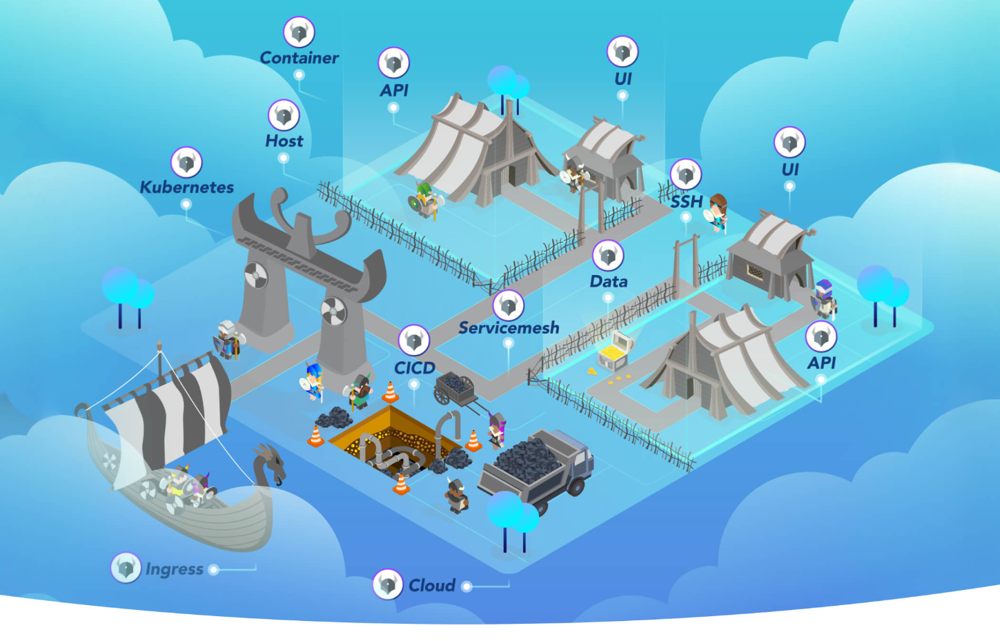
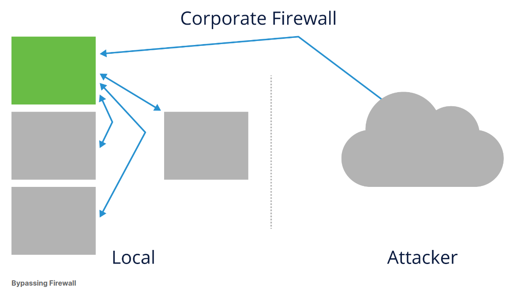
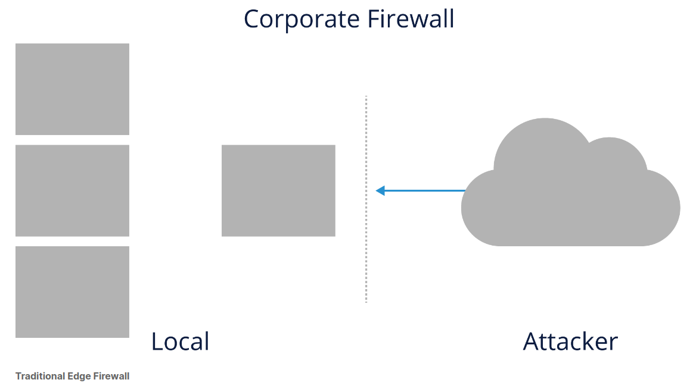
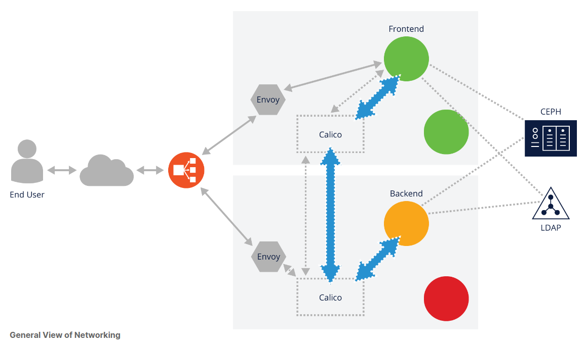
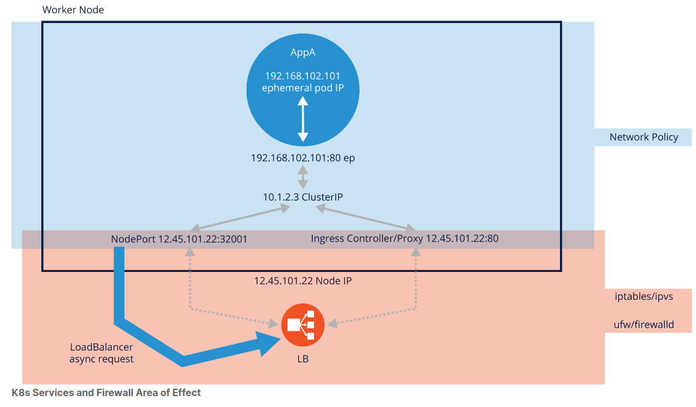
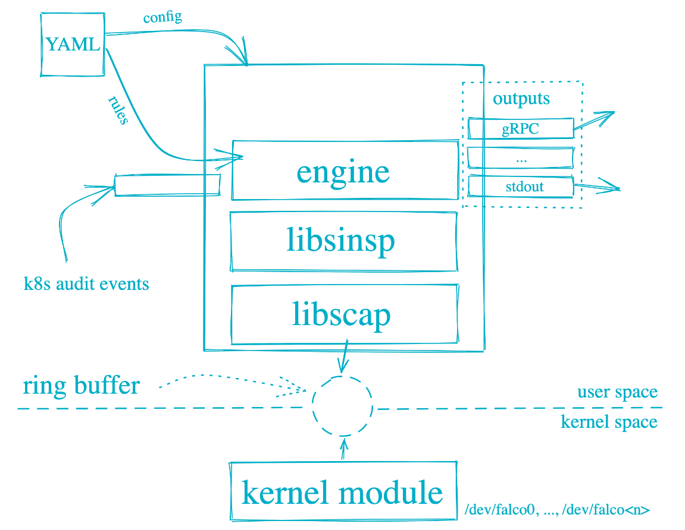

# Kubernetes 安全纪要和最佳实践（Kubernetes Security Specialist）

## 注意 ⚠️

- **未经允许，禁止转载**

## Prefix

- 授课时长：
    - 上午：9:30 至 12:00
    - 下午：13:30 至 16:00
- Prerequisite
    - [CKA](class-01-Kubernetes-Administration.md)

## Catalog

| Date | Time | Title | Content |
| ---- | ---- | ----- | ------- |

- 概述
- 课程概述
- 什么是安全
- 云安全
  - cncf 项目安全相关
  - 安全考量原则
  - 理解攻击面
  - 攻击类别
  - 攻击源
  - 主动/被动 攻击
  - 安全方面的网上资源
    - NIST Cybersecurity Framework
    - High Value Asset Protection
    - National Checklist Program
    - CIS Benchmarks
    - kube-bench
  - 企业安全文化
    - 开发组安全文化
    - 安全组文化
- k8s 风险面
  - 来自镜像的风险
    - 私有镜像仓库 -- 愤怒的员工
    - 公网镜像的风险 -- 理解镜像的供应链
    - 应对策略
  - 运行镜像引擎的风险考量 -- container runtime
    - gvisor
    - kata
    - firecrack
  - 来自于软件安装包的风险考量
    - 应对策略
        * The Update Framework (TUF)
        * Notary
- 搭建 k8s 集群前的安全事考量
  - 找到内核的风险点 CVE
  - 利用内核功能抵御攻击
  - 搭建多节点集群
- 加固集群访问安全
  - 加固 kube-apiserver
  - 开启审计日志
  - 合理使用 RBAC
  - 使用 Pod Security Policies
  - etcd 的安全
  - 加密 secret 数据
  - 合理使用 admission controller
  - 使用 serviceaccount
- 加固 k8s 集群网络安全
  - 网络漏洞扫描
  - 阻止 pod 跨 namespace 访问
  - 服务网格的产品的考量
  - 尽可能的使用  mTLS
- k8s 工作负载的安全加固和考量
  - 下载一个镜像前的考量
  - 运行一个容器前的考量
  - 保护容器 container layer 的安全
  - 容器运行后的安全分析
  - crd 和 operator 的安全考量
  - 容器运行中安全工具介绍
    - seccomp
    - selinux
    - apparmor
- 问题风险发现
  - 理解攻击的生命周期
    - 理解 kill chain
  - 风险管控的 checklist
  - 被攻击后的应对策略
    - 被攻击后的应对策略 -- 报告机制
    - 涉及违法的应对策略
    - 建立紧急应对小组
    - 完善的故障报告
  - 入侵检测
    - 主机入侵检查
    - 网络入侵检查

## 1. 课程介绍

云安全是一个演进的过程，不是一朝一夕，而是需要经历持续的、无数的积累和实践，才能构建出让人放心的云环境。

本课程旨在介绍：

1. 如何解决云生产环境的安全问题
2. 安全容器供应链
3. K8S 集群持续安全和敏捷使用
4. 在哪里可以找到持续的安全和漏洞信息

该课程包括：

1. 用于构建和保护 Kubernetes 集群的动手实验
2. 监控和记录安全事件的动手实验

在本课程结束时，您将学到以下内容：

1. 了解云生产环境的安全问题
2. 了解如何强化系统和集群
3. 讨论围绕容器供应链的安全主题
4. 了解如何监控和记录安全事件等等

## 2. 云安全概述

### 2.1 章节梗概

- 理解安全问题的发生和防止是一个持续的过程
- 讨论安全问题的发生和应对方法
- 讨论攻击的类型
- 4C 安全层级：code / container / cluster / cloud
- 了解安全机制和安全资源

### 2.2 什么是计算机安全？


计算机安全是对计算机或计算机系统有用资产（Asset）的保护。资产包括：硬件、软件、数据、流程、人员或其他们的组合。

- **资产的生命周期**：安全始于获取资产。重要的是，实物资产有一个保管链，直到资产上电。
- **软件开发的生命周期**：包括设计、开发、测试和部署的过程。在项目的设计阶段考虑安全性是至关重要的。
- **制定组织政策和程序**：制定政策和程序可以降低意外或故意伤害的风险。
- **定义角色和职责**：建立事件响应的层次结构非常重要。由于工作的艰巨性，需要有一个明确的领导者或分配领导者的预案。

安全从来不是一朝一夕的事情，他需要经历持续的、无数的积累和实践才能构建出让人放心的云环境。因为工具手段不停的在更新和演进，所以我们也需要不停的学习和实践，才能保证我们的云平台安全。

### 2.3 攻击面

每个云平台中的组件都是一个可能被攻击的点，每个组件都由代码构成，都会存在风险。最安全的做法是不让这些数据通过网络暴露出来（锁在安全级别高的房间里），但是这样我们也不能对外正常提供服务了，也就失去了存在的意义，所以控制好平衡很有必要。

#### 2.3.1 ETCD 数据库安全

k8s 中存放最核心数据的是 etcd 数据库，一但数据文件被恶意摧毁，如果没有备份，就很难恢复。

- 默认 kubeadm 会将 etcd 和 controller 部署在一起，etcd 数据目录上挂载到 /var/lib/etcd，如果攻击者删除这个目录话，就会对集群造成致命影响。
- **从安全角度来说一个分离部署的 etcd 数据库集群是更理想**，你可以参照 [集群数据库分离](https://github.com/justmeandopensource/kubernetes/blob/master/kubeadm-external-etcd/3%20setup-kubernetes-with-external-etcd.md) 来搭建数据库和 k8s 集群分离的场景

```yaml
# default kubeadm etcd static pod
$ cat /etc/kubernetes/manifests/etcd.yaml
# output
    volumeMounts:
  - mountPath: /var/lib/etcd
    name: etcd-data
 ...
volumes:
...
- hostPath:
    path: /var/lib/etcd
    type: DirectoryOrCreate
  name: etcd-data

# separete etcd cluster config
$ kubectl get cm -nkube-system kubeadm-config -o yaml
apiVersion: v1
data:
  ClusterConfiguration: |
    apiServer:
      certSANs:
      - kubernetes
      - kubernetes.default
      - kubernetes.default.svc
      - kubernetes.default.svc.mec01.com
      - localhost
      - 127.0.0.1
      - vip.mec01.com
      - 172.xx.xx.100
      - master-1
      - master-1.mec01.com
      - 172.xx.xx.207
      - master-2
      - master-2.mec01.com
      - 172.xx.xx.228
      - master-3
      - master-3.mec01.com
      - 172.xx.xx.225
      - 10.xx.xx.1
      extraArgs:
        authorization-mode: Node,RBAC
        bind-address: 0.0.0.0
        feature-gates: CSIStorageCapacity=true,ReadWriteOncePod=true,RotateKubeletServerCertificate=true
      timeoutForControlPlane: 4m0s
    apiVersion: kubeadm.k8s.io/v1beta3
    certificatesDir: /etc/kubernetes/pki
    clusterName: mec01.com
    controlPlaneEndpoint: vip.mec01.com:6443
    controllerManager:
      extraArgs:
        bind-address: 0.0.0.0
        cluster-signing-duration: 87600h
        feature-gates: RotateKubeletServerCertificate=true,CSIStorageCapacity=true,ReadWriteOncePod=true
        node-cidr-mask-size: "24"
      extraVolumes:
      - hostPath: /etc/localtime
        mountPath: /etc/localtime
        name: host-time
        readOnly: true
    dns:
      imageRepository: registry-1.ict-mec.net:18443/coredns
      imageTag: 1.9.3
    etcd:
      external:
        caFile: /etc/ssl/etcd/ssl/ca.pem
        certFile: /etc/ssl/etcd/ssl/node-master-1.pem
        endpoints:
        - https://xx.xx.xx.xx:2379
        - https://xx.xx.xx.xx:2379
        - https://xx.xx.xx.xx:2379
        keyFile: /etc/ssl/etcd/ssl/node-master-1-key.pem
    imageRepository: registry-1.ict-mec.net:18443/kubesphere
    kind: ClusterConfiguration
    kubernetesVersion: v1.27.2
    networking:
      dnsDomain: mec01.com
      podSubnet: 10.xx.xx.0/18
      serviceSubnet: 10.xx.xx.0/18
    scheduler:
      extraArgs:
        bind-address: 0.0.0.0
        feature-gates: CSIStorageCapacity=true,ReadWriteOncePod=true,RotateKubeletServerCertificate=true
kind: ConfigMap
metadata:
  creationTimestamp: "2023-08-23T05:47:44Z"
  name: kubeadm-config
  namespace: kube-system
  resourceVersion: "233"
  uid: fd244790-167b-4024-b465-60caaf9c04ea
```

#### 2.3.2 网络安全

网络也需要额外注意，我们期望正常访问不受影响，同时阻拦非正常的访问。可以配置防火墙白名单，比如我们对 kube-apiserver 的可访问地址段做配置，只能从 172.25.0.0/24 这个网段来访问 kube-apiserver。

- k8s 近期的版本所有的请求基本都是 zero trust 所有通讯都用 mTls (双向 tls) 认证的方式来访问，但是如果由于处于某原因，比如贪图方便直接通过 `kubectl proxy"` 来开放 kube-apiserver 访问方式就增加不安全风险
- 更糟的情况 `kubectl proxy --address="0.0.0.0"` 如果你的集群有配置 san 名比如 abc.com ，前面的命令会造成更大的安全问题，攻击者很容易就通过配置 .kube/config 配合 /etc/hosts 中伪装 abc.com 指向，就可以通过其他节点攻击 kube-apiserver 了

```console
# 查看访问路径
$ kubectl get node -v=10 2>&1 | tee output
$ cat output | grep -i "GET https:"
# output
I1009 10:05:38.708661   36252 round_trippers.go:553] GET https://xx.xx.xx.xx:6443/api/v1/nodes?limit=500 200 OK in 8 milliseconds
$ kubectl proxy
# 无证书直接访问 api-server
$ curl http://127.0.0.1:8001/api/v1/nodes?limit=500
```

k8s 中的 kube-proxy、kubelet 都需要和 kube-apiserver 安全通讯机制。不能为了方便妥协。

#### 2.3.3 其它安全考量

云平台通常是有很多个项目组合而成的，项目越多自然攻击平面就越广泛，我们应该选择 cncf 的**毕业项目**，这些项目应该已经充分考虑的安全因素，**孕育中的项目** 则会多多少少欠缺一点安全性，比如：CNI, CRI-O, Linkerd, OpenTracing, Thanos 等。**Sandbox 项目**则会比会”孕育中的项目“安全情况可能更严峻一些，比如 Artifact Hub，k3s，in-toto，Keylime，Parsec。**Archived 项目**则是已经停止维护的项目，用户如果使用这些项目，则要自己面对安全风险。

k8s 有专门的 sig 负责安全方面的工作 [Kubernetes Security Profiles Operator SIG](https://github.com/kubernetes-sigs/security-profiles-operator), 并且 cncf 有专门的小组负责所有项目的安全 [CNCF Special Interest Group for Security](https://github.com/cncf/sig-security)

#### 2.3.4 风险的来源、类别和应对

资源的分配 -- 可能会造成各种风险的提升比如

- SSO 单点登陆的方案看似很好管理，但是他提高的安全的风险，如果 sso 服务出现的了问题，则所有的平台都不可登录。
- 每多增加一个安全管理成员就多一份安全风险，这是从人事任命角度的观点。因为人有很多不可控的因素比如情绪、生活压力等，当然只有一个安全管理也是一个安全风险。
- 耦合度过高服务应用 -- 比如将很多关键服务部署在了没有灾备方案的主机群或者平台上，如果平台或者主机群出现的断电则这些服务都将停止服务。

应对策略

- Prevention / 防止机制 -- 我们需要经可能的防止使安全风险上升的事情发生，我们可以通过硬件或者软件的手段来达成这样的目标。
  - 通过安全登录软件来控制 `人/应用` 对特定的 `软件/硬件` 的访问
  - 增加管理流程，比如 `appA` 需要访问 `数据库A` 需要填写必要的申请并等待审核通过
  - 根据安全等级，我们甚至可以将物理设备离线管理，唯一能够登录的地方可以设置在一间带有密码锁，或者需要授权的员工卡才能打开的房间里
- Detection/检测机制 -- 当然光靠 `Prevention/防止机制` 是不可能完全屏蔽安全风险的，一旦有影响安全事件发生时，我们需要能够通过各种手段检测到， 在我们称之为 `Intrusion Detection and Prevention Systems/入侵检测和防止系统(IDPS)` 中的 `Prevention Systems/防止系统` 就是我们上面讨论的问题。 `Intrusion Detection/入侵检测` 对我们来说比较直观的方法是 `静态数据监控` 即通过 `监控/日志` 收集的方式来实现比如我们可以在 k8s 上安装 `Prometheus`
  - Reaction/应对机制 -- 应对总是被动的，但是我们可以把应对变的尽可能不这么被动， 比如当 k8s 彻底宕机了，但如果我们在每天定时做了 etcd 数据库全量备份或者使用 velero 做了对象备份，那么可能我们至少能将集群回复到一个最接近宕机前的状态

攻击者的类别

- White Hat/白帽 -- 通常就职于安全公司，他们会遵守法律将发现的漏洞通知对应的机构
- Black Hat/黑帽 -- 也是我们常说的黑客他们会入侵计算机 窃取 或者 摧毁 宝贵的数据，用于他们自己的目的
- Script Kiddie/脚本小子 -- 不是高手只是懂点皮毛，他们拿着别人写好的脚本或者工具来进行攻击
- Hacktivist/有黑客行为者 -- 这些人一般带有宣传目的来攻击，他们一般攻击网页篡改首页显示的文字来达到他们的目的
- Nation State/国家组织 -- 这些攻击者隶属于一个国家的机构
- Organized Crime/有组织的犯罪 -- 处于某些利益，有组织的攻击计算机
- Bots/机器人 -- 被攻击这控制的电脑或者终端，被控制后用来攻击计算机

攻击来源

- 内部 -- 内部攻击一般来自于内部员工，最常见的比如窃取了他们本身有权访问的源码或者设计图纸，但是将这些信息贩卖给了竞争对手
- 外部 -- 通过网络的手段作为非法的用户登录的计算机上窃取信息

攻击类别

- Active Attacks/主动 -- 主动攻击类型，主要目的是摧毁正常工作的应用和服务，通常的手段有 拒绝、泛洪攻击等即通过增加应用的负载或者贷款来让服务变得几乎不可用
  - Denial of service/拒绝服务 -- 通常通过让客户端负载超负荷，比如疯狂发起对 kube-apiserver 请求导致 kube-apiserver 无法相应正常的请求，导致 k8s 平台不可用
  - Spoofing attacks/欺骗攻击 -- 或者收茂名顶替的攻击通常发生在 ARP、DNS、IP地址和MAC容易受到欺骗，比如服务 `appA` 使用 ip 为 10.0.0.100 身份认证 api `apiA` ，如果攻击者假装成为 10.0.0.100 上的 `apiA` 并授权所有从 `appA` 请求的用户那么 `appA` 怎完全失去了认证授权的保护了
  - Port scanning/端口扫描 -- 攻击者通过使用 nmap 来扫描主机上的端口，返回的结果可以给攻击者充分的服务应用列表正在运行在目标节点之上
- Passive Attacks/被动 -- 被动攻击者通常不会修改任何东西，他们只是查看一些敏感的数据，并拍照或者复制下来，很难被察觉。

4c 安全层级--我们的安全实现的思路是尽可能不让 code 层的风险外溢到 container 外面。

- code -- 代码层级位于最内层
- container -- 容器层级位于第二层
- Cluster -- 集群层级位于第三层
- Cloud -- 云平台层级位于最外层



硬件方面安全演进 -- 在硬件层面安全软件也在蓬勃发展中比如 [Platform AbstRaction for SECurity (PARSEC)](https://github.com/parallaxsecond/parsec) 为硬件提供通用的安全的 api

Federal Information Processing Standard (FIPS)/联邦信息安全处理标准 -- 是美国关于计算机安全的一个标准，大家有兴趣的话可以查看 [Computer Security Resource Center Publications web page](https://csrc.nist.gov/publications) 长篇大论，总结核心内容如下：

- Asset Management/资产管理
- Business Environment/商业环境
- Governance/政府相关决策
- Risk Assessment/风险把控
- Risk Management Strategy/风险管理机制
- Supply Chain Risk Management/供应链安全管理

High Value Asset Protection/高价值资产保护 -- 一些非常敏感的业务做好服务与安全的平衡非常重要，比如银行信用卡信息查询的接口，如果过度保护起来则他将不再有能为大家提供必要的查询服务，所以我们需要走出妥协，在美国我们可以向 `Cybersecurity and Infrastructure Security Agency (CISA)` 协会申请对应用进行必要的风险评估，以确认他的安全机制是有能力抵御安全风险的

National Checklist Program/国家安全检查程序列表 -- 是一个网站在他背后有数据库(National Vulnerability Database (NVD))记录着大量的软件或者云平台各个版本中存在的漏洞或者风险,大家可以访问 [NATIONAL VULNERABILITY DATABASE](https://nvd.nist.gov/) 来查看一个全局的信息，或者直接通过查询页面来查询 k8s 特定版本存在的问题  [NIST 查询页面](https://nvd.nist.gov/ncp/repository)

[National Vulnerability Database](https://nvd.nist.gov/)


[NIST 查询页面](https://nvd.nist.gov/ncp/repository)


CIS Benchmarks/cis 安全压力测试 -- [Center for Internet Security, Inc. (CIS®)](https://www.cisecurity.org/) 是一个 `非盈利性组织` 他提供一些免费的最佳实践信息以及一些免费安全压力测试组件，有兴趣的同学可以自行了解下

kube-bench -- [kube-bench](https://github.com/aquasecurity/kube-bench) 是一个工具用来做 k8s 的安全测试工具来自于一家安全公司 `Aqua Security` 它提供的测试可能并没有 `CIS Benchmarks` 来的那么全面但是还是值得一用的

More on High Value Asset Protection/更多高价值资源防护信息 -- 你可以访问 `Homeland Security/国土安全` 的页面 [Cybersecurity Directives/安全漏洞目录](https://www.cisa.gov/news-events/directives) 来查看目前存在的安全漏洞，以及查看 [Securing High Value Assets page](https://cyber.dhs.gov/bod/18-02/) 页面来了解来自 `Homeland Security/国土安全` 部门对高价值资产保护的建议

Improve Security Team Culture/安全部门的文化建设 -- 经常在研发团队内，大家谈到安全都会略有反感，可能觉得一些安全考量会影响我们的开发工作觉得很麻烦，这种抵触的情绪应该通过培训和学习来装便这样的观念，安全团队应该尽可能的介入每个项目的开发生命周期中，同时安全团队需要建设良好的协助机制，来协助研发完成开发工作并同时兼顾安全，比如当研发团队提出的功能实现设计安全风险时，安全团队不应该立刻拒绝这个功能的实现，而是帮助研发如何实现这个功能并且兼顾安全。

Limit Access/访问限制 -- 通过限制各个访问关键的节点也是有效的提高安全的一种的方法

- 节点与节点之间的网络安全 -- `工作节点` 到 `工作节点` 之间的网络应有 `软件/硬件` 的防火墙存在，包括 `工作节点` 到 `infa node/基础节点(通常在 k8s 中是南北向网络出入的节点即 k8s 外部访问 k8s 内部的节点)` 之间也应该有 `软件/硬件` 的防火墙
- ci/cd 环境--经常会因为代码的更新不停的迭代，我们也不应该忽视风险的存在，比如 ci/cd 的环境应该拒绝从公网被访问，因为这些代码刚被写出来可能存在者安全的风险，同时我们应该增加安全扫描软件在整个 pipeline 的构建过程。
- 非容器化的安全工具 -- 比如 SELinux, Kerberos, SAML ,这里 SELinux 比较有争议 软件/平台 都会建议大家关闭他，我们的态度是如果 软件/平台 没有显式的提出需要关闭它，那么我们建议就开着 SELinux

### 2.4 lab

#### 2.4.1 lab: install aio k8s

参考 [实验：k8s 的部署](class-01-Kubernetes-Administration.md#27-实验k8s-的部署)

## 3. 安装准备

### 3.1 章节梗概

- 理解镜像构建链和安全保障工具
- 了解其它用于容器隔离的运行时沙盒
- 考虑基于策略的访问和权限控制
- 使用镜像前先扫描

### 3.2 镜像的安全风险

理解镜像供应链 -- 我们可以简单的理解为我们部署的、基于镜像的应用就是一道上台面的菜，在它背后有很多的食材供应商，我们需要保证这些食材的安全性。比如：镜像来自于哪里，镜像是如何构建的，镜像中是否存在安全漏洞，镜像中是否存在恶意代码等等。良好管理方式是很重要的环节之一，幸运的是我们有这样的软件帮助我们完全这个过程，比如 [grafeas](https://github.com/grafeas/grafeas)

#### 3.2.1 grafeas

现在让我们来谈谈 Grafeas 以及它的功能。Grafeas 也是首先以开源方式开发的，如果您想查看，所有的提交历史记录都在 Github 上。它在软件供应链中的位置在哪里？它代表了所有不同的步骤。它专门用于存储有关它的信息，源代码，部署它的人以及谁何时提交的代码，测试结果等。在软件供应链中的每个阶段，它都能够表示。

CICD -- 主线可以将所有镜像的保存的相关源数据都保存在 Grafeas 里，包括扫描的结果之类信息，同时他还是支持存放自己定义签发的安全镜像签名证书，可以用来结合 cicd 来做实现没有通过证书的镜像不允许在 k8s 中启动的安全机制，通常配合 Kritis 一起来使用


intergate with kubernetes -- 配合 pod 的 validation webhook 我们可以拒绝所有没有通过镜像签名的镜像启动的请求


#### 3.2.2 来自镜像仓库的风险

**从公共仓库拉取的镜像** -- 一般官方的镜像比如 nginx 等都是经过过安全扫描的会相对比较安全，但也不排除有安全漏洞的版本

- 应对策略1--所以一旦有安全漏洞的版本被告知后，作为安全团队应该及时的通知研发团队升级到最新的版本。

**从私有仓库拉取的镜像** -- 一般私有仓库的镜像都是自己团队构建的，或者是用作离线的仓库，这里容易被 `内部攻击`  比如一位受到不公待遇的即将离职的员工他替换了 etcd 数据库的镜像为自己编译的镜像并且在镜像中植入的恶意的删库代码 `etcdctl del "" --prefix`

```dockerfile
# 一个恶意替换原本二进制文件的镜像的恶意 Dockerfile
# Dockerfile
FROM orgin
RUN update-ca-trust
RUN mv /usr/bin/org-binary /usr/bin/org-binary-renamed
COPY hack-binary /usr/bin/org-binary

# 一个恶意删除 etcd 数据库的数据文件的 Dockerfile 制作镜像代码片段
# 由于 kubeadm 在启动时会自用超级权限模式来运行，所以攻击者只要替换 CMD 指令就可以轻易删除之前 etcd 数据库目录下的所有相关文件
# Dockerfile
...
CMD [ "sh", "-c", "rm -rf /var/lib/etcd/*" ]
```

- 应对策略1--这种情况下我们需要自己来保证镜像的安全性，加强镜像的 md5sum 等镜像校对工作
- 应对策略2--我们可以通过 `镜像签名` 来保证镜像的安全性，比如我们可以使用 `cosign` 来对镜像进行签名，这样我们就可以保证镜像的安全性了
- 应对策略3--避免使用不需要认证就能推送镜像的私有镜像仓库，所有的镜像仓库至少需要认证才能推送镜像，比如使用 `harbor` 时我们应该开启镜像仓库的认证功能

### 3.3 镜像中软件的安全

运行镜像的软件的安全 -- 我们的容器技术使用的是 kernel 的 namespace 技术用来做隔离的，根本上来说它是通过软件隔离，所以存在 `越狱` 等风险，所以一款良好的容器运行时是很重要的，比如我们可以使用 `gvisor` 来做容器运行时，当然我们有很多的选择

- 应对策略1--使用 [gvisor](https://github.com/google/gvisor) 来做容器运行时 -- 容器运行时是运行所需应用程序的二进制入口点，位于沙箱内部，同时每个容器都会有2个进程来负责， Sentry 负责容器内调用内核的功能处理，你可以理解为模拟了一个 kernel 只给这个容器内的应用来用，而 `Gofer` 负责文件系统的访问，运行在一个受限制的 `seccomp` 容器中
- 应对策略2--使用 [kata](https://katacontainers.io/) 来做容器运行时 -- 最早是诞生在 openstack 社区的项目，用来做轻量级的 vm，后来被容器社区接受并且成为了 CNCF 的项目，它的原理是通过 `kvm` 来做隔离，每个容器都是一个轻量级的 vm，所以它的隔离性是非常好的，但是它的缺点是启动速度比较慢，因为它需要启动一个 vm，换句话说每个容器都会有一个内核互相隔离运行，这样的好处是非常的安全。
- 应对策略3--使用 [firecracker](https://github.com/firecracker-microvm/firecracker-containerd) 来做容器运行时 -- firecracker 实现方式类似于 kata 的方式

### 3.4 攻击方式举例

#### 3.4.1 错误 mount 越狱

通过挂载 host 的文件系统到容器中来达到越狱的目的，比如我们可以挂载 host 的 `/var/run/docker.sock` 文件到容器中，这样容器就可以通过 api 来访问 docker 的容器了，这样就可以通过 docker 的容器来攻击 host 了

```bash
# 一个最简单的 docker 容器越狱的例子
$ docker run -v /var/run/docker.sock:/var/run/docker.sock -p 8080:8080 -it centos /bin/bash
$ [root@40611890a749 /]#  curl -s --unix-socket /var/run/docker.sock http://172.17.0.2:8080/containers/json
# output
[{"Id":"40611890a74960d37455c19f252ada510b50db35110e7a7780297c698ab76b34","Names":["/wizardly_moser"],"Image":"centos","ImageID":"sha256:5d0da3dc976460b72c77d94c8a1ad043720b0416bfc16c52c45d4847e53fadb6","Command":"/bin/bash","Created":1696676011,"Ports":[{"IP":"0.0.0.0","PrivatePort":8080,"PublicPort":8080,"Type":"tcp"},{"IP":"::","PrivatePort":8080,"PublicPort":8080,"Type":"tcp"}],"Labels":{"org.label-schema.build-date":"20210915","org.label-schema.license":"GPLv2","org.label-schema.name":"CentOS Base Image","org.label-schema.schema-version":"1.0","org.label-schema.vendor":"CentOS"},"State":"running","Status":"Up About a minute","HostConfig":{"NetworkMode":"default"},"NetworkSettings":{"Networks":{"bridge":{"IPAMConfig":null,"Links":null,"Aliases":null,"NetworkID":"01be86c752174fbf8436b6974f78802f52ceaa6e2b91f96c934032f6ca8fa589","EndpointID":"3728c585e295bfedf81adb39b02c147ce6512e60ec79413ba539face73816f1a","Gateway":"172.17.0.1","IPAddress":"172.17.0.2","IPPrefixLen":16,"IPv6Gateway":"","GlobalIPv6Address":"","GlobalIPv6PrefixLen":0,"MacAddress":"02:42:ac:11:00:02","DriverOpts":null}}},"Mounts":[{"Type":"bind","Source":"/var/run/docker.sock","Destination":"/var/run/docker.sock","Mode":"","RW":true,"Propagation":"rprivate"}]}]

# think this way
# 既然我们能够通过 api 去访问 docker 的容器，那么curl -s --unix-socket /var/run/docker.sock "http://172.17.0.2:8080/containers/create" -X POST -H "Content-Type: application/json" -d  {...} 也能创建任意用来攻击的恶意容器
```

#### 3.4.2 `notify_on_release` 攻击

利用 cgroup v1 的 `notif_on_release` 来攻击，这个攻击的原理是利用 cgroup v1 的 `notif_on_release` 功能，这个功能是用来在 cgroup 释放时通知父 cgroup 的，这个功能是为了让父 cgroup 可以做一些清理工作，比如释放一些资源，但是这个功能也可以被利用来做攻击。简单的讲被用来清理的方法的函数被变为了一个攻击点



### 3.5 容器运行时

k8s runtime class -- 用于指定容器的运行时，比如我们可以指定 pod 使用 kata 来运行，也可以指定 pod 使用 gvisor 来运行，这样我们就可以保证 pod 的安全性了




```yaml
apiVersion: node.k8s.io/v1beta1
kind: RuntimeClass
metadata:
  name: gvisor
handler: runsc

# pod 制定 runtime
apiVersion: v1
kind: Pod
metadata:
  name: mypod
spec:
  runtimeClassName: myclass
```

### 3.6 软件包的安全

考虑到 BIOS，操作系统，Kubernetes 和其他软件以及容器化的应用程序，每个软件都有定期更新，攻击者可以利用这些软件中的任何一个更新过程中下载的软件包来进行攻击。每个软件都应该来自可信的来源，并且应该检查以确保它们在创建后没有更改。如果开发人员下载了恶意的软件包里的代码，黑客攻击也会删除这些恶意代码，因此开发人员从未知道。ci pipeline 的其余部分都假设一切都是安全的。

- 应对策略1--利用基于 [The Update Framework(TUF)](https://theupdateframework.io/) 安全库的软件 比如 [Notary](https://github.com/theupdateframework/notary)

### 3.7 中心化的策略管理工具

[Open Policy Agent(OPA)](https://www.openpolicyagent.org/) 他可以从各个方面去为 k8s 定制规则(policy)，比如可以拒绝所有用非 `linux.com/` 为开头的镜像的容器启动请求，或者可以拒绝所有的容器使用 `latest` 为 tag 的镜像，或者可以拒绝所有的容器使用 `root` 用户启动等等，这样我们就可以保证容器的安全性了

[gatekeeper](https://github.com/open-policy-agent/gatekeeper-library/tree/c7bd62bf6a2694106519ad4c52dec99c05c2d29b/library) -- gatekeeper 利用 [OPA Constraint Framework](https://github.com/open-policy-agent/frameworks/tree/master/constraint) 做为行为控制(admission controller),所有我们要定义的规则(policy) 都已一个 crd 实例来定义

```yaml
# 一个简单的例子，限制所有的 pod 必须有 label 才能运行
# 规则则通过 rego 语言来编写
apiVersion: templates.gatekeeper.sh/v1beta1
kind: ConstraintTemplate
metadata:
  name: k8srequiredlabels
spec:
  crd:
    spec:
      names:
        kind: K8sRequiredLabels
        listKind: K8sRequiredLabelsList
        plural: k8srequiredlabels
        singular: k8srequiredlabels
      validation:
        # Schema for the `parameters` field
        openAPIV3Schema:
          properties:
            labels:
              type: array
              items: string
  targets:
    - target: admission.k8s.gatekeeper.sh
      rego: |
        package k8srequiredlabels

        deny[{"msg": msg, "details": {"missing_labels": missing}}] {
          provided := {label | input.review.object.metadata.labels[label]}
          required := {label | label := input.parameters.labels[_]}
          missing := required - provided
          count(missing) > 0
          msg := sprintf("you must provide labels: %v", [missing])
        }

# 一旦 template 创建好了之后就可以使用
# rule-label1.yaml
apiVersion: constraints.gatekeeper.sh/v1beta1
kind: K8sRequiredLabels
metadata:
  name: ns-require-label
spec:
  match:
    kinds:
 - apiGroups: [""]
        kinds: ["Namespace"]
  parameters:
    labels: ["gk-ns"]
```

```bash
# 那么将他作用在某个 namespace 下就可以限制这个 ns 下的所有 api 对象都必须要有 label
$ kubectl create -f rule-label1.yaml -n label-required-ns
```



### 3.8 lab

#### 3.8.1 调查安全组件

- [Trow](https://trow.io/)
- [Prisma Cloud](https://www.paloaltonetworks.com/prisma/cloud)
- [NeuVector](https://neuvector.com/)
- [Clair](https://github.com/quay/clair)
- [Trivy](https://github.com/aquasecurity/trivy)
- [Aqua](https://www.aquasec.com/)
- [Notary](https://github.com/theupdateframework/notary)

#### 3.8.2 体验 Trivy

```bash
sudo apt-get install wget apt-transport-https gnupg lsb-release
wget -qO - https://aquasecurity.github.io/trivy-repo/deb/public.key | gpg --dearmor | sudo tee /usr/share/keyrings/trivy.gpg > /dev/null
echo "deb [signed-by=/usr/share/keyrings/trivy.gpg] https://aquasecurity.github.io/trivy-repo/deb $(lsb_release -sc) main" | sudo tee -a /etc/apt/sources.list.d/trivy.list
sudo apt-get update
sudo apt-get install trivy
```

```bash
# 扫描镜像 knqyf263/vuln-image:1.2.3
trivy image knqyf263/vuln-image:1.2.3
```

```log
# output
2023-07-27T00:33:44.811Z	INFO	Need to update DB
2023-07-27T00:33:44.811Z	INFO	DB Repository: ghcr.io/aquasecurity/trivy-db
2023-07-27T00:33:44.812Z	INFO	Downloading DB...
38.50 MiB / 38.50 MiB [--------------------------------------------------------------------------------------------------------------------------------------------------------------------------------------------------------------------------------------------------------------------------------------------------------------------------] 100.00% 14.70 MiB p/s 2.8s
2023-07-27T00:33:49.545Z	INFO	Vulnerability scanning is enabled
2023-07-27T00:33:49.546Z	INFO	Secret scanning is enabled
2023-07-27T00:33:49.546Z	INFO	If your scanning is slow, please try '--scanners vuln' to disable secret scanning
2023-07-27T00:33:49.546Z	INFO	Please see also https://aquasecurity.github.io/trivy/v0.43/docs/scanner/secret/#recommendation for faster secret detection
2023-07-27T00:33:56.692Z	INFO	Detected OS: alpine
2023-07-27T00:33:56.692Z	INFO	Detecting Alpine vulnerabilities...
2023-07-27T00:33:56.696Z	INFO	Number of language-specific files: 2
2023-07-27T00:33:56.696Z	INFO	Detecting composer vulnerabilities...
2023-07-27T00:33:56.697Z	INFO	Detecting cargo vulnerabilities...
2023-07-27T00:33:56.702Z	WARN	This OS version is no longer supported by the distribution: alpine 3.7.1
2023-07-27T00:33:56.703Z	WARN	The vulnerability detection may be insufficient because security updates are not provided

knqyf263/vuln-image:1.2.3 (alpine 3.7.1)

Total: 64 (UNKNOWN: 0, LOW: 1, MEDIUM: 25, HIGH: 19, CRITICAL: 19)

┌───────────────────────┬──────────────────┬──────────┬───────────────────┬───────────────┬──────────────────────────────────────────────────────────────┐
│        Library        │  Vulnerability   │ Severity │ Installed Version │ Fixed Version │                            Title                             │
├───────────────────────┼──────────────────┼──────────┼───────────────────┼───────────────┼──────────────────────────────────────────────────────────────┤
│ curl                  │ CVE-2018-14618   │ CRITICAL │ 7.61.0-r0         │ 7.61.1-r0     │ curl: NTLM password overflow via integer overflow            │
│                       │                  │          │                   │               │ https://avd.aquasec.com/nvd/cve-2018-14618                   │
│                       ├──────────────────┤          │                   ├───────────────┼──────────────────────────────────────────────────────────────┤
...
├───────────────────────┼──────────────────┼──────────┤                   │               ├──────────────────────────────────────────────────────────────┤
│ subversion-libs       │ CVE-2019-0203    │ HIGH     │                   │               │ subversion: NULL pointer dereference in svnserve leading to  │
│                       │                  │          │                   │               │ an unauthenticated remote DoS...                             │
│                       │                  │          │                   │               │ https://avd.aquasec.com/nvd/cve-2019-0203                    │
│                       ├──────────────────┼──────────┤                   │               ├──────────────────────────────────────────────────────────────┤
│                       │ CVE-2018-11782   │ MEDIUM   │                   │               │ subversion: remotely triggerable DoS vulnerability in        │
│                       │                  │          │                   │               │ svnserve 'get-deleted-rev'                                   │
│                       │                  │          │                   │               │ https://avd.aquasec.com/nvd/cve-2018-11782                   │
├───────────────────────┼──────────────────┤          ├───────────────────┼───────────────┼──────────────────────────────────────────────────────────────┤
│ tar                   │ CVE-2018-20482   │          │ 1.29-r1           │ 1.31-r0       │ tar: Infinite read loop in sparse_dump_region function in    │
│                       │                  │          │                   │               │ sparse.c                                                     │
│                       │                  │          │                   │               │ https://avd.aquasec.com/nvd/cve-2018-20482                   │
└───────────────────────┴──────────────────┴──────────┴───────────────────┴───────────────┴──────────────────────────────────────────────────────────────┘

php-app/composer.lock (composer)

Total: 8 (UNKNOWN: 0, LOW: 0, MEDIUM: 0, HIGH: 8, CRITICAL: 0)

┌───────────────────┬────────────────┬──────────┬───────────────────┬─────────────────────┬─────────────────────────────────────────────────────────────┐
│      Library      │ Vulnerability  │ Severity │ Installed Version │    Fixed Version    │                            Title                            │
├───────────────────┼────────────────┼──────────┼───────────────────┼─────────────────────┼─────────────────────────────────────────────────────────────┤
│ guzzlehttp/guzzle │ CVE-2016-5385  │ HIGH     │ 6.2.0             │ 6.2.1, 4.2.4, 5.3.1 │ PHP: sets environmental variable based on user supplied     │
│                   │                │          │                   │                     │ Proxy request header                                        │
│                   │                │          │                   │                     │ https://avd.aquasec.com/nvd/cve-2016-5385                   │
│                   ├────────────────┤          │                   ├─────────────────────┼─────────────────────────────────────────────────────────────┤
│                   │ CVE-2022-29248 │          │                   │ 7.4.3, 6.5.6        │ Guzzle is a PHP HTTP client. Guzzle prior to versions 6.5.6 │
│                   │                │          │                   │                     │ and...                                                      │
│                   │                │          │                   │                     │ https://avd.aquasec.com/nvd/cve-2022-29248                  │
│                   ├────────────────┤          │                   ├─────────────────────┼─────────────────────────────────────────────────────────────┤
│                   │ CVE-2022-31042 │          │                   │ 7.4.4, 6.5.7        │ Guzzle is an open source PHP HTTP client. In affected       │
│                   │                │          │                   │                     │ versions the...                                             │
│                   │                │          │                   │                     │ https://avd.aquasec.com/nvd/cve-2022-31042                  │
│                   ├────────────────┤          │                   │                     ├─────────────────────────────────────────────────────────────┤
│                   │ CVE-2022-31043 │          │                   │                     │ Guzzle is an open source PHP HTTP client. In affected       │
│                   │                │          │                   │                     │ versions `Author...                                         │
│                   │                │          │                   │                     │ https://avd.aquasec.com/nvd/cve-2022-31043                  │
│                   ├────────────────┤          │                   ├─────────────────────┼─────────────────────────────────────────────────────────────┤
│                   │ CVE-2022-31090 │          │                   │ 7.4.5, 6.5.8        │ Guzzle, an extensible PHP HTTP client. `Authorization`      │
│                   │                │          │                   │                     │ headers on requ ...                                         │
│                   │                │          │                   │                     │ https://avd.aquasec.com/nvd/cve-2022-31090                  │
│                   ├────────────────┤          │                   │                     ├─────────────────────────────────────────────────────────────┤
│                   │ CVE-2022-31091 │          │                   │                     │ Guzzle, an extensible PHP HTTP client. `Authorization` and  │
│                   │                │          │                   │                     │ `Cookie` he ...                                             │
│                   │                │          │                   │                     │ https://avd.aquasec.com/nvd/cve-2022-31091                  │
├───────────────────┼────────────────┤          ├───────────────────┼─────────────────────┼─────────────────────────────────────────────────────────────┤
│ guzzlehttp/psr7   │ CVE-2022-24775 │          │ 1.5.2             │ 2.1.1, 1.8.4        │ guzzlehttp/psr7 is a PSR-7 HTTP message library. Versions   │
│                   │                │          │                   │                     │ prior to 1.8 ......                                         │
│                   │                │          │                   │                     │ https://avd.aquasec.com/nvd/cve-2022-24775                  │
│                   ├────────────────┤          │                   ├─────────────────────┼─────────────────────────────────────────────────────────────┤
│                   │ CVE-2023-29197 │          │                   │ 1.9.1, 2.4.5        │ guzzlehttp/psr7 is a PSR-7 HTTP message library             │
│                   │                │          │                   │                     │ implementation in PHP. ...                                  │
│                   │                │          │                   │                     │ https://avd.aquasec.com/nvd/cve-2023-29197                  │
└───────────────────┴────────────────┴──────────┴───────────────────┴─────────────────────┴─────────────────────────────────────────────────────────────┘

rust-app/Cargo.lock (cargo)

Total: 10 (UNKNOWN: 0, LOW: 1, MEDIUM: 2, HIGH: 3, CRITICAL: 4)

┌────────────────┬─────────────────────┬──────────┬───────────────────┬───────────────┬─────────────────────────────────────────────────────────────┐
│    Library     │    Vulnerability    │ Severity │ Installed Version │ Fixed Version │                            Title                            │
├────────────────┼─────────────────────┼──────────┼───────────────────┼───────────────┼─────────────────────────────────────────────────────────────┤
│ ammonia        │ CVE-2019-15542      │ HIGH     │ 1.9.0             │ 2.1.0         │ Uncontrolled recursion in ammonia                           │
│                │                     │          │                   │               │ https://avd.aquasec.com/nvd/cve-2019-15542                  │
│                ├─────────────────────┼──────────┤                   ├───────────────┼─────────────────────────────────────────────────────────────┤
│                │ CVE-2021-38193      │ MEDIUM   │                   │ 2.1.3, 3.1.0  │ An issue was discovered in the ammonia crate before 3.1.0   │
│                │                     │          │                   │               │ for Rust....                                                │
│                │                     │          │                   │               │ https://avd.aquasec.com/nvd/cve-2021-38193                  │
├────────────────┼─────────────────────┼──────────┼───────────────────┼───────────────┼─────────────────────────────────────────────────────────────┤
│ openssl        │ CVE-2016-10931      │ HIGH     │ 0.8.3             │ 0.9.0         │ Improper Certificate Validation in openssl                  │
│                │                     │          │                   │               │ https://avd.aquasec.com/nvd/cve-2016-10931                  │
├────────────────┼─────────────────────┼──────────┼───────────────────┼───────────────┼─────────────────────────────────────────────────────────────┤
│ rand_core      │ CVE-2020-25576      │ CRITICAL │ 0.4.0             │ 0.3.1, 0.4.2  │ An issue was discovered in the rand_core crate before 0.4.2 │
│                │                     │          │                   │               │ for Rust....                                                │
│                │                     │          │                   │               │ https://avd.aquasec.com/nvd/cve-2020-25576                  │
├────────────────┼─────────────────────┼──────────┼───────────────────┼───────────────┼─────────────────────────────────────────────────────────────┤
│ remove_dir_all │ GHSA-mc8h-8q98-g5hr │ LOW      │ 0.5.1             │ 0.8.0         │ Race Condition Enabling Link Following and Time-of-check    │
│                │                     │          │                   │               │ Time-of-use (TOCTOU) Race Condition in...                   │
│                │                     │          │                   │               │ https://github.com/advisories/GHSA-mc8h-8q98-g5hr           │
├────────────────┼─────────────────────┼──────────┼───────────────────┼───────────────┼─────────────────────────────────────────────────────────────┤
│ smallvec       │ CVE-2019-15551      │ CRITICAL │ 0.6.9             │ 0.6.10        │ An issue was discovered in the smallvec crate before 0.6.10 │
│                │                     │          │                   │               │ for Rust....                                                │
│                │                     │          │                   │               │ https://avd.aquasec.com/nvd/cve-2019-15551                  │
│                ├─────────────────────┤          │                   │               ├─────────────────────────────────────────────────────────────┤
│                │ CVE-2019-15554      │          │                   │               │ An issue was discovered in the smallvec crate before 0.6.10 │
│                │                     │          │                   │               │ for Rust....                                                │
│                │                     │          │                   │               │ https://avd.aquasec.com/nvd/cve-2019-15554                  │
│                ├─────────────────────┤          │                   ├───────────────┼─────────────────────────────────────────────────────────────┤
│                │ CVE-2021-25900      │          │                   │ 1.6.1, 0.6.14 │ An issue was discovered in the smallvec crate before 0.6.14 │
│                │                     │          │                   │               │ and 1.x...                                                  │
│                │                     │          │                   │               │ https://avd.aquasec.com/nvd/cve-2021-25900                  │
│                ├─────────────────────┼──────────┤                   ├───────────────┼─────────────────────────────────────────────────────────────┤
│                │ CVE-2018-25023      │ HIGH     │                   │ 0.6.13        │ An issue was discovered in the smallvec crate before 0.6.13 │
│                │                     │          │                   │               │ for Rust....                                                │
│                │                     │          │                   │               │ https://avd.aquasec.com/nvd/cve-2018-25023                  │
│                ├─────────────────────┼──────────┤                   │               ├─────────────────────────────────────────────────────────────┤
│                │ GHSA-66p5-j55p-32r9 │ MEDIUM   │                   │               │ smallvec creates uninitialized value of any type            │
│                │                     │          │                   │               │ https://github.com/advisories/GHSA-66p5-j55p-32r9           │
└────────────────┴─────────────────────┴──────────┴───────────────────┴───────────────┴─────────────────────────────────────────────────────────────┘
```

```bash
# 检验下 nginx 镜像
trivy image nginx

# 检验下安全的镜像
trivy image alpine
```

## 4. 安装 K8S 集群需要注意的问题

### 4.1 章节梗概

- 计划定期的集群和项目软件升级
- 通过各种工具强化内核（Kernel）
  - Kernel 安全漏洞
  - Kernel 漏洞检测脚本
  - 处理 Kernel 漏洞的方法
- 讨论提高能安全性的硬件选项
- 实施 Linux 安全模块和相应的管理工具

### 4.2 保护内核

kernel 安全漏洞--是一个只有你知道的答案， 因为当你一个 linux kernel 的出现漏洞时，你通常选项一般只有更新内核这一条路，但是更新内核也会带来一些问题，比如你的应用可能会因为内核的更新而出现不兼容的问题，所以我们需要在更新内核前做好充分的测试工作，确保更新内核不会影响到我们的应用，或者不更新内核转而使用一些缓和的手段

#### 4.2.1 kernel 漏洞检测脚本

我们可以利用 CVE 库并配合一些开源的脚本来检测我们的内核是否存在漏洞，比如 [linux-exploit-suggester-2](https://github.com/jondonas/linux-exploit-suggester-2)

```bash
# 下载代码
git clone https://github.com/jondonas/linux-exploit-suggester-2.git

# 进入代码目录执行脚本
./linux-exploit-suggester-2.pl
```

#### 4.2.2 处理 kernel 漏洞的缓和方法

关闭动态加载内核模块的功能 -- 一些黑客工具会利用 kernel module 来伪装攻击工具，他们一旦成功加载他们将无法被 ps 或者 top 命令中看到这个进程，大大降低的攻击被发现的可能性，这些攻击的路径通常是 权限逃逸 -> 动态加载恶意的内核模块 -> 清理入侵痕迹, 所以关闭动态加载内核模块可以有效防御这个攻击路径， 管理员可以通过设置 `kernel.modules_disabled` 为 1 来关闭动态加载内核模块的功能

开启 userspace 内存地址随机分配 -- 一些攻击手段是通过获取固定的内存地址的数据来达到工具目的，此时工具者无需获得 root 权限也能获得敏感数据，可以通过启用动态随机分配 userspace 程序的内存地址的分配--(ASLR )Adaptive Stack Layout Randomization，可以让程序每次运行时内存地址 shared memory 和 data address 变化，管理员可以通过 sysctl 工具我们可以设置 `kernel.randomize_va_space sysctl` 字段来实现

  - 0 = 不开启
  - 1 = 开启，shared memory 地址随机分配
  - 2 = 开启，shared memory 和 data address 地址随机分配

### 4.3 硬件安全选项

linux 同时可以通过管理一些硬件功能来达到安全的目的比

- NX(No eXecute) --  通常现在的 cpu 都会开启这个功能，来阻止在 stack 和 heap 区域中执行代码，这样可以防止一些 buffer overflow 的攻击，可以通过 `cat /proc/cpuinfo | grep -i nx | wc -l` 只要结果不是 0 就说明开启了这个功能,更早期的 cpu 可以通过 `ExecShield` 来实现相同的功能。
- Vt-d Virtualization -- VT-D 是 intel cpu 的扩展功能可以让虚拟机直接访问 host 上的设备我们称之为 越狱 攻击，如果我们的节点不运行虚拟机，我们可以通过关闭这个功能来降低风险，通过 bios 里面的设置可以关闭这个功能
- Trusted Platform Module (TPM) -- 是一个硬件功能呢个， 他可以将启动盘的 checksum 记录下来并在将来的某时用来对比来发现安全风险
- Trusted Executed Technology (TXT) -- 配合 TPM 使用，用来隔离 虚拟机 的内存地址，防止恶意的内核来访问 host 上敏感的数据从而达到攻击的目的
- Secure computing mode (seccomp) -- 通过限制一个应用能够访问哪些 system call api 来减少攻击面的安全机制，他有 2 种模式
  - 模式1 -- 不信任模式，在这种模式下，程序只能访问 `read() write() exit() sigreturn()` 这 4 个 system call api
  - 模式2 -- 匹配模式，我们通过明确编写允许的 system call api 的名字来添加到白名单中，这样程序只能访问白名单中的 system call api

### 4.3 lab

#### 4.3.1 lab 1：使用 kube-bench 来检测安装的安全风险

```bash
# 安装 kube-bench
wget https://github.com/aquasecurity/kube-bench/releases/download/v0.6.17/kube-bench_0.6.17_linux_amd64.deb
sudo dpkg -i kube-bench_0.6.17_linux_amd64.deb

# 开始检测
sudo kube-bench
```

#### 4.3.2 lab2：使用 Open Policy Agent  GateKeeper

```console
# 下载 GateKeeper 项目
$ git clone https://github.com/open-policy-agent/gatekeeper.git
$ cd gatekeeper
$ kubectl create -f deploy/gatekeeper.yaml

# 检查 gatekeeper 是否安装成功
$ kubectl get pods -n gatekeeper-system

# 输出
NAME                                                                                          READY   STATUS    RESTARTS   AGE
gatekeeper-audit-54b5f86d57-k6qnf                             1/1          Running   0                    37s
gatekeeper-controller-manager-5b96bd668-cxvs8    1/1          Running   0                    37s
gatekeeper-controller-manager-5b96bd668-fhv6g    1/1          Running   0                    37s
gatekeeper-controller-manager-5b96bd668-hvkp8   1/1          Running   0                    37s

# 创建一个规则来拒绝 namepsace 的创建
$ cat <<EOF > gk-ns-constraintTemplate.yaml
apiVersion: templates.gatekeeper.sh/v1beta1
kind: ConstraintTemplate
metadata:
  name: k8srequiredlabels
spec:
  crd:
    spec:
      names:
        kind: K8sRequiredLabels
      validation:
        openAPIV3Schema:
          properties:
            labels:
              type: array
              items: string
  targets:
    - target: admission.k8s.gatekeeper.sh
      rego: |
        package k8srequiredlabels

        violation[{"msg": msg, "details": {"missing_labels": missing}}] {
          provided := {label | input.review.object.metadata.labels[label]}
          required := {label | label := input.parameters.labels[_]}
          missing := required - provided
          count(missing) > 0
          msg := sprintf("You must provide labels: %v", [missing])
        }
EOF

# 创建一个 constraint 模板，模板不会生效，只有创建了 constraint 对象才会生效
$ kubeclt apply -f gk-ns-constraintTemplate.yaml

# 创建一个 constraint 对象
$ cat <<EOF > gk-ns-constraint.yaml
apiVersion: constraints.gatekeeper.sh/v1beta1
kind: K8sRequiredLabels
metadata:
  name: ns-require-label
spec:
  match:
    kinds:
      - apiGroups: [""]
        kinds: ["Namespace"]
  parameters:
    labels: ["gk-ns"]
EOF

# 这行命令之后，所有的 namespace 创建时都必须带有 gk-ns 的 label
$ kubectl apply -f gk-ns-constraint.yaml


# 创建一个 namespace， 这个请求将被拒绝
$ kubectl create ns test-ns

# 创建一个带有 gk-ns: xxx 的 namespace， 这个请求将被允许
$ cat <<EOF > test-ns.yaml
apiVersion: v1
kind: Namespace
metadata:
  name: test-ns
  labels:
    gk-ns: xxx
EOF

# 创建 namespace , 因为这个 namespace 有 gk-ns: xxx 的 label 所以这个请求可以被允许
$ kubectl apply -f test-ns.yaml

# 创建一个 image 规则的模板，这个规则 模板会接收实列中的对应字段 registry 来作为判断 pod 启动时的 image 是否合法
$ cat <<EOF > gk-ns-constraintTemplate.yaml
apiVersion: templates.gatekeeper.sh/v1beta1
kind: ConstraintTemplate
metadata:
  name: k8srequiredregistry
spec:
  crd:
    spec:
      names:
        kind: K8sRequiredRegistry
      validation:
        openAPIV3Schema:
          properties:
            image:
              type: string
  targets:
    - target: admission.k8s.gatekeeper.sh
      rego: |
        package k8srequiredregistry
        violation[{"msg": msg, "details": {"Registry must be": required}}] {
          input.review.object.kind == "Pod"
          some i
          image := input.review.object.spec.containers[i].image
          required := input.parameters.registry
          not startswith(image,required)
          msg := sprintf("Forbidden registry: %v", [image])
        }
  EOF

# 创建一个 constraint 对象，这个对象会拒绝所有的 image 以 registry.docker.io 开头的 pod
$ cat <<EOF > gk-image-constraint.yaml
apiVersion: constraints.gatekeeper.sh/v1beta1
kind: K8sRequiredRegistry
metadata:
  name: only-quay-images
spec:
  match:
    kinds:
      - apiGroups: [""]
        kinds: ["Pod"]
  parameters:
    registry: "quay.io/"
  EOF

# 创建一个 pod，这个 pod 的 image 是以 registry.docker.io 开头的，所以这个请求会被拒绝
$ cat <<EOF > test-pod.yaml
apiVersion: v1
kind: Pod
metadata:
  name: test-pod
spec:
  containers:
  - name: test-pod
    image: registry.docker.io/nginx
EOF

$ kubectl create -f test-pod.yaml
```

## 5. Kube-APIServer 的安全防护

### 5.1 章节梗概

- kube-apiserver 关键参数
- 开启 kube-apiserver 的审计日志
- RBAC 基于角色的访问控制
- 容器安全策略（PSP，Pod Security Policies）
- 服务账户令牌（ServiceAccount Token）

### 5.2 kube-apiserver 关键参数

kube-apiserver 是整个 k8s 的 api 接口，所有和 k8s 打交道的服务都需要通过它，所以的安全也是非常重要的。

- --advertise-address -- 用来指定 kube-apiserver 的地址，如果不指定的话，他会使用 --bind-address 的值，如果 --bind-address 也没有指定的话， 这里会涉及到 kube-apiserver 在网络层面上被攻击平面的问题，通常我们的 kube-apiserver 一般都只对内网开放，所以通过合理的设置 --advertise-address 来限制 kube-apiserver 的访问范围是非常重要的，比如我们 internet 访问的地址段是 10.0.0.0/24，集群管理网段 172.25.0.0/24，那么我们的 kube-apiserver 的 --advertise-address 应该设置为 172.25.0.x 而不是 10.0.0.x 或者 0.0.0.0，并且网络链路上应该尽可能避免 10.0.0.0/24 和 172.25.0.0/24 三层互通。
- --allow-privileged -- 这个参数是用来控制是否允许 pod 使用特权模式，默认值是 False。如果设置为 true 的话，那么所有的 pod 都可以使用特权模式。如果设置为 False 的话，那么所有的 pod 都不能使用特权模式。通过 pod security policy 允许以更小的细粒度来限制用户或者 pod 是否具备特权模式（特权模式的 pod 可以访问 host 上的敏感数据）
  - 需要考量的问题 -- 如果设成 false 有可能吗？ 从我个人你经验来看做不到，因为比如像 cni 这些 pod 很多都需要特权模式下来运行。
- --authorization-mode --  授权模式，目前这块其实没有太多安全方面的配置需要调整，因为目前 k8s 支持的授权模式都是基于 RBAC 的，所以这个参数的设置和 RBAC 的设置是一致的，一般我们这里配置都是 `Node,RBAC` , Node 是用来授权 kubelet 的，RBAC 是用来授权 kube-apiserver 的访问权限的
- --client-ca-file -- 这个指向了初始化集群时的 ca 证书的物理位置，如果有攻击者恶意替换了这个位置或者证书文件没，会导致整个集群都不可用的状态
- --enable-admission-plugins -- 开启准入控制器，这个参数的设置和 Admission Controllers 的设置是一致的，一般我们这里配置都是 `NodeRestriction` , 有很多种类型的准入控制器，但会调几个跟安全相关的来阐述
  -  NodeRestriction -- 这个准入控制器是用来限制 kubelet 不允许 kubelet 不能通过 kube-apiserver 来删除 node 对象，这样可以防止攻击者通过攻占某个节点的 kubelet 来删除整个集群的 node 对象，从而导致整个集群不可用
  - AlwaysPullImages -- 这个准入控制器是用来强制要求 pod 的 image 必须每次都是从镜像仓库拉取，忽略本地的镜像，可以有效防止有人在某台服务器上将一个正常的镜像替换成恶意的镜像。
  - EventRateLimit -- 这个准入控制器是用来限制每秒钟 kube-apiserver 接收的 event 数量，可以有效防止攻击者通过大量的 event 来攻击 kube-apiserver。
  - ImagePolicyWebhook -- 这个准入控制器是用来检查 pod 的 image 是否符合自定义的安全策略，即将验证 image 的合法性委托给一个外置的服务来完成，通常会和 `Open Policy Agent GateKeeper` 配合来使用。
- --enable-bootstrap-token-auth -- 当这个设置为 true 时会增加 kube-apiserver 认证的风险，攻击者可以利用这个 token 加入恶意的节点到集群中，所以这个参数的设置应该是 false。

#### 5.2.1 lab：启用 API server 认证

操作如下：

- 使用 Node,RBAC 授权模式和 NodeRestriction 准入控制器

    ```yaml
    vi /etc/kubernetes/manifests/kube-apiserver.yaml
    # 确保以下内容
    - --authorization-mode=Node,RBAC
    - --enable-admission-plugins=NodeRestriction
    - --client-ca-file=/etc/kubernetes/pki/ca.crt
    - --enable-bootstrap-token-auth=true
    ```

- 删除 system:anonymous 的 ClusterRolebinding 角色绑定，取消匿名用户的集群管理员权限

    ```bash
    kubectl delete clusterrolebinding system:anonymous
    ```

#### 5.2.2 lab：ImagePolicyWebhook

实验如下：

1. 修改控制器配置文件，将未找到有效后端时的默认拒绝改为默认不拒绝

    `vi /etc/kubernetes/epconfig/admission_configuration.json`

    ```json
    {

    "imagePolicy": {
        "kubeConfigFile": "/etc/kubernetes/epconfig/kubeconfig.yaml",
        "allowTTL": 50,
        "denyTTL": 50,
        "retryBackoff": 500,
        "defaultAllow": false
    }
    }
    ```

2. 修改控制器访问 webhook server 的 kubeconfig

    `vi /etc/kubernetes/epconfig/kubeconfig.yaml`

    修改如下内容

    ```yaml
    apiVersion: v1
    kind: Config
    clusters:
    - cluster:
        certificate-authority: /etc/kubernetes/epconfig/webhook.pem
        server: https://acme.local:8082/image_policy  # web hook server 的地址
    name: bouncer_webhook
    # 以下省略
    ```

3. 启用 ImagePolicyWebhook

    `vi /etc/kubernetes/manifests/kube-apiserver.yaml`

    ```yaml
    # 启用 ImagePolicyWebhook
    - --enable-admission-plugins=NodeRestriction,ImagePolicyWebhook
    # 指定准入控制器配置文件
    - --admission-control-config-file=/etc/kubernetes/epconfig/admission_configuration.json
    # mount
        volumeMounts:
        - mountPath: /etc/kubernetes/epconfig
        name: epconfig
    # 映射 volumes
    volumes:
        - name: epconfig
        hostPath:
        path: /etc/kubernetes/epconfig
    ```

4. 测试是否生效

    ```bash
    systemctl daemon-reload
    systemctl restart kubelet
    kubectl apply -f /cks/img/web1.yaml
    ```

### 5.3 审计日志

在被攻击后追溯攻击者的行为也是重要的一部分的工作，如果 kube-apiserver 没有开启 audit 那么基本就很难追溯攻击者到底在 k8s 中做了什么，所以开启 audit 是非常重要的。审计日志有以下级别：

- None - don't log events that match this rule./不记录任何事件
- Metadata - log request metadata (requesting user, timestamp, resource, verb, etc.) but not request or response body./记录请求元数据（请求用户、时间戳、资源、动词等），但不记录请求或响应正文。
- Request - log event metadata and request body but not response body. This does not apply for non-resource requests./记录事件元数据和请求正文，但不记录响应正文。这不适用于非资源请求。
- RequestResponse - log event metadata, request and response bodies. This does not apply for non-resource requests./记录事件元数据、请求和响应正文。这不适用于非资源请求。

```console
# 创建 audit 日志目录
$ sudo mkdir -p /etc/kubernetes/audit
$ sudo bash -c 'cat <<EOF > /etc/kubernetes/audit/audit-policy.yaml
apiVersion: audit.k8s.io/v1
kind: Policy
rules:
- level: Metadata # 一般使用 Metadata 就能满足我们需求
EOF'

$ sudo mkdir -p /var/log/kubernetes/audit
$ sudo touch /var/log/kubernetes/audit/audit.log
# 重新配置 kube-apiserver,添加红色部分的内容到该文件中
# 保存后 kube-apiserver 会重新启动
# 如果 1 分钟都没有启动成功，请查看日志到 /var/log/pod/kube-system_kube-apiserverxxxxx
$ sudo vi /etc/kubernetes/kube-apiserver.yaml
```

```yaml
# command 中加入
  - command:
    - kube-apiserver
    ...
    - --audit-policy-file=/etc/kubernetes/audit/audit-policy.yaml
    - --audit-log-path=/var/log/kubernetes/audit/audit.log
    - --audit-log-maxage=30 # 旧的审计日志最多保留多少天
    - --audit-log-maxbackup=10 # 最多有多少份 audit 会被保留，比如 auduit.log 写满了 100m 会被保留并改名为类似于 audit202302022xxx.log
    - --audit-log-maxsize=100 # 当前审计日志文件 audit.log 到达多少 m 后被改名后保存
    ...
    volumeMounts:
    ...
    - mountPath: /etc/kubernetes/audit
      name: k8s-audit-config
      readOnly: true
    - mountPath: /var/log/kubernetes/audit
      name: k8s-audit-log
      readOnly: false
  volumes:
  ...
  - hostPath:
      path: /var/log/kubernetes/audit
      type: DirectoryOrCreate
    name: k8s-audit-log
  - hostPath:
      path: /etc/kubernetes/audit
      type: DirectoryOrCreate
    name: k8s-audit-config
```

### 5.4 RBAC 基于角色的权限管理

这里我们不阐述具体的配置，应该有 cka 基础都能了解 `clusterrole, role` 的作用域了。

我们要给出的建议是，不要因为地简单将 `clusterrole -- cluster-admin` 直接赋予某个用户，这样会导致这个用户拥有整个集群的所有权限，如果这个用户的 token 泄露了，那么攻击者就可以通过这个 token 来做任何事情。所以我们应该根据实际的业务场景来给用户分配合适的权限，比如说我们的运维人员只需要管理某个 namespace 下的资源，那么我们就可以给他分配一个 `role` 来管理这个 namespace 下的资源，而不是直接给他分配 `clusterrole -- cluster-admin`。

### 5.5 Pod 安全策略（PSP，Pod Security Policies）

pod 安全策略是用过批量修改满足特定条件的 pod 的安全选项的，比如 在 namespace ns1 下的所有 pod 都需要 `drop_capability=CAP_SYS_ADMIN`，即使 pod 使用了 特权模式 运行也会被强制修改为 `drop_capability=CAP_SYS_ADMIN`，这样就可以有效防止攻击者通过攻占某个 pod 来获取到 host 上的 root 权限，从而导致整个集群不可用。通常管理员可以配置 Pod Security Policies 指向某个 namespace。

但是值得注意的是这个功能[在 1.21 被标记为 deprecated，在 K8S 1.25 以后的版本中被彻底移除](https://kubernetes.io/docs/concepts/security/pod-security-policy/)，所以我们应该尽快的使用 Admission Controllers 来替代 [Pod Security Policies](https://kubernetes.io/docs/concepts/security/pod-security-admission/) 。目前这并不是考试的内容。

实验如下：

1. 创建 psp

    ```yaml
    apiVersion: policy/v1beta1
    kind: PodSecurityPolicy
    metadata:
    name: restrict-policy
    spec:
    privileged: false
    seLinux:
        rule: RunAsAny
    supplementalGroups:
        rule: RunAsAny
    runAsUser:
        rule: RunAsAny
    fsGroup:
        rule: RunAsAny
    volumes:
    - '*'
    ```

2. 创建 clusterrole，使用 psp

    `kubectl create clusterrole restrict-access-role --verb=use --resource=psp --resource-name=restrict-policy`

3. 创建 serviceaccount

    `kubectl create sa psp-denial-sa -n staging`

4. 绑定 clusterrole 到 serviceaccount

    `kubectl create clusterrolebinding dany-access-bind --clusterrole=restrict-access-role --serviceaccount=staging:psp-denial-sa`

5. 启用 PSP

    ```yaml
    vi /etc/kubernetes/manifests/kube-apiserver.yaml
    # 确保有以下内容：
    - --enable-admission-plugins=NodeRestriction,PodSecurityPolicy
    ```

### 5.6 服务账户令牌（Service Account Token）

这个是用来授权 pod 访问 kube-apiserver 的，所以这个 token 的安全性也是非常重要的，如果这个 token 泄露了，那么攻击者就可以通过这个 token 来做任何事情，所以我们应该定期的轮换这个 token，比如每个月轮换一次，这样即使这个 token 泄露了，比如由于不正确的配置导致攻击者将有 cluster-admin 权限的 service account 的 token 挂载到了 `恶意的 pod` 中， 那么他很容易通过 InClusterConfig() 方法轻易获取到访问 kube-apiserver 中所有的 api group 的所有的权限，他可以轻易删掉 node 对象和其他任何对象，对集群造成很大的破坏。

```bash
# 生成一个模板
kubectl create sa correct-sa -n task2 --dry-run=client -o yaml > task2-temp-sa.yaml
# 确保配置如下
vi task2-temp-sa.yaml
```

serviceaccount 有个选项 automountServiceAccountToken, 这个选项决定是否自动挂载 secret 到 pod。

有这个选项，我们可以控制 pod 创建并绑定 serviceaccount 时，不自动挂载对应的 secret，这样 pod 就没有权限访问 apiserver，提高了业务 pod 的安全性。

可以在 serviceaccount 和 pod 的 spec 里设置。serviceaccount 里的设置是全局的，pod 的设置会覆盖 serviceaccount 里的设置。

```yaml
# task2-temp-sa.yaml
apiVersion: v1
kind: ServiceAccount
metadata:
  name: correct-sa
  namespace: task2
automountServiceAccountToken: false # 注意这里要是 false，默认是 true
```

```bash
# 创建 sa
kubectl create -f  task2-temp-sa.yaml

# 修改 pod
# 将 serviceAccountName: sa-not-exist 改成 serviceAccountName: correct-sa
vi /tmp/task2/pod.yaml

```yaml
apiVersion: v1
kind: Pod
metadata:
  name: backend
  namespace: qa
spec:
  serviceAccountName: correct-sa
  containers:
  - image: nginx:1.9
    imagePullPolicy: IfNotPresent
    name: backend
```

然后创建 pod，检测 pod 中是否可以通过 service token 与 k8s apiserver 通信

```bash
# 创建 pod
kubectl create -f /tmp/task2/pod.yaml
```

自动挂载的 service token 的 pod 可以做很多事，比如 get secret

```bash
k -n restricted get pod -o yaml | grep automountServiceAccountToken

curl https://kubernetes.default/api/v1/namespaces/restricted/secrets -H "Authorization: Bearer $(cat /run/secrets/kubernetes.io/serviceaccount/token)" -k
```

### 5.7 lab

#### 5.7.1 lab1 审计日志

编写日志审计策略文件

```yaml
apiVersion: audit.k8s.io/v1
kind: Policy
omitStages:
- "RequestReceived"
rules:
- level: RequestResponse
    resources:
    - group: ""
    resources: ["namespaces"]

- level: Request
    resources:
    - group: ""
    resources: ["persistentvolumes"]
    namespaces: ["front-apps"]

- level: Metadata
    resources:
    - group: ""
    resources: ["secrets", "configmaps"]

- level: Metadata
    omitStages:
    - "RequestReceived"
```

修改 kube-apiserver.yaml 配置文件，启用日志审计策略，日志策略配置文件位置、日志文件存储位置、循环周期。

```bash
vi /etc/kubernetes/manifests/kube-apiserver.yaml
```

```yaml
# 设置日志审计策略文件在 pod 里的 mount 位置
- --audit-policy-file=/etc/kubernetes/logpolicy/sample-policy.yaml

# 设置日志文件存储位置
- --audit-log-path=/var/log/kubernetes/audit-logs.txt

# 设置日志文件循环
- --audit-log-maxage=10
- --audit-log-maxbackup=2

# mount 日志策略和日志文件的
volumeMounts:
- mountPath: /etc/kubernetes/logpolicy/sample-policy.yaml
    name: audit
    readOnly: true
- mountPath: /var/log/kubernetes/audit-logs.txt
    name: audit-log
    readOnly: false
volumes:
- name: audit
    hostPath:
    path: /etc/kubernetes/logpolicy/sample-policy.yaml
    type: File
- name: audit-log
    hostPath:
    path: /var/log/kubernetes/audit-logs.txt
    type: FileOrCreate
```

重启 API Server 来检查 audit.log

```bash
cd /etc/kubernetes/manifests/
mv kube-apiserver.yaml ..
watch crictl ps # wait for apiserver gone
truncate -s 0 /etc/kubernetes/audit/logs/audit.log
mv ../kube-apiserver.yaml .

cat audit.log | tail | jq

# shows Secret entries
cat audit.log | grep '"resource":"secrets"' | wc -l

# confirms Secret entries are only of level Metadata
cat audit.log | grep '"resource":"secrets"' | grep -v '"level":"Metadata"' | wc -l

# shows RequestResponse level entries
cat audit.log | grep -v '"level":"RequestResponse"' | wc -l

# shows RequestResponse level entries are only for system:nodes
cat audit.log | grep '"level":"RequestResponse"' | grep -v "system:nodes" | wc -l
```

## 6. 网络

### 6.1 应用的网络防护

注意事项：

1. 不受约束的攻击平面 -- 如果我们的应用没有对外的防火墙来保护的话，那么攻击的路径和行为将很难被追溯,如下图攻击者直接攻击了集群中的某台的主机，然后通过这个主机攻击集群中的其他主机，管理员很恩找到完整的攻击发起的路径

    
1. 防火墙 -- 我们考虑整个 k8s 集群是一个黑盒子的的话，每个访问的入口点都应该尽可能经过防火墙，防火墙可以是软件比如 firewalld 或者是一些硬件防火墙，因为防火墙都能足够强大的日志记录功能，可以方便追溯到攻击的来源和详细数据，并且配合防火墙规则我们可以很容易安全需求，比如不允许访问 22 端口等措施

    
1. k8s 网络面的安全风险 -- 在下图中，我们可以看到用户在最左侧通过网络访问一个负载均衡组件比如一个 nginx 或者 硬件设备 f5 ,然后请求被分流到了内部的 ingress(图中使用了 envoy 当然可以其他选项 nginx 我们这里不做讨论)，流量到达节点后如果改 pod 不在这个节点，cni (图中使用了 calico) 将流量转发到其他节点上，然后 pod 通过网络链接 ceph 之类的存储服务，这个过程中我们可以看到有很多的网络链接，每个链接都有可能被攻击。

    
1. k8s 网络面安全职责划分 -- 如下图所示，负载均衡都是在集群外部的组件，当你选择使用软件的负载均衡比如 nginx 或者 haproxy 时，你可以选择使用 iptables 或者 ipvs 来做安全防护，当然可以选择不做任何配置，而是在更前端配置一台防火墙来在那里完成各种安全配置就如同你使用 F5 作为负载均衡时那样

    
1. k8s 侧的网络安全防护 -- 我们可以使用 network policy 来实现,比如下面 2 个例子是一个关闭所有入口流量的网络策略，另一个则是过滤了一些流量，这些策略都是在 pod 层面的

```yaml
kind: NetworkPolicy
apiVersion: networking.k8s.io/v1
metadata:
  name: deny-all # 策略名称
  namespace: prod-ns # 策略所在的命名空间，即策略作用的范围
spec:
  podSelector: {}
  policyTypes:
  - Ingress

# 一个更复杂的网络策略的例子
kind: NetworkPolicy
apiVersion: networking.k8s.io/v1
metadata:
  name: deny-partial # 策略名称
  namespace: prod-ns # 策略所在的命名空间，即策略作用的范围
spec:
  podSelector:
    matchLabels:
      app: scooter # 策略作用的对象，这里是 app=scooter 的 pod
      role: db # 和策略作用的对象，这里是 role=db 的 pod
  ingress: # 入口流量的策略
  - from:
    - podSelector: # 允许来自 app=scooter, role=search 的 pod 的流量
        matchLabels:
          app: scooter
          role: search
    - podSelector: # 允许来自 app=scooter, role=api 的 pod 的流量
        matchLabels:
          app: scooter
          role: api
    - podSelector: # 允许来自 app=inventory, role=web 的 pod 的流量
        matchLabels:
          app: inventory
          role: web
```

```yaml
kind: NetworkPolicy
apiVersion: networking.k8s.io/v1
metadata:
  name: deny-all
  namespace: prod-ns
spec:
  podSelector:
    matchLabels:
      app: scooter
      role: db
  ingress:
  - from:
    - podSelector:
        matchLabels:
          app: scooter
          role: search
    - podSelector:
        matchLabels:
          app: scooter
          role: api
    - podSelector:
        matchLabels:
          app: inventory
          role: web
```

### 6.2 lab

#### 6.2.1 lab1 配置 ingress 自签名证书

这个练习是让我们给 ingress 添加一个 tls 证书，我们使用自签名证书来完成这个练习，所有验证最后结果是我们 curl -k 来信任该证书，生产中我们可以使用 let's encrypt 来颁发证书，则不再需要 curl -k 来忽略证书发布方的认证

```bash
# 部署 ingress
$ kubectl apply -f ../src/cks/chapter-6/ingress-deploy.yaml

#  检验结果
$ kubectl -n ingress-nginx get pod --field-selector=status.phase=Running
# 输出
NAME                                        READY   STATUS    RESTARTS      AGE
ingress-nginx-controller-7f97f76d55-vxrw8   1/1     Running   1 (84s ago)   10m

$ kubectl get svc -n ingress-nginx
NAME                                 TYPE           CLUSTER-IP      EXTERNAL-IP   PORT(S)                      AGE
ingress-nginx-controller             LoadBalancer   10.233.19.143   <pending>     80:32077/TCP,443:30022/TCP   6m4s
ingress-nginx-controller-admission   ClusterIP      10.233.38.200   <none>        443/TCP                      6m4s

# 创建 ingress 规则
$ cat <<EOF > ingress-instance.yaml
apiVersion: networking.k8s.io/v1
kind: Ingress
metadata:
  name: tester
  annotations:
    nginx.ingress.kubernetes.io/rewrite-target: /$1
spec:
  ingressClassName: nginx
  rules:
    - host: example.io
      http:
        paths:
          - path: /
            pathType: Prefix
            backend:
              service:
                name: tester
                port:
                  number: 80
EOF

$ kubectl create -f ingress-instance.yaml

# 检查 ingress 是否生效
$ kubectl get ing
# 输出
NAME     CLASS   HOSTS        ADDRESS   PORTS   AGE
tester   nginx   example.io             80      23s

# 创建一个 nginx pod 用于测试
$ kubectl create deployment tester --image nginx:alpine
# 发布服务
$ kubectl expose deployment tester --port=80

# 验证整体流程
$ curl http://10.0.0.10:32077 -H'Host: example.io'
# 输出
<!DOCTYPE html>
<html>
<head>
<title>Welcome to nginx!</title>
<style>
html { color-scheme: light dark; }
body { width: 35em; margin: 0 auto;
font-family: Tahoma, Verdana, Arial, sans-serif; }
</style>
</head>
<body>
<h1>Welcome to nginx!</h1>
<p>If you see this page, the nginx web server is successfully installed and
working. Further configuration is required.</p>

<p>For online documentation and support please refer to
<a href="http://nginx.org/">nginx.org</a>.<br/>
Commercial support is available at
<a href="http://nginx.com/">nginx.com</a>.</p>

<p><em>Thank you for using nginx.</em></p>
</body>
</html>

# 颁发证书
$ openssl req -x509 \-newkey rsa:2048 \-keyout example.key \-out example.out \-days 365 \-nodes \-subj "/C=US/ST=Ohio/L=Columbus/O=LFtraining/CN=example.io"

# 创建 secret
$ kubectl create secret tls example \--key="example.key" \--cert="example.out"

# 更新 ingress 规则
$ kubectl delete -f ingress-instance.yaml
$ cp ingress-instance.yaml ingress-instance-tls.yaml
# vi ingress-instance-tls.yaml
apiVersion: networking.k8s.io/v1
kind: Ingress
metadata:
  name: tester
  annotations:
    nginx.ingress.kubernetes.io/rewrite-target: /$1
spec:
  ingressClassName: nginx
  tls:
  - hosts:
    - example.io
    secretName: example
  rules:
    - host: example.io
      http:
        paths:
          - path: /
            pathType: Prefix
            backend:
              service:
                name: tester
                port:
                  number: 80
      https:
        paths:
          - path: /
            pathType: Prefix
            backend:
              service:
                name: tester
                port:
                  number: 443

# 验证整体流程,注意我们要用 Ingres https 对应的端口 30022
$ curl http://example.io:30022 -k --resolve example.io:30022:10.0.0.10
# 输出
<!DOCTYPE html>
<html>
<head>
<title>Welcome to nginx!</title>
<style>
html { color-scheme: light dark; }
body { width: 35em; margin: 0 auto;
font-family: Tahoma, Verdana, Arial, sans-serif; }
</style>
</head>
<body>
<h1>Welcome to nginx!</h1>
<p>If you see this page, the nginx web server is successfully installed and
working. Further configuration is required.</p>

<p>For online documentation and support please refer to
<a href="http://nginx.org/">nginx.org</a>.<br/>
Commercial support is available at
<a href="http://nginx.com/">nginx.com</a>.</p>

<p><em>Thank you for using nginx.</em></p>
</body>
</html>
```

## 7. 工作负载考虑事项

### 7.1 章节梗概

- 静态分析
- 动态分析
- 主动防御措施

### 7.2 在运行容器上生产环境之前的安全防御

之前我们已经讨论过了一些镜像供应链上的风险，现在我们来讨论下，整体在正式运行一个容器之前比较符合安全的规范的动作，如下图一个镜像被放置到镜像仓库钱，应该经历 2 个检查后 -- 静态分析和动态分析，然后才能被放到镜像仓库中，然后才能被使用


#### 7.2.1 静态分析

静态分析（Static Analysis）是指在运行容器之前对容器镜像进行分析，以便发现容器镜像中的安全问题，比如容器镜像中是否包含了恶意软件，是否包含了不安全的软件，是否包含了不安全的配置等，这些都是我们在运行容器之前需要考虑的问题，通常我们可以通过以下工具来进行静态分析

- docker bench -- Docker 一直在维护 [Docker Bench](https://github.com/docker/docker-bench-security)，这是一个类似于 kube-bench 的工具，可以在不需要成为 Kubernetes 集群的一部分的情况下运行它来调查镜像。这个工具叫做 docker-bench-security。输出和检查类似，但没有包含对每个问题的建议修复。Docker Bench 工具现在落后于 CIS 几个版本，自从 Mirantis 接管 Docker 并承诺继续开源项目以来，它就没有更新过。它可能会在将来的某个时候更新和更新。
- clair -- [clair](https://github.com/quay/clair) -- 这个工具是由 Quay.io 开发的，现在是 Red Hat 拥有的公司。该工具分为两部分，有三个功能部分。
  - 第一阶段是索引，它从提交给 Clair 的清单开始。Clair 使用此信息下载像层(image layer)，并在每一次层扫描它们并生成 IndexReport。
  - 第二阶段是匹配，当 IndexReport 与已知漏洞进行比较时。这些是定期下载的。请注意，在启动 Clair 之后，您可能必须等待下载才能进行匹配。(在国内会比较慢)
  - 第三阶段是在 IndexReport 中发现漏洞时。根据通知的配置，一般会打印出来，当然我们可以配置 action 来做对应的处理
- trivy -- [trivy](https://github.com/aquasecurity/trivy) trivy 是一个简单而全面的容器漏洞扫描程序。每次运行 trivy 时，它都会检索更完整的 vuln-list 进行分析。由于此列表是从 Alpine Linux 下载的，因此在分析 Alpine 和 RHEL/CentOS 时最完整。在大型环境中，您可能希望设置自己的 vuln-list 服务器，然后在客户端模式下使用 trivy 并传递服务器的地址和端口。这不会下载数据库，而是引用服务器上的公共数据库。这也有助于在空气隔离的环境中，在外部系统上下载列表，检查内容，然后在受保护的服务器上手动安装列表。Trivy 并且可以很方便的和 ci 集成。（也是考试中会出现的知识点）

#### 7.2.2 动态分析

完成了镜像静态的扫描后，下一个阶段就是“动态分析”（Dynamic Analysis）比如这个是否在访问那些敏感的 system call api 等，我们可以利用工具比如 perf 和 ftrace Linux 命令有助于在运行时跟踪和分析进程。Tracee 程序可以用来执行类似的跟踪，使用 eBPF 程序来观察系统调用和事件。它还可以用于查看进程使用的内存，并提取二进制文件以完全了解程序正在处理的内容。

如何在 k8s 里实现动态分析 -- 我们可以通过使用 mutating webhook（针对 pod），我们可以在每个 pod 启动的 yaml 里添加一个 init container 来做业务启动前的动态扫描, 下面是一个 MutatingWebhookConfiguration 的例子，他将 pod  创建动作指向了一个服务 dns 名 `my-webhook.example.com`（kube-system 是 MutatingWebhookConfiguration 所在的），在对应服务里我们控制需要用 `client-go` 去获取到这个 pod，然后在 containers 里添加一个 init container 去执行 trivy 二进制文件即可，如果执行结果有问题怎退出这个 pod 的创建，`但是同时这样的安全策略会带来额外的资源开销`。

```yaml
This example shows a mutating webhook that would match a CREATE of any resource (but not subresources) with the label foo: bar:

apiVersion: admissionregistration.k8s.io/v1
kind: MutatingWebhookConfiguration
webhooks:
- name: my-webhook.example.com
  objectSelector:
    matchLabels:
      foo: bar
  rules:
  - operations: ["CREATE"]
    apiGroups: ["*"]
    apiVersions: ["*"]
    resources: ["*"]
    scope: "*"
```

Tracee -- [Tracee](https://github.com/aquasecurity/tracee) 是一个工具，允许实时监视系统调用和内核事件。虽然所有操作都将被跟踪，但您可以通过 grep 来缩小范围，以便将其缩小到特定的 pod。显示的信息具有精确的时间戳、uts_name、UID、PID、返回代码、事件和参数。

Falco -- [Falco](https://falco.org/docs/) 是一个更大更全的框架，他有若干个组件来监视 system call,并且支持针对某个特定的容器制定特定的规则，更细化比如容器写或读取了 `/usr/bin , /etc/` 等关键目录， 有比如容器发起了 `ssh scp` 命令都会被捕捉到， 当这个容器违反了规则，则你会输出到日志或者通过 grcp 协议调用某些 api 这里我们可以是一个告警消息接受平台，把这些消息接受下来进一部处理



#### 7.2.3 主动防御（change containers）

安全人员希望容器一旦运行后不应该有任何的更改，但现实中很难被实现，比如一个 mysql 的容器需要将数据写入他挂在的目录里的 data 文件里，又同时需要写入 binlog 对应的目录，当然我们是可以在 k8s 做到将 容器 的 container layer 做成 readonly ，所以我们可能需要从更底层来主动防御会来的更可行，比如如果容器访问了一个 fork() system call api 是不符合我们的安全预期的，那么这个请求应该被拒绝，幸运的是我们可以借助以下这些工具来实现

- seccomp -- 主要是通过限制应用的能够访问的 system call 的 api 来实现安全限制，早期的版本套用了 seccomp 的应用只能访问这个 4 个 system call api 分别是 `read(), write(), exit(), and sigreturn()` ,在最近的版本利用了 ebpf 技术，可以实现通过字符串来制定应用可以访问那些 system call api，在 k8s 中使用 seccomp 如果违反了设置这个 pod 将呈现为 `CrashLoopBackoff` 的状态。
- selinux --  SELinux 最初由美国国家安全局（National Security Administration）使用一家名为 Tresys 的公司开发。红帽公司也是早期的合作伙伴，它帮助开发和集成软件，用于政府和军事应用。它一直是 RHEL 的重要组成部分，这为它带来了大量的使用基础。在操作上，SELinux 是一组安全规则，用于确定哪些进程可以访问系统上的哪些文件、目录、端口和其他项目。由于 Linux 中的所有对象都是某种类型的“文件”，而所有的操作都是某种类型的“进程”，因此 SELinux 可以用来控制一切。
- AppArmor -- (`考试内容`)AppArmor 是 SELinux 的替代 LSM（Linux 安全模块）。对它的支持已经被纳入 Linux 内核，自 2006 年以来。它已经被 SUSE、Ubuntu 和其他发行版使用。AppArmor 通过提供强制访问控制（MAC）来补充传统的 UNIX 自主访问控制（DAC）模型。除了手动指定配置文件之外，AppArmor 还包括学习模式，在该模式下，配置文件的违规行为被记录，但不会被阻止。然后可以根据程序的典型行为将此日志转换为配置文件。
  - 增补了 DAC 的不足(Unix discretionary access control)
  - 主要实现思路通过 MAC (mandatory access control)
  - 从 linux kernel mainline 2.6.36 开始，AppArmor 就被合并到了 linux kernel 中

AppArmor 加载查询：

```console
$ sudo aa-status
apparmor module is loaded.
32 profiles are loaded.
32 profiles are in enforce mode.
   /snap/snapd/18357/usr/lib/snapd/snap-confine
   /snap/snapd/18357/usr/lib/snapd/snap-confine//mount-namespace-capture-helper
   /snap/snapd/19457/usr/lib/snapd/snap-confine
   /snap/snapd/19457/usr/lib/snapd/snap-confine//mount-namespace-capture-helper
   /usr/bin/man
   /usr/lib/NetworkManager/nm-dhcp-client.action
   /usr/lib/NetworkManager/nm-dhcp-helper
   /usr/lib/connman/scripts/dhclient-script
   /usr/lib/snapd/snap-confine
   /usr/lib/snapd/snap-confine//mount-namespace-capture-helper
   /{,usr/}sbin/dhclient
   cri-containerd.apparmor.d
   lsb_release
   man_filter
   man_groff
   nvidia_modprobe
   nvidia_modprobe//kmod
   snap-update-ns.lxd
   snap.lxd.activate
   snap.lxd.benchmark
   snap.lxd.buginfo
   snap.lxd.check-kernel
   snap.lxd.daemon
   snap.lxd.hook.configure
   snap.lxd.hook.install
   snap.lxd.hook.remove
   snap.lxd.lxc
   snap.lxd.lxc-to-lxd
   snap.lxd.lxd
   snap.lxd.migrate
   snap.lxd.user-daemon
   tcpdump
0 profiles are in complain mode.
0 profiles are in kill mode.
0 profiles are in unconfined mode.
10 processes have profiles defined.
10 processes are in enforce mode.
   /usr/local/bin/kube-scheduler (5312) cri-containerd.apparmor.d
   /usr/local/bin/kube-apiserver (5335) cri-containerd.apparmor.d
   /usr/local/bin/kube-controller-manager (5354) cri-containerd.apparmor.d
   /usr/local/bin/etcd (5384) cri-containerd.apparmor.d
   /sbin/tini (6699) cri-containerd.apparmor.d
   /code/calico-typha (6716) cri-containerd.apparmor.d
   /code/apiserver (7380) cri-containerd.apparmor.d
   /code/apiserver (7532) cri-containerd.apparmor.d
   /usr/bin/kube-controllers (7624) cri-containerd.apparmor.d
   /usr/local/bin/operator (8161) cri-containerd.apparmor.d
0 processes are in complain mode.
0 processes are unconfined but have a profile defined.
0 processes are in mixed mode.
0 processes are in kill mode.

# journalctl -xf
```

### 7.3 lab

#### 7.3.1 lab1-trivy

trivy 的操作，在考试和实际使用场景中都是三板斧：

```bash
# 获取镜像名
kubect get pod XXXX -n kamino -o yaml | grep image
# 扫描镜像
trivy imagename | grep (HIGH|CRITICAL)
trivy nginx:1.16.1-alpine | grep -E 'CVE-2020-10878|CVE-2020-1967'
# 删除 pod
kubectl delete po XXXX
```

完整的实验如下：

分别使用镜像 `nginx:latest` 和 `alpine:latest` 启动 2 个 pod 在 namespace chapter-7 下， 然后用 trivy 对他们的镜像进行一个扫描

```bash
# 创建 namespace
kubectl create ns chapter-7

cat <<EOF > chapter7-pod1.yaml
apiVersion: v1
kind: Pod
metadata:
  name: chapter7-pod1
  namespace: chapter-7
spec:
  containers:
  - name: chapter7-container1
    image: nginx
EOF

cat <<EOF > chapter7-pod2.yaml
apiVersion: v1
kind: Pod
metadata:
  name: chapter7-pod2
  namespace: chapter-7
spec:
  containers:
  - name: chapter7-container2
    image: alpine
EOF

kubectl create -f chapter7-pod1.yaml
kubectl create -f chapter7-pod2.yaml

image_list=`kubectl get po -n chapter-7  --output=custom-columns="IMAGE:.spec.containers[*].image" | sed -n '1!p'`
for i in $image_list;do trivy image --skip-db-update  -s 'HIGH,CRITICAL' $i;done
```

```log
2023-08-03T00:56:07.143Z	INFO	Vulnerability scanning is enabled
2023-08-03T00:56:07.143Z	INFO	Secret scanning is enabled
2023-08-03T00:56:07.143Z	INFO	If your scanning is slow, please try '--scanners vuln' to disable secret scanning
2023-08-03T00:56:07.143Z	INFO	Please see also https://aquasecurity.github.io/trivy/v0.43/docs/scanner/secret/#recommendation for faster secret detection
2023-08-03T00:56:10.327Z	INFO	Detected OS: debian
2023-08-03T00:56:10.327Z	INFO	Detecting Debian vulnerabilities...
2023-08-03T00:56:10.351Z	INFO	Number of language-specific files: 0

nginx (debian 12.1)

Total: 3 (HIGH: 3, CRITICAL: 0)

┌───────────────┬────────────────┬──────────┬───────────────────┬───────────────┬───────────────────────────────────────────────────────────┐
│    Library    │ Vulnerability  │ Severity │ Installed Version │ Fixed Version │                           Title                           │
├───────────────┼────────────────┼──────────┼───────────────────┼───────────────┼───────────────────────────────────────────────────────────┤
│ libde265-0    │ CVE-2023-27103 │ HIGH     │ 1.0.11-1          │               │ Libde265 v1.0.11 was discovered to contain a heap buffer  │
│               │                │          │                   │               │ overflow via ...                                          │
│               │                │          │                   │               │ https://avd.aquasec.com/nvd/cve-2023-27103                │
├───────────────┼────────────────┤          ├───────────────────┼───────────────┼───────────────────────────────────────────────────────────┤
│ libldap-2.5-0 │ CVE-2023-2953  │          │ 2.5.13+dfsg-5     │               │ null pointer dereference in ber_memalloc_x function       │
│               │                │          │                   │               │ https://avd.aquasec.com/nvd/cve-2023-2953                 │
├───────────────┼────────────────┤          ├───────────────────┼───────────────┼───────────────────────────────────────────────────────────┤
│ perl-base     │ CVE-2023-31484 │          │ 5.36.0-7          │               │ CPAN.pm before 2.35 does not verify TLS certificates when │
│               │                │          │                   │               │ downloading distributions over...                         │
│               │                │          │                   │               │ https://avd.aquasec.com/nvd/cve-2023-31484                │
└───────────────┴────────────────┴──────────┴───────────────────┴───────────────┴───────────────────────────────────────────────────────────┘
2023-08-03T00:56:11.019Z	INFO	Vulnerability scanning is enabled
2023-08-03T00:56:11.019Z	INFO	Secret scanning is enabled
2023-08-03T00:56:11.019Z	INFO	If your scanning is slow, please try '--scanners vuln' to disable secret scanning
2023-08-03T00:56:11.019Z	INFO	Please see also https://aquasecurity.github.io/trivy/v0.43/docs/scanner/secret/#recommendation for faster secret detection
2023-08-03T00:56:14.200Z	INFO	Detected OS: alpine
2023-08-03T00:56:14.200Z	INFO	Detecting Alpine vulnerabilities...
2023-08-03T00:56:14.204Z	INFO	Number of language-specific files: 0


alpine (alpine 3.18.2)

Total: 0 (HIGH: 0, CRITICAL: 0)
```

#### 7.3.2 lab2-appamora

使用镜像 `nginx` 来创建一个 pod 在 namespace -- chapter-7 中，然后创建一个 appamora 规则拒绝这个 pod 的任何写操作

```bash
# 注意如果你有多节点的话，需要在每个节点上都执行这个命令，除非你启动 pod 时指定了 nodeSelector
sudo bash -c 'cat <<EOF > /etc/apparmor.d/chapter7-profile1
#include <tunables/global>
profile k8s-apparmor-chapter7-pod3-deny-write flags=(attach_disconnected) {
  #include <abstractions/base>

  file,

  # Deny all file writes.
  deny /** w,
}
EOF'
```

```yaml
cat <<EOF > chapter7-pod3.yaml
apiVersion: v1
kind: Pod
metadata:
  name: chapter7-pod3
  namespace: chapter-7
  annotations:
    container.apparmor.security.beta.kubernetes.io/chapter7-container3: localhost/k8s-apparmor-chapter7-pod3-deny-write # 添加这一行，该注解表示加载对应的 apparmor profile。
spec:
  containers:
  - name: chapter7-container3
    image: nginx
EOF

kubectl create -f chapter7-pod3.yaml
```

## 8. 问题检测

### 8.1 攻击的生命周期


- reconnaissance/侦查阶段 -- `攻击者通过各种方式侦查目标，比如扫描端口，探测服务等，甚至可能是攻击者直接通过请 it 人员喝酒聊天来套取必要信息`，之所以要这么做是因为他需要了解整个系统的拓扑结构，以及各个组件的版本信息，这些信息都是他后续攻击的基础，这个阶段完成的越周全，攻击者的攻击成功效率就越高，比如如果攻击者了解到整个环境都是用了 cgroup v1 则，攻击者会尝试使用 `notify_on_release` 来进行容器越狱攻击，通常这个节点是比较容易能够被探测到的
- control/控制 -- 一旦掌握的必要信息就可以开始控制目标了。这个阶段攻击者通过各种手段植入攻击工具等，随着被控制的主机越来越多攻击也越来越难被发现
- target attainment/目标达成 -- 达打某些目标，比如获取某些敏感信息，或者是破坏某些服务，这个阶段攻击者会尽可能的深入到系统中，比如攻击者可以通过控制某些 pod 来获取到某些敏感信息，或者是通过控制某些 pod 来破坏某些服务

kill chain 攻击的生命周期的细化 -- 我们细化为 7 个详细的步骤


1. reconnaissance -- 之前已经阐述过了，这里不再重复阐述
1. weaponization/武器化 -- 武器化是指攻击者将攻击工具打包成可执行的文件，比如攻击者可以将攻击工具打包成一个 docker 镜像，然后通过 docker run 来执行，这样可以方便攻击者在不同的环境中使用，又或者伪装成一个 pdf 文件，然后通过邮件发送给目标用户，当用户打开这个 pdf 文件时，攻击工具就会被执行，这样攻击者就可以控制用户的主机了
1. delivery/传递 -- 传递是指攻击者将武器化的攻击工具传递给目标，比如攻击者可以通过邮件发送给目标用户，或者是通过其他方式传递给目标用户，这个阶段攻击者需要考虑的是如何让目标用户打开这个文件，比如攻击者可以通过社交工程的方式来让目标用户打开这个文件，比如攻击者可以通过邮件发送给目标用户，邮件内容是一个 pdf 文件， 一旦打开了这个文件，攻击者就可以进入 Exploitation 阶段。又或者攻击程序攻占 usb 被攻击者拿着 usb 插入自己的主机，一旦插入，攻击者就可以控制被攻击者的主机了
1. Exploitation/攻占漏洞 -- 一旦攻击脚本/weaponization 进入到目标主机，攻击者就可以开始攻占漏洞了，比如攻击者可以通过攻占漏洞来获取到目标主机的 root 权限，然后攻击者就可以控制目标主机了
1. Installation/安装恶意软件 -- 一旦攻占漏洞成功活得 root 权限后，攻击者就可以安装恶意软件了，比如攻击者可以安装一个后门程序，然后攻击者就可以随时进入到目标主机了
1. Command and Control/控制 -- 一旦安装了恶意软件，攻击者就可以控制目标主机了，比如攻击者可以通过恶意软件来控制目标主机，比如攻击者可以通过恶意软件来获取目标主机的敏感信息，比如攻击者可以通过恶意软件来破坏目标主机的服务
1. Actions on Objectives/达成目标 -- 一旦攻击者控制了目标主机，攻击者就可以达成目标了，比如攻击者可以通过控制目标主机来获取目标主机的敏感信息，比如攻击者可以通过控制目标主机来破坏目标主机的服务

### 8.2 被攻击的应对策略

- 良好的应对数据泄漏的策略 -- 在应对敏感数据泄漏时，企业应有完善的流程来应对，比如在发现敏感数据泄漏时，应该立即通知相关人员，然后对泄漏的数据进行分析，找出泄漏的原因，然后对泄漏的数据进行清理，最后对泄漏的原因进行修复，这个过程中应该有专门的人员来负责，而不是让所有人都来处理，这样会导致处理效率低下，而且容易出错。
- 周期性的备份 -- 我们应定义进行备份，比如对 k8s 的 etcd 数据库进备份，并定期举行灾难恢复演练，这样可以保证在出现灾难时，我们可以快速的恢复到正常状态。
- 紧急应对小组 -- 企业应该组件紧急应对小组，专门应对敏感数据泄漏，这样可以保证在出现敏感数据泄漏时，可以快速的应对，而不是让所有人都来处理，这样会导致处理效率低下，而且容易出错。
- 法律层面的应对 -- 对应不同程度信息泄露，有时我们可能需要警察的介入，但是不同的国家会有不同的处理方式，比如在中国没有明确的规定在什么规模下数据泄漏下需要报警处理，但在美国不同程度的泄漏甚至需要上报 FBI 等机构，所以在应对数据泄漏时，我们需要了解当地的法律法规，以便我们可以更好的应对。

### 8.3 入侵检测系统

传染入侵检测系统：

- 主机入侵检测系统/Host Intrusion Detection Systems (HIDS) -- 我们可以利用 HIDS 工具来进行检测，他们周期性在本地节点中进行扫描工作来检测是否是被入侵， 比如开源的有 [Tripwire](https://github.com/Tripwire/tripwire-open-source) 和 [OSSEC](https://www.ossec.net/)
- 网络入侵检测系统/Network Intrusion Detection Systems (NIDS) -- 比如 [SNORT](https://snort.org/snort3) 和 [Suricata](https://suricata-ids.org/)

AI 反入侵工具：通过 AI 来检测入侵，就如果反到系统一样，会比我们人类反应更快，经过大量学习后这些 AI 反入侵工具可以自动的检测出入侵，比如：

- [NeuVector](https://neuvector.com/)
- [StackRox](https://www.stackrox.com/)
- 其它

## 9. Exam Tips

用 k 代替 kubectl，减少敲键盘

```bash
alias k=kubectl
```

其它小窍门：

- 善用考试软件提供的 notepad 功能，先把 yaml 文件或命令写到 notepad 里，再粘贴到 terminal 里
- 别忘了 `kubectl apply -f`
- 别忘了 set context & ssh，别忘了退出 ssh
- 别忘了 log 文件一般放在外面
- 修改文件之前先 cp
- 修改 k8s 对象之前，先导出 yaml
